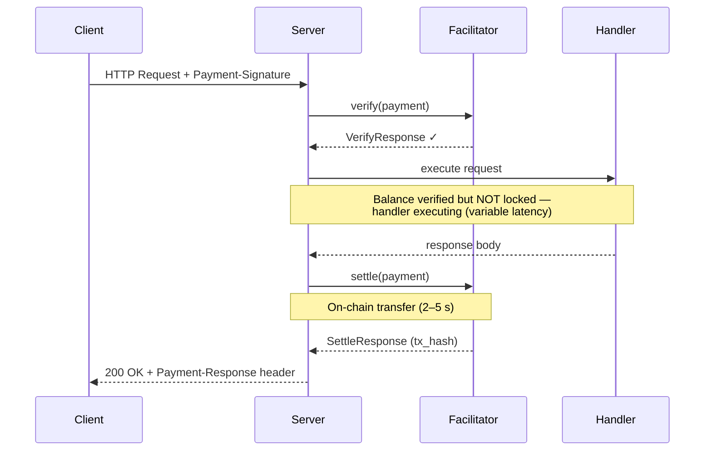
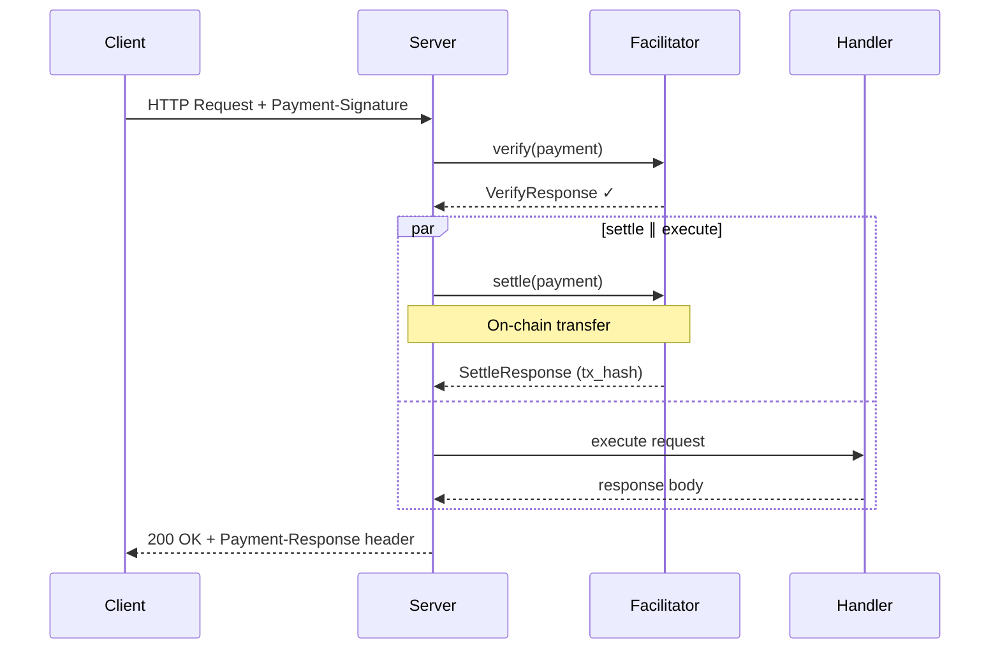
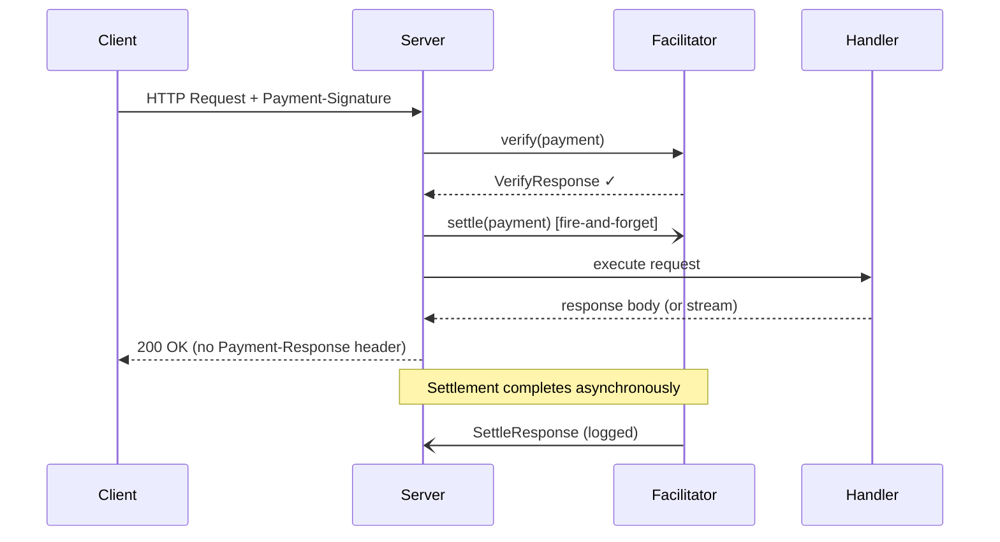

<!-- markdownlint-disable MD033 MD041 MD036 -->

# R402

[![Crates.io][crates-badge]][crates-url]
[![Docs.rs][docs-badge]][docs-url]
[![CI][ci-badge]][ci-url]
[![License][license-badge]][license-url]
[![Rust][rust-badge]][rust-url]

[crates-badge]: https://img.shields.io/crates/v/r402.svg
[crates-url]: https://crates.io/crates/r402
[docs-badge]: https://img.shields.io/docsrs/r402.svg
[docs-url]: https://docs.rs/r402
[ci-badge]: https://github.com/qntx/r402/actions/workflows/ci.yml/badge.svg
[ci-url]: https://github.com/qntx/r402/actions/workflows/ci.yml
[license-badge]: https://img.shields.io/badge/license-MIT%2FApache--2.0-blue.svg
[license-url]: LICENSE-MIT
[rust-badge]: https://img.shields.io/badge/rust-edition%202024-orange.svg
[rust-url]: https://doc.rust-lang.org/edition-guide/

**Modular Rust SDK for the [x402 payment protocol](https://www.x402.org/) — client signing, server gating, and facilitator settlement over HTTP 402.**

r402 is a production-grade, multi-chain implementation of x402 with dual-path ERC-3009 / Permit2 transfers, the `exact` and `upto` (usage-based) schemes, composable lifecycle hooks, and built-in deployments across **EVM, Solana, Tron, Casper, NEAR, and XRPL**.
r402 is a production-grade, multi-chain implementation of x402 with dual-path ERC-3009 / Permit2 transfers, the `exact` and `upto` (usage-based) schemes, composable lifecycle hooks, and built-in deployments across **EVM, Solana, Tron, Casper, NEAR, and Hedera**.
r402 is a production-grade, multi-chain implementation of x402 with dual-path ERC-3009 / Permit2 transfers, the `exact` and `upto` (usage-based) schemes, composable lifecycle hooks, and built-in deployments across **EVM, Solana, Tron, Casper, NEAR, and Algorand**.
r402 is a production-grade, multi-chain implementation of x402 with dual-path ERC-3009 / Permit2 transfers, the `exact` and `upto` (usage-based) schemes, composable lifecycle hooks, and built-in deployments across **EVM, Solana, Tron, Casper, NEAR, and Keeta**.
r402 is a production-grade, multi-chain implementation of x402 with dual-path ERC-3009 / Permit2 transfers, the `exact` and `upto` (usage-based) schemes, composable lifecycle hooks, and built-in deployments across **EVM, Solana, Tron, Casper, NEAR, and TON**.
r402 is a production-grade, multi-chain implementation of x402 with dual-path ERC-3009 / Permit2 transfers, the `exact` and `upto` (usage-based) schemes, composable lifecycle hooks, and built-in deployments across **EVM, Solana, Tron, Casper, NEAR, and Stellar**.
r402 is a production-grade, multi-chain implementation of x402 with dual-path ERC-3009 / Permit2 transfers, the `exact` and `upto` (usage-based) schemes, composable lifecycle hooks, and built-in deployments across **EVM, Solana, Tron, Casper, NEAR, TON, XRPL, Hedera, Algorand, Keeta, and Stellar**.
r402 is a production-grade, multi-chain implementation of x402 with dual-path ERC-3009 / Permit2 transfers, the `exact` and `upto` (usage-based) schemes, composable lifecycle hooks, and built-in deployments across **EVM, Solana, Tron, Casper, NEAR, TON, XRPL, Hedera, Algorand, Aptos, and Keeta**.
r402 is a production-grade, multi-chain implementation of x402 with dual-path ERC-3009 / Permit2 transfers, the `exact` and `upto` (usage-based) schemes, composable lifecycle hooks, and built-in deployments across **EVM, Solana, Tron, Casper, NEAR, TON, XRPL, Hedera, Algorand, Aptos, Keeta, and Stellar**.

> **See also** [`facilitator`](https://github.com/qntx/facilitator) — a production-ready facilitator server built on r402.

## Quick Start

### Install

```toml
[dependencies]
r402 = { version = "0.16", features = ["evm", "http", "client", "server"] }
```

Full feature matrix and crate list: **[`crates/README.md`](crates/README.md)**.

### Protect a Route (Server)

```rust
use alloy_primitives::address;
use axum::{Router, routing::get};
use r402_evm::{Eip155Exact, USDC};
use r402_http::server::X402Middleware;

let x402 = X402Middleware::try_new("https://facilitator.example.com")?;

let app = Router::new().route(
    "/paid-content",
    get(handler).layer(
        x402.with_price_tag(Eip155Exact::price_tag(
            address!("0xYourPayToAddress"),
            USDC::base().amount(1_000_000u64), // 1 USDC (6 decimals)
        ))
    ),
);
```

### Send Payments (Client)

```rust
use alloy_signer_local::PrivateKeySigner;
use r402_evm::Eip155ExactClient;
use r402_http::client::{WithPayments, X402Client};
use std::sync::Arc;

let signer = Arc::new("0x...".parse::<PrivateKeySigner>()?);
let x402 = X402Client::new().register(Eip155ExactClient::new(signer));

let client = reqwest::Client::new().with_payments(x402);

let res = client.get("https://api.example.com/paid").send().await?;
```

### Usage-Based Pricing (`upto` Scheme)

The `upto` scheme lets the buyer sign a **maximum** while the resource server picks the final charge at request time (meter reads, token usage, dynamic tiers). The facilitator settles for any value in `[0, max]`; a final amount of `0` returns no on-chain transaction.

```rust
use alloy_primitives::address;
use axum::{Router, response::IntoResponse, routing::post};
use r402_evm::{Eip155Upto, USDC};
use r402_http::server::{UptoActualAmount, X402Middleware};

async fn meter(/* ... */) -> impl IntoResponse {
    let mut response = "result".into_response();
    // Charge 0.125 USDC for this call.
    response.extensions_mut().insert(UptoActualAmount::new("125000"));
    response
}

let layer = X402Middleware::try_new("https://facilitator.example.com")?
    .with_price_tag(Eip155Upto::price_tag(
        address!("0xYourPayToAddress"),
        USDC::base().amount(1_000_000u64), // up to 1 USDC
    ));
let app = Router::new().route("/meter", post(meter).layer(layer));
```

Handlers opt in by inserting `UptoActualAmount` into the response extensions; the middleware patches `paymentRequirements.amount` before forwarding the settle request. Buyers sign with `Eip155UptoClient` (shares the Permit2 auto-approve plumbing with `Eip155ExactClient`).

> **Note:** `UptoActualAmount` is honoured only by `SettlementMode::Sequential`.
> Concurrent and background modes start settlement before the handler returns and therefore charge the signed maximum.

## Settlement Modes

`X402Middleware` supports three settlement strategies, configurable via [`with_settlement_mode()`](https://docs.rs/r402-http/latest/r402_http/server/struct.X402Layer.html#method.with_settlement_mode):

### Sequential (default)

Verify → execute → settle. The safest mode — on-chain settlement only occurs after the handler succeeds, and the `Payment-Response` header is included in the same HTTP response.



### Concurrent

Verify → (settle ∥ execute) → await both. Reduces total latency by overlapping on-chain settlement with handler execution, saving one facilitator round-trip. On handler error the settlement task is detached (fire-and-forget).



### Background

Verify → spawn settle (fire-and-forget) → execute → return. Settlement runs entirely in the background — the response is returned to the client as soon as the handler completes, without waiting for on-chain confirmation. Ideal for **streaming responses** (SSE, LLM token streams) where the client should start receiving data immediately. Settlement errors are logged but do not propagate to the caller. **Trade-off:** the `Payment-Response` header is not attached since settlement may still be in progress when the response is sent.



### Comparison

| Mode | Total latency | Safety | `Payment-Response` | Best for |
| --- | --- | --- | --- | --- |
| **Sequential** | verify + handler + settle | Settlement only on handler success | ✅ Included | Standard request/response APIs |
| **Concurrent** | verify + max(handler, settle) | Settlement may occur on handler failure | ✅ Included | Latency-sensitive endpoints |
| **Background** | verify + handler | Settlement errors are non-fatal (logged) | ❌ Not attached | SSE / LLM streaming responses |

> For full manual control over settlement timing, use the composable [`Paygate`](https://docs.rs/r402-http/latest/r402_http/server/struct.Paygate.html) API directly with `verify_only()` + `VerifiedPayment::settle()`.

## Design

- **Chains** — EVM (EIP-155), Solana, Tron, Casper, NEAR, TON, XRPL, Hedera, Algorand, Aptos, Keeta, Stellar
- **Schemes** — **`exact`** (all chains) + **`upto`** (usage-based, EVM)
- **Transfer methods** — ERC-3009 / Permit2 (EVM, Tron); SPL (SVM); CEP-18 auth (Casper)
- **Lifecycle hooks** — `FacilitatorHooks` (verify/settle) + `ClientHooks` (payment creation)
- **Async model** — zero `async_trait` in core — RPITIT / `Pin<Box<dyn Future>>`
- **Facilitator trait** — unified, dyn-compatible `Box<dyn Facilitator>` across schemes
- **Wire format** — V2-only server (CAIP-2 chain IDs, `Payment-Signature` header)
- **Settlement errors** — failed settle returns 402 with structured error
- **Smart wallets** — EIP-6492 (counterfactual) + EIP-1271 (deployed) + ERC-2098 (compact)
- **Strict linting** — Clippy `pedantic` + `nursery` + `correctness` (deny)

## Crates

See **[`crates/README.md`](crates/README.md)** for the full crate table, chain matrix, dependency graph, and feature flag reference.

## Acknowledgments

- [x402 Protocol Specification](https://www.x402.org/) — protocol design by Coinbase
- [coinbase/x402](https://github.com/coinbase/x402) — official reference implementations (TypeScript, Python, Go)
- [x402-rs/x402-rs](https://github.com/x402-rs/x402-rs) — community Rust implementation

## License

Licensed under either of:

- Apache License, Version 2.0 ([LICENSE-APACHE](LICENSE-APACHE) or <https://www.apache.org/licenses/LICENSE-2.0>)
- MIT License ([LICENSE-MIT](LICENSE-MIT) or <https://opensource.org/licenses/MIT>)

at your option.

Unless you explicitly state otherwise, any contribution intentionally submitted for inclusion in this project shall be dual-licensed as above, without any additional terms or conditions.

---

<div align="center">

A **[QuantX](https://qntx.fun)** open-source project.

<a href="https://qntx.fun"></a>

Code is law. We write both.

</div>
