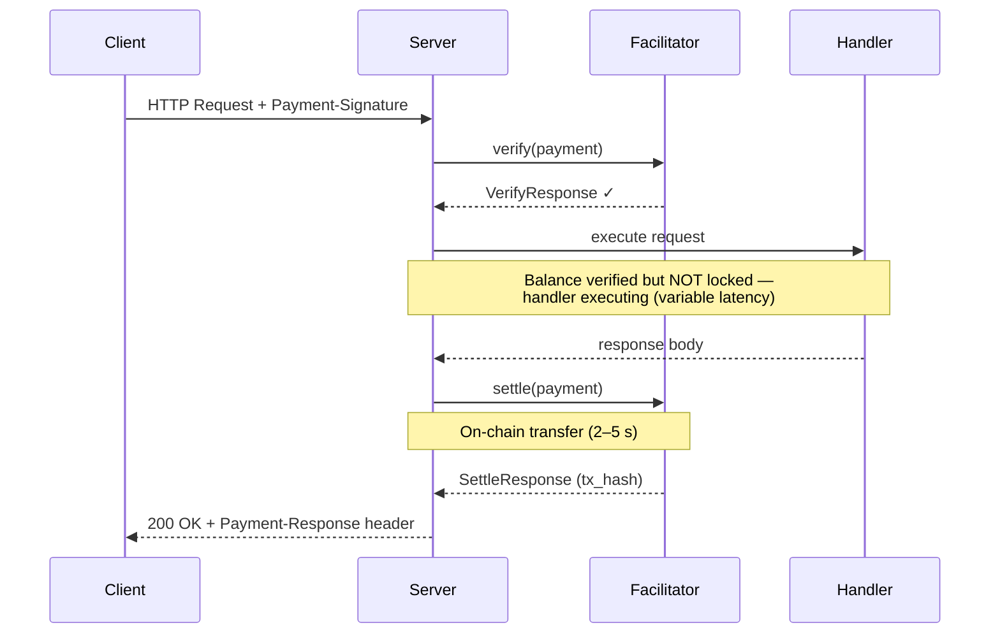
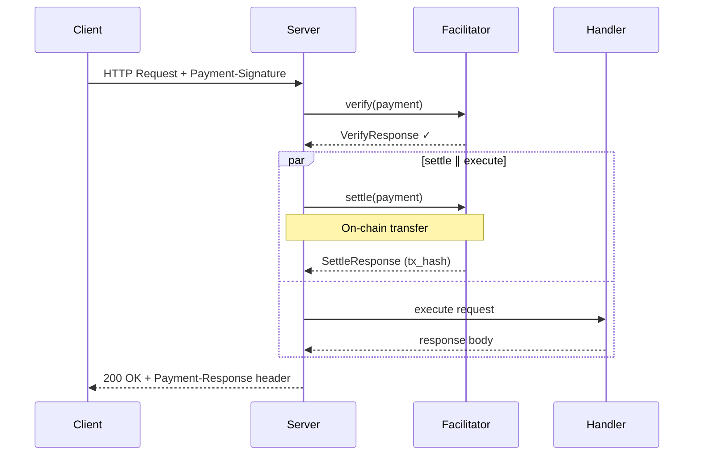
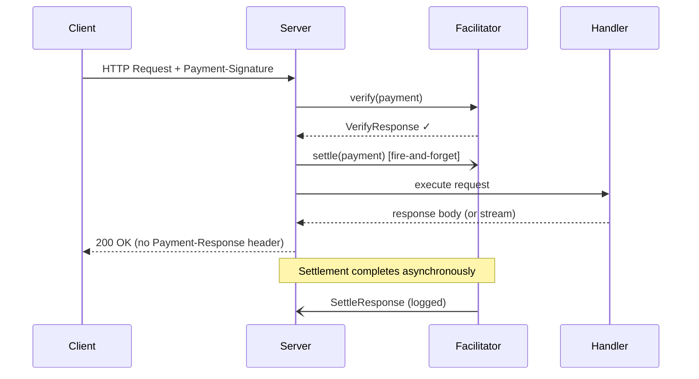

<!-- markdownlint-disable MD033 MD041 MD036 -->

# R402

[![Crates.io][crates-badge]][crates-url]
[![Docs.rs][docs-badge]][docs-url]
[![CI][ci-badge]][ci-url]
[![License][license-badge]][license-url]
[![Rust][rust-badge]][rust-url]

[crates-badge]: https://img.shields.io/crates/v/r402.svg
[crates-url]: https://crates.io/crates/r402
[docs-badge]: https://img.shields.io/docsrs/r402.svg
[docs-url]: https://docs.rs/r402
[ci-badge]: https://github.com/qntx/r402/actions/workflows/ci.yml/badge.svg
[ci-url]: https://github.com/qntx/r402/actions/workflows/ci.yml
[license-badge]: https://img.shields.io/badge/license-MIT%2FApache--2.0-blue.svg
[license-url]: LICENSE-MIT
[rust-badge]: https://img.shields.io/badge/rust-edition%202024-orange.svg
[rust-url]: https://doc.rust-lang.org/edition-guide/

**Modular Rust SDK for the [x402 payment protocol](https://www.x402.org/) — client signing, server gating, and facilitator settlement over HTTP 402.**

Protocol version **2** only. Schemes `exact` / `upto`. Deployments: **EVM, SVM (Solana), NEAR, XRPL, Hedera, Algorand, Aptos, Keeta, TON, Stellar, Concordium**. Tron is experimental / not an x402 protocol mechanism. Casper is extra / not an x402 protocol mechanism.

> **See also** [`facilitator`](https://github.com/qntx/facilitator) — a production-ready facilitator server built on r402.

## Quick Start

### Install

```toml
[dependencies]
r402 = { version = "0.19", features = ["evm", "http"] }
```

`default = ["evm", "http"]`. Concordium is opt-in (`concordium`). SVM (Solana) is crate `r402-svm`. AVM (Algorand) is crate `r402-avm`.

Full feature matrix and crate list: **[`crates/README.md`](crates/README.md)**.

### Protect a Route (Server)

```rust
use alloy_primitives::address;
use axum::{Router, routing::get};
use r402::evm::{Eip155Exact, USDC};
use r402::http::server::X402Middleware;

let x402 = X402Middleware::try_new("https://facilitator.example.com")?
    .with_base_url("https://api.example.com".parse()?)
    .with_scheme("eip155:*".parse()?, Eip155Exact);

let app = Router::new().route(
    "/paid-content",
    get(handler).layer(
        x402.with_price_tag(Eip155Exact::price_tag(
            address!("0xYourPayToAddress"),
            USDC::base().amount(1_000_000u64),
            None,
        ))?,
    ),
);
```

### Send Payments (Client)

```rust
use alloy_signer_local::PrivateKeySigner;
use r402::evm::Eip155ExactClient;
use r402::http::{WithPayments, X402Client};
use std::sync::Arc;

let signer = Arc::new("0x...".parse::<PrivateKeySigner>()?);
let client = reqwest::Client::new().with_payments(
    X402Client::new().register(Eip155ExactClient::new(signer)),
);
let res = client.get("https://api.example.com/paid").send().await?;
```

## Settlement Modes

Configurable via [`with_settlement_mode()`](https://docs.rs/r402-http/latest/r402_http/server/struct.X402Layer.html#method.with_settlement_mode) after `with_price_tag`.

### Sequential (default)

Verify → execute → settle. The safest mode — on-chain settlement only occurs after the handler succeeds, and the `Payment-Response` header is included in the same HTTP response.



### Concurrent

Verify → (settle ∥ execute) → await both. Reduces total latency by overlapping on-chain settlement with handler execution, saving one facilitator round-trip. On handler error the settlement task is detached (fire-and-forget).



### Background

Verify → spawn settle (fire-and-forget) → execute → return. Settlement runs entirely in the background — the response is returned to the client as soon as the handler completes, without waiting for on-chain confirmation. Ideal for **streaming responses** (SSE, LLM token streams) where the client should start receiving data immediately. Settlement errors are logged but do not propagate to the caller. **Trade-off:** the `Payment-Response` header is not attached since settlement may still be in progress when the response is sent.



### Comparison

| Mode | Total latency | Safety | `Payment-Response` | Best for |
| --- | --- | --- | --- | --- |
| **Sequential** | verify + handler + settle | Settlement only on handler success | ✅ Included | Standard request/response APIs |
| **Concurrent** | verify + max(handler, settle) | Settlement may occur on handler failure | ✅ Included | Latency-sensitive endpoints |
| **Background** | verify + handler | Settlement errors are non-fatal (logged) | ❌ Not attached | SSE / LLM streaming responses |

> **Note:** `UptoActualAmount` is honoured only by `SettlementMode::Sequential`. Concurrent and background modes start settlement before the handler returns and therefore charge the signed maximum.

## `upto`

EVM `upto` (Permit2 witness: verify = max, settle = actual ≤ max) and Solana `upto` (escrow). `Eip155Upto::price_tag(pay_to, asset)` takes two arguments (the max amount). Handlers opt in with `UptoActualAmount` on Sequential responses.

## Wire

| Item | Contract |
| --- | --- |
| Version | `x402Version: 2` |
| 402 challenge | `Payment-Required` (base64, Title-Case) |
| Retry | `Payment-Signature` |
| Receipt | `Payment-Response` |
| JSON | camelCase, `deny_unknown_fields` |

| Situation | Status |
| --- | --- |
| Unpaid / verify fail / settle fail / malformed header | 402 |
| Permit2 allowance | 412 |
| Incompatible mode / missing scheme | 500 |
| Facilitator transport | 502 |
| Success | 200 |

## Design

- **Chains** — EVM (EIP-155), SVM (Solana), NEAR, TON, XRPL, Hedera, Algorand, Aptos, Keeta, Stellar, Concordium. Tron is experimental / not an x402 protocol mechanism. Casper is extra / not an x402 protocol mechanism.
- **Schemes** — `exact` (all chains) + `upto` (EVM Permit2 witness, Solana escrow)
- **Transfer methods** — ERC-3009 / Permit2 (EVM, Tron); SPL (SVM); CEP-18 (Casper); NEP-141 / NEP-366 (NEAR); TEP-74 / W5R1 (TON); XRP / RLUSD Payment (XRPL); HBAR / HTS (Hedera); ASA (Algorand); FA (Aptos); SEND (Keeta); SEP-41 (Stellar); CCD / PLT (Concordium)
- **Wire** — V2-only (CAIP-2 chain IDs, `Payment-*` headers)
- **Smart wallets** — EIP-6492 (counterfactual) + EIP-1271 (deployed) + ERC-2098 (compact)

## Crates

See **[`crates/README.md`](crates/README.md)** for the crate table, chain matrix, and feature flags.

## Acknowledgments

- [x402 Protocol Specification](https://www.x402.org/) — protocol design by Coinbase
- [coinbase/x402](https://github.com/coinbase/x402) — official reference implementations (TypeScript, Python, Go)
- [x402-rs/x402-rs](https://github.com/x402-rs/x402-rs) — community Rust implementation

## License

Licensed under either of:

- Apache License, Version 2.0 ([LICENSE-APACHE](LICENSE-APACHE) or <https://www.apache.org/licenses/LICENSE-2.0>)
- MIT License ([LICENSE-MIT](LICENSE-MIT) or <https://opensource.org/licenses/MIT>)

at your option.

Unless you explicitly state otherwise, any contribution intentionally submitted for inclusion in this project shall be dual-licensed as above, without any additional terms or conditions.

---

<div align="center">

A **[QuantX](https://qntx.org)** open-source project.

<a href="https://qntx.org"></a>

Code is law. We write both.

</div>
