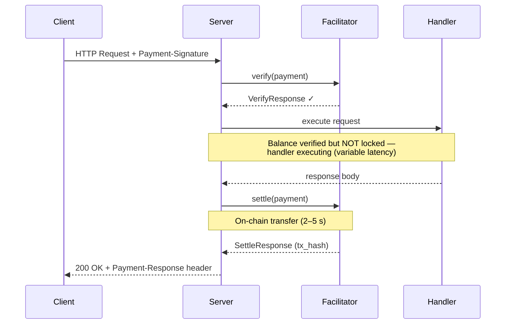
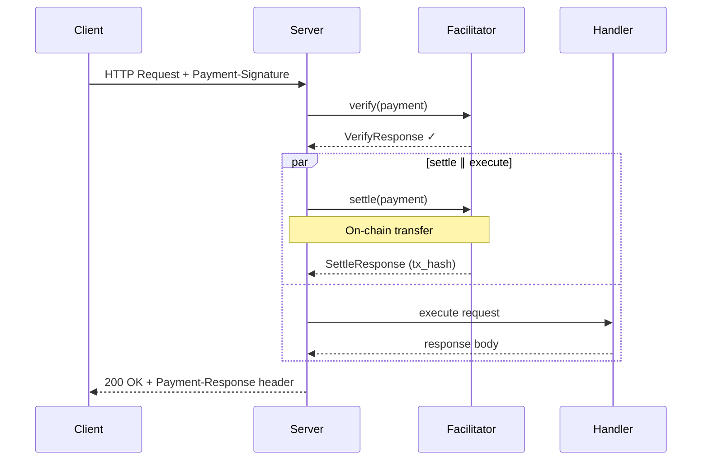
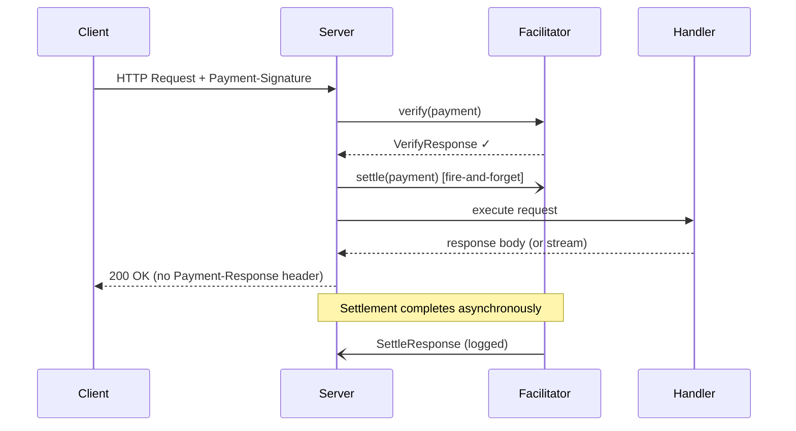

<!-- markdownlint-disable MD033 MD041 MD036 -->

# R402

[![Crates.io][crates-badge]][crates-url]
[![Docs.rs][docs-badge]][docs-url]
[![CI][ci-badge]][ci-url]
[![License][license-badge]][license-url]
[![Rust][rust-badge]][rust-url]

[crates-badge]: https://img.shields.io/crates/v/r402.svg
[crates-url]: https://crates.io/crates/r402
[docs-badge]: https://img.shields.io/docsrs/r402.svg
[docs-url]: https://docs.rs/r402
[ci-badge]: https://github.com/qntx/r402/actions/workflows/ci.yml/badge.svg
[ci-url]: https://github.com/qntx/r402/actions/workflows/ci.yml
[license-badge]: https://img.shields.io/badge/license-MIT%2FApache--2.0-blue.svg
[license-url]: LICENSE-MIT
[rust-badge]: https://img.shields.io/badge/rust-edition%202024-orange.svg
[rust-url]: https://doc.rust-lang.org/edition-guide/

**Modular Rust SDK for the [x402 payment protocol](https://www.x402.org/) — client signing, server gating, and facilitator settlement over HTTP 402.**

Protocol version **2** only. Schemes `exact` / `upto`. Deployments: **EVM, SVM (Solana), NEAR, XRPL, Hedera, Algorand, Aptos, Keeta, TON, Stellar, Concordium**. Tron is experimental / not an x402 protocol mechanism. Casper is extra / not an x402 protocol mechanism.

> **See also** [`facilitator`](https://github.com/qntx/facilitator) — a production-ready facilitator server built on r402.

## Quick Start

### Install

```toml
[dependencies]
r402 = { version = "0.20", features = ["evm", "http"] }
# SVM + MCP, same crate:
# r402 = { version = "0.20", features = ["evm", "svm", "http", "mcp"] }
# Every production chain + HTTP + MCP:
# r402 = { version = "0.20", features = ["full"] }
```

`default = ["evm", "http"]` so a first `r402` dep does not compile Solana, protobuf, or gRPC. Enable chains as features (`svm`, `near`, `xrpl`, `hedera`, `avm`, `aptos`, `keeta`, `tvm`, `stellar`, `concordium`). `tron` and `casper` are opt-in and not in `full`. Individual `r402-*` crates remain for binaries that want one crate and no facade.

Full feature matrix and crate list: **[`crates/README.md`](crates/README.md)**.

### Protect a Route (Server)

```rust
use alloy_primitives::address;
use axum::{Router, routing::get};
use r402::evm::{Eip155Exact, USDC};
use r402::http::server::X402Middleware;

let x402 = X402Middleware::try_new("https://facilitator.example.com")?
    .with_base_url("https://api.example.com".parse()?)
    .with_scheme("eip155:*".parse()?, Eip155Exact);

let app = Router::new().route(
    "/paid-content",
    get(handler).layer(
        x402.with_price_tag(Eip155Exact::price_tag(
            address!("0xYourPayToAddress"),
            USDC::base().amount(1_000_000u64),
            None,
        ))?,
    ),
);
```

### Send Payments (Client)

```rust
use alloy_signer_local::PrivateKeySigner;
use r402::evm::Eip155ExactClient;
use r402::http::{WithPayments, X402Client};
use std::sync::Arc;

let signer = Arc::new("0x...".parse::<PrivateKeySigner>()?);
let client = reqwest::Client::new().with_payments(
    X402Client::new().register(Eip155ExactClient::new(signer)),
);
let res = client.get("https://api.example.com/paid").send().await?;
```

## Settlement Modes

`SettlementMode` is **not** a `paymentFlow`. Spec `paymentFlow` (`authorization` / `upfront` / `escrow`) is the on-wire ordering of verify and settle around the handler. Sequential / Concurrent / Background are a resource-server scheduler for the **after-handler settle of `authorization`**: whether this HTTP response waits for that settle. Facilitators and clients never see the knob; it is not written into `PAYMENT-REQUIRED`.

- **Sequential** (default) is spec `authorization`: verify → handler → settle → respond with `Payment-Response`.
- **Concurrent** and **Background** overlap that after-handler settle with the handler (async I/O). They are not a fourth flow. `upfront` / `escrow` reject them (`IncompatibleSettlementMode`) because those flows already settle before the handler.

Configurable via [`with_settlement_mode()`](https://docs.rs/r402-http/latest/r402_http/server/struct.X402Layer.html#method.with_settlement_mode) after `with_price_tag`.

### Sequential (default)

Verify → execute → settle. Spec `authorization`. On-chain settlement only after the handler succeeds; `Payment-Response` is on the same HTTP response.



### Concurrent

Verify → (settle ∥ execute) → await both. Still `authorization` on the wire. Overlaps the after-handler settle RPC with the handler so total latency is verify + max(handler, settle). The response still waits and still carries `Payment-Response`. On handler error the settlement task is detached — the payer may be charged even if the handler failed.



### Background

Verify → spawn settle (fire-and-forget) → execute → return. Still `authorization` on the wire. The HTTP response does not wait for on-chain confirmation, so SSE / LLM streams can start before settle finishes. Settlement errors are logged and do not fail the request. **Trade-off:** `Payment-Response` is omitted — headers are already on the way out — and the payer may be charged if the handler later fails.



### Comparison

Applies only to `paymentFlow = authorization`. `upfront` / `escrow` stay Sequential.

| Mode | Total latency | Safety | `Payment-Response` | Best for |
| --- | --- | --- | --- | --- |
| **Sequential** | verify + handler + settle | Settlement only on handler success | Included | Spec `authorization`; buffered responses |
| **Concurrent** | verify + max(handler, settle) | Settlement may occur on handler failure | Included | Overlap settle with a slow handler |
| **Background** | verify + handler | Settlement errors are non-fatal (logged) | Not attached | SSE / LLM streaming (headers must leave before the body) |

> **Note:** `UptoActualAmount` is honoured only by `SettlementMode::Sequential`. Concurrent and Background start settlement before the handler returns and therefore charge the signed maximum. They cannot meter a stream.

## Acknowledgments

- [x402 Protocol Specification](https://www.x402.org/) — protocol design by Coinbase
- [coinbase/x402](https://github.com/coinbase/x402) — official reference implementations (TypeScript, Python, Go)
- [x402-rs/x402-rs](https://github.com/x402-rs/x402-rs) — community Rust implementation

## License

Licensed under either of:

- Apache License, Version 2.0 ([LICENSE-APACHE](LICENSE-APACHE) or <https://www.apache.org/licenses/LICENSE-2.0>)
- MIT License ([LICENSE-MIT](LICENSE-MIT) or <https://opensource.org/licenses/MIT>)

at your option.

Unless you explicitly state otherwise, any contribution intentionally submitted for inclusion in this project shall be dual-licensed as above, without any additional terms or conditions.

---

<div align="center">

A **[QuantX](https://qntx.org)** open-source project.

<a href="https://qntx.org"></a>

Code is law. We write both.

</div>
