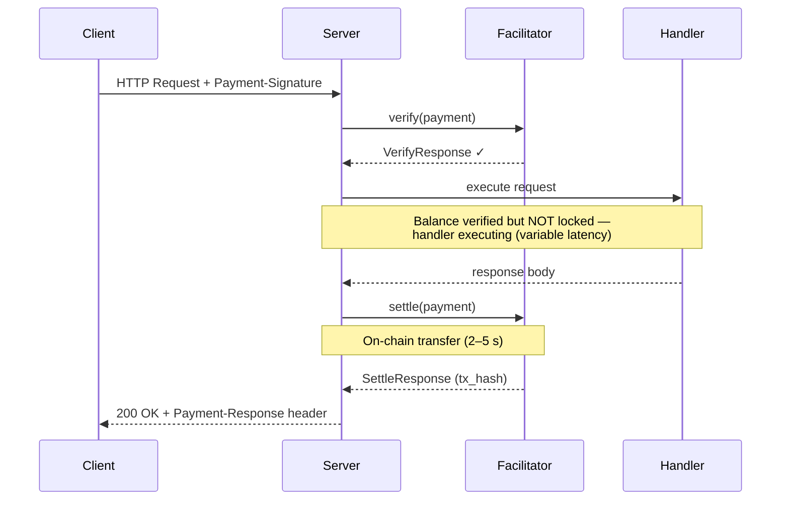
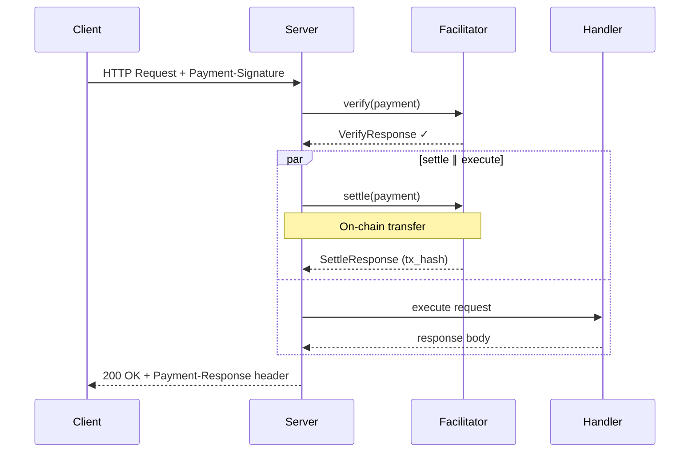
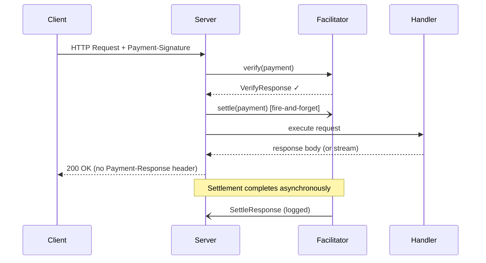

# r402

[![CI][ci-badge]][ci-url]
[![License][license-badge]][license-url]
[![Rust][rust-badge]][rust-url]

[ci-badge]: https://github.com/qntx/r402/actions/workflows/rust.yml/badge.svg
[ci-url]: https://github.com/qntx/r402/actions/workflows/rust.yml
[license-badge]: https://img.shields.io/badge/license-MIT%2FApache--2.0-blue.svg
[license-url]: LICENSE-MIT
[rust-badge]: https://img.shields.io/badge/rust-edition%202024-orange.svg
[rust-url]: https://doc.rust-lang.org/edition-guide/

**Modular Rust SDK for the [x402 payment protocol](https://www.x402.org/) — client signing, server gating, and facilitator settlement over HTTP 402.**

r402 provides a production-grade, multi-chain implementation of the x402 protocol with dual-path ERC-3009 / Permit2 transfers, composable lifecycle hooks, and 44 built-in chain deployments across EVM and Solana.

See [Security](SECURITY.md) before using in production.

## Crates

| Crate | | Description |
| --- | --- | --- |
| **[`r402`](r402/)** | [![crates.io][r402-crate]][r402-crate-url] [![docs.rs][r402-doc]][r402-doc-url] | Core library — protocol types, scheme traits, facilitator abstractions, and hook system |
| **[`r402-evm`](r402-evm/)** | [![crates.io][r402-evm-crate]][r402-evm-crate-url] [![docs.rs][r402-evm-doc]][r402-evm-doc-url] | EVM (EIP-155) — ERC-3009 transfer authorization, multi-signer management, nonce tracking |
| **[`r402-svm`](r402-svm/)** | [![crates.io][r402-svm-crate]][r402-svm-crate-url] [![docs.rs][r402-svm-doc]][r402-svm-doc-url] | Solana (SVM) — SPL token transfers, program-derived addressing |
| **[`r402-http`](r402-http/)** | [![crates.io][r402-http-crate]][r402-http-crate-url] [![docs.rs][r402-http-doc]][r402-http-doc-url] | HTTP transport — Axum payment gate middleware, reqwest client middleware, facilitator client |

[r402-crate]: https://img.shields.io/crates/v/r402.svg
[r402-crate-url]: https://crates.io/crates/r402
[r402-evm-crate]: https://img.shields.io/crates/v/r402-evm.svg
[r402-evm-crate-url]: https://crates.io/crates/r402-evm
[r402-svm-crate]: https://img.shields.io/crates/v/r402-svm.svg
[r402-svm-crate-url]: https://crates.io/crates/r402-svm
[r402-http-crate]: https://img.shields.io/crates/v/r402-http.svg
[r402-http-crate-url]: https://crates.io/crates/r402-http
[r402-doc]: https://img.shields.io/docsrs/r402.svg
[r402-doc-url]: https://docs.rs/r402
[r402-evm-doc]: https://img.shields.io/docsrs/r402-evm.svg
[r402-evm-doc-url]: https://docs.rs/r402-evm
[r402-svm-doc]: https://img.shields.io/docsrs/r402-svm.svg
[r402-svm-doc-url]: https://docs.rs/r402-svm
[r402-http-doc]: https://img.shields.io/docsrs/r402-http.svg
[r402-http-doc-url]: https://docs.rs/r402-http

See also **[`facilitator`](https://github.com/qntx/facilitator)** — a production-ready facilitator server built on r402.

## Quick Start

### Protect a Route (Server)

```rust
use alloy_primitives::address;
use axum::{Router, routing::get};
use r402_evm::{Eip155Exact, USDC};
use r402_http::server::X402Middleware;

let x402 = X402Middleware::new("https://facilitator.example.com");

let app = Router::new().route(
    "/paid-content",
    get(handler).layer(
        x402.with_price_tag(Eip155Exact::price_tag(
            address!("0xYourPayToAddress"),
            USDC::base().amount(1_000_000u64), // 1 USDC (6 decimals)
        ))
    ),
);
```

### Send Payments (Client)

```rust
use alloy_signer_local::PrivateKeySigner;
use r402_evm::Eip155ExactClient;
use r402_http::client::{WithPayments, X402Client};
use std::sync::Arc;

let signer = Arc::new("0x...".parse::<PrivateKeySigner>()?);
let x402 = X402Client::new().register(Eip155ExactClient::new(signer));

let client = reqwest::Client::new().with_payments(x402);

let res = client.get("https://api.example.com/paid").send().await?;
```

## Settlement Modes

`X402Middleware` supports three settlement strategies, configurable via [`with_settlement_mode()`](https://docs.rs/r402-http/latest/r402_http/server/struct.X402LayerBuilder.html#method.with_settlement_mode):

### Sequential (default)

Verify → execute → settle. The safest mode — on-chain settlement only occurs after the handler succeeds, and the `Payment-Response` header is included in the same HTTP response.



### Concurrent

Verify → (settle ∥ execute) → await both. Reduces total latency by overlapping on-chain settlement with handler execution, saving one facilitator round-trip. On handler error the settlement task is detached (fire-and-forget).



### Background

Verify → spawn settle (fire-and-forget) → execute → return. Settlement runs entirely in the background — the response is returned to the client as soon as the handler completes, without waiting for on-chain confirmation. Ideal for **streaming responses** (SSE, LLM token streams) where the client should start receiving data immediately. Settlement errors are logged but do not propagate to the caller. **Trade-off:** the `Payment-Response` header is not attached since settlement may still be in progress when the response is sent.



### Comparison

| Mode | Total latency | Safety | `Payment-Response` | Best for |
| --- | --- | --- | --- | --- |
| **Sequential** | verify + handler + settle | Settlement only on handler success | ✅ Included | Standard request/response APIs |
| **Concurrent** | verify + max(handler, settle) | Settlement may occur on handler failure | ✅ Included | Latency-sensitive endpoints |
| **Background** | verify + handler | Settlement errors are non-fatal (logged) | ❌ Not attached | SSE / LLM streaming responses |

> For full manual control over settlement timing, use the composable [`Paygate`](https://docs.rs/r402-http/latest/r402_http/server/struct.Paygate.html) API directly with `verify_only()` + `VerifiedPayment::settle()`.

## Design

| Aspect | Details |
| --- | --- |
| Built-in chains | **44** — 42 EVM (EIP-155) + 2 Solana |
| Transfer methods | **Dual path** — ERC-3009 `transferWithAuthorization` + Permit2 proxy |
| Lifecycle hooks | **`FacilitatorHooks`** (verify/settle) + **`ClientHooks`** (payment creation) |
| Async model | **Zero `async_trait`** in core — RPITIT / `Pin<Box<dyn Future>>` |
| Facilitator trait | **Unified** — dyn-compatible `Box<dyn Facilitator>` across all schemes |
| Wire format | **V2-only** server (CAIP-2 chain IDs, `Payment-Signature` header) |
| Settlement errors | **Explicit** — failed settle returns 402 with structured error |
| Network definitions | **Decoupled** — per-chain crate (`r402-evm`, `r402-svm`) |
| Smart wallets | **EIP-6492** (counterfactual) + **EIP-1271** (deployed) + **ERC-2098** (compact signatures) |
| Linting | **`pedantic` + `nursery` + `correctness`** (deny) |

## Feature Flags

Each chain and transport crate uses feature flags to minimize compile-time dependencies:

| Crate | `server` | `client` | `facilitator` | `telemetry` |
| --- | --- | --- | --- | --- |
| `r402-http` | Axum payment gate + facilitator client | Reqwest middleware | — | `tracing` spans |
| `r402-evm` | Price tag generation | EIP-712 / EIP-3009 / Permit2 signing | On-chain verify & settle | `tracing` spans |
| `r402-svm` | Price tag generation | SPL token signing | On-chain verify & settle | `tracing` spans |

## Security

See [`SECURITY.md`](SECURITY.md) for disclaimers, supported versions, and vulnerability reporting.

## Acknowledgments

- [x402 Protocol Specification](https://www.x402.org/) — protocol design by Coinbase
- [coinbase/x402](https://github.com/coinbase/x402) — official reference implementations (TypeScript, Python, Go)
- [x402-rs/x402-rs](https://github.com/x402-rs/x402-rs) — community Rust implementation

## License

Licensed under either of:

- Apache License, Version 2.0 ([LICENSE-APACHE](LICENSE-APACHE) or <https://www.apache.org/licenses/LICENSE-2.0>)
- MIT License ([LICENSE-MIT](LICENSE-MIT) or <https://opensource.org/licenses/MIT>)

at your option.

Unless you explicitly state otherwise, any contribution intentionally submitted for inclusion in this project shall be dual-licensed as above, without any additional terms or conditions.

---

<div align="center">

A **[QNTX](https://qntx.fun)** open-source project.

<a href="https://qntx.fun"></a>

<!--prettier-ignore-->
Code is law. We write both.

</div>
