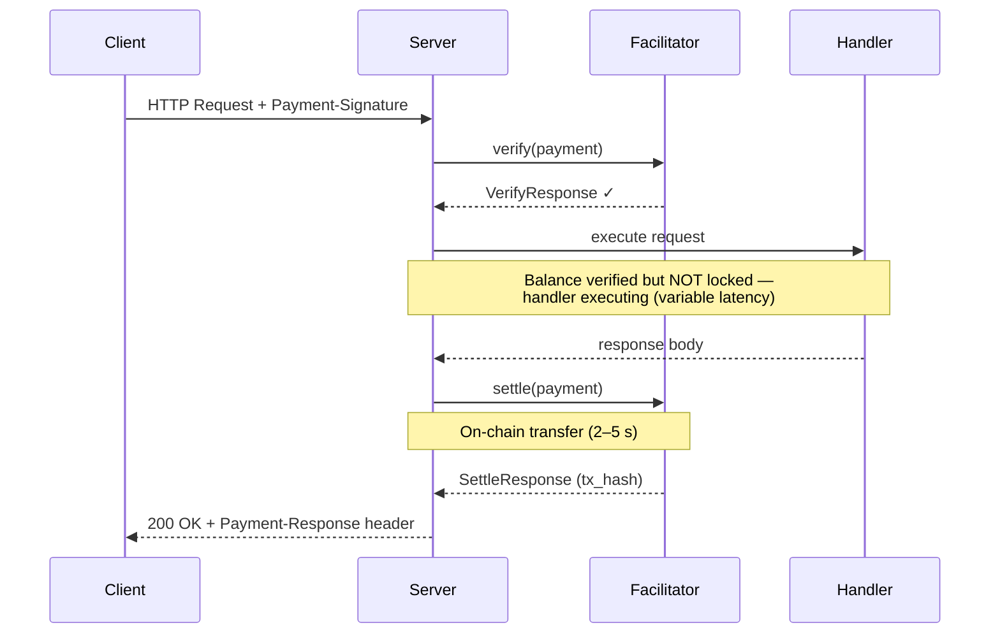
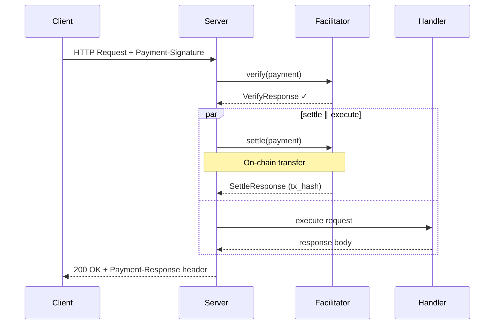
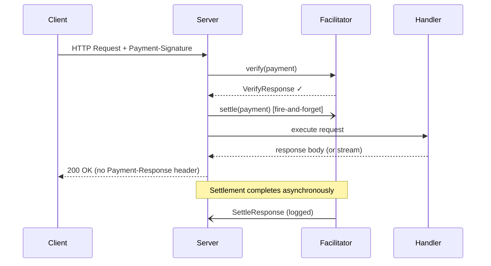

# r402

x402 Payment Protocol SDK for Rust. Protocol version **2** only.

```toml
[dependencies]
r402 = { version = "0.19", features = ["evm", "http"] }
# r402 = { version = "0.19", features = ["evm", "svm", "http"] }
# r402 = { version = "0.19", features = ["full"] }
```

`default = ["evm", "http"]`. Chain crates are feature-gated re-exports (`svm`, `near`, `xrpl`, `hedera`, `avm`, `aptos`, `keeta`, `tvm`, `stellar`, `concordium`). `full` is every production chain plus HTTP and MCP. `tron` / `casper` are opt-in, not in `full`.

## Protect a Route (Server)

```rust
use alloy_primitives::address;
use axum::{Router, routing::get};
use r402::evm::{Eip155Exact, USDC};
use r402::http::server::X402Middleware;

let x402 = X402Middleware::try_new("https://facilitator.example.com")?
    .with_base_url("https://api.example.com".parse()?)
    .with_scheme("eip155:*".parse()?, Eip155Exact);

let app = Router::new().route(
    "/paid-content",
    get(handler).layer(
        x402.with_price_tag(Eip155Exact::price_tag(
            address!("0xYourPayToAddress"),
            USDC::base().amount(1_000_000u64),
            None,
        ))?,
    ),
);
```

## Send Payments (Client)

```rust
use alloy_signer_local::PrivateKeySigner;
use r402::evm::Eip155ExactClient;
use r402::http::{WithPayments, X402Client};
use std::sync::Arc;

let signer = Arc::new("0x...".parse::<PrivateKeySigner>()?);
let client = reqwest::Client::new().with_payments(
    X402Client::new().register(Eip155ExactClient::new(signer)),
);
let res = client.get("https://api.example.com/paid").send().await?;
```

## Settlement Modes

`SettlementMode` is **not** a `paymentFlow`. Spec `paymentFlow` (`authorization` / `upfront` / `escrow`) is the on-wire ordering of verify and settle around the handler. Sequential / Concurrent / Background are a resource-server scheduler for the **after-handler settle of `authorization`**: whether this HTTP response waits for that settle. Facilitators and clients never see the knob; it is not written into `PAYMENT-REQUIRED`.

- **Sequential** (default) is spec `authorization`: verify → handler → settle → respond with `Payment-Response`.
- **Concurrent** and **Background** overlap that after-handler settle with the handler (async I/O). They are not a fourth flow. `upfront` / `escrow` reject them (`IncompatibleSettlementMode`) because those flows already settle before the handler.

Configurable via [`with_settlement_mode()`](https://docs.rs/r402-http/latest/r402_http/server/struct.X402Layer.html#method.with_settlement_mode) after `with_price_tag`.

### Sequential (default)

Verify → execute → settle. Spec `authorization`. On-chain settlement only after the handler succeeds. `Payment-Response` is attached.



### Concurrent

Verify → (settle ∥ execute) → await both. Still `authorization` on the wire. Overlaps the after-handler settle RPC with the handler. The response still waits and still carries `Payment-Response`. On handler error the settlement task is detached — the payer may be charged even if the handler failed.



### Background

Verify → spawn settle → execute → return. Still `authorization` on the wire. No `Payment-Response` (headers leave before settle finishes). For SSE / LLM streams.



### Comparison

Applies only to `paymentFlow = authorization`. `upfront` / `escrow` stay Sequential.

| Mode | Total latency | Safety | `Payment-Response` | Best for |
| --- | --- | --- | --- | --- |
| **Sequential** | verify + handler + settle | Settlement only on handler success | ✅ Included | Spec `authorization`; buffered responses |
| **Concurrent** | verify + max(handler, settle) | Settlement may occur on handler failure | ✅ Included | Overlap settle with a slow handler |
| **Background** | verify + handler | Settlement errors are non-fatal (logged) | ❌ Not attached | SSE / LLM streaming (headers must leave before the body) |

> **Note:** `UptoActualAmount` is honoured only by `SettlementMode::Sequential`. Concurrent and Background start settlement before the handler returns and therefore charge the signed maximum. They cannot meter a stream.

## License

Licensed under either of MIT or Apache-2.0, at your option.
