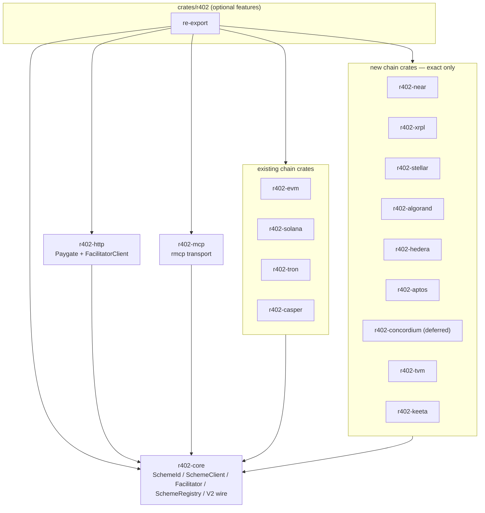
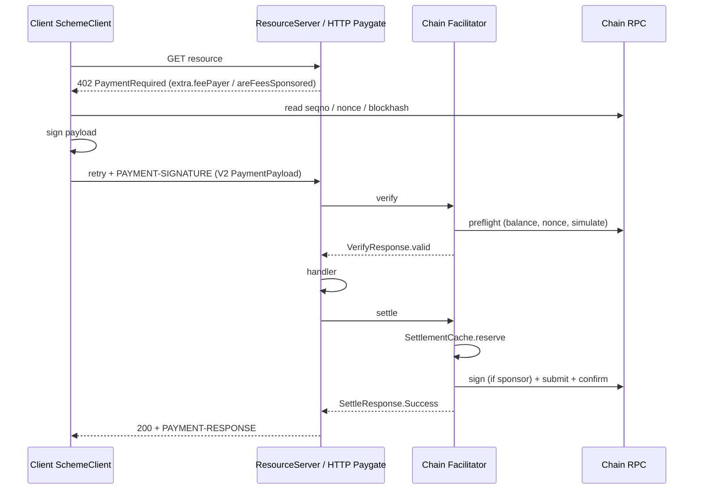

> **Obsolete.** Not the construction contract. Implement from [`docs/layout/`](layout/README.md) (384 enumerable files, HTTP shape B, three SettlementModes KEEP, upto KEEP, `r402-contract` unpublished). This file still describes workspace `0.16.0` and `vendor/x402`.

# r402 Chain Parity with Official x402 TypeScript SDK

| Field | Value |
| --- | --- |
| **Title** | r402 chain-parity design: implement every official TS mechanism chain |
| **Author** | r402 maintainers |
| **Date** | 2026-08-19 |
| **Status** | Draft |
| **Workspace** | `/Users/xu/Desktop/qntx/r402` (crates `0.16.0`, edition 2024, **MSRV 1.91** today; see [MSRV policy](#msrv-policy)) |
| **TS vendor** | `vendor/x402/typescript` (`@x402/*` **2.23.0**) |
| **Spec pin** | `vendor/x402/specs/` (v2 only) |

---

## Overview

Official x402 TypeScript ships **eleven** mechanism packages under `vendor/x402/typescript/packages/mechanisms/`. r402 today implements four CAIP-2 families (`eip155`, `solana`, `tron`, `casper`). Three of those match TS (`evm`, `svm` exact, and r402’s Tron which is **not** TS `tvm`). One is r402-only (Casper). Nine TS families are missing from r402.

This document is the implementable plan to close **exact-scheme chain parity**. It reverse-engineers r402’s existing chain-crate template (`r402-solana` / `r402-tron` in-process, `r402-casper` remote, `r402-evm` multi-scheme) and every TS mechanism’s payload, networks, assets, verify/settle rules, and SDK. New work is **one crate per CAIP-2 namespace**, V2-only, `exact` first, in-process facilitator wherever local verify+submit is possible. No plugin system, no v1 wire, no empty crate stubs, no stopgap codecs.

TS SVM `upto` is **escrow** (before-handler deposit + after-handler claim). r402 HTTP Paygate and `ResourceServer` only do `verify → handler → one settle`. That scheme is **out of this design**; it needs a separate escrow-orchestration document. This document still adds Solana **testnet + default-asset table** for `exact`.

The first mergeable unit is a complete E2E on **NEAR** (`r402-near`: client sign → 402 → verify → settle). Remaining exact crates follow one crate per PR. Stellar and Aptos land only after a workspace MSRV bump to **1.95**.

---

## Background & Motivation

### Current r402 state

Workspace members are `crates/*` (`Cargo.toml`). Chain crates:

| Crate | CAIP-2 | Schemes | Settlement | Template role |
| --- | --- | --- | --- | --- |
| `r402-evm` | `eip155:*` | `exact`, `upto`, `auth-capture`, `batch-settlement` | In-process (Alloy) | Rich-scheme |
| `r402-solana` | `solana:5eykt4UsFv8P8NJdTREpY1vzqKqZKvdp`, `solana:EtWTRABZaYq6iMfeYKouRu166VU2xqa1` | `exact` | In-process (Anza RPC) | Token-transfer / fee-payer |
| `r402-tron` | `tron:0x2b6653dc`, `tron:0xcd8690dc` | `exact` | In-process (TronGrid HTTP) | HTTP JSON REST |
| `r402-casper` | `casper:casper`, `casper:casper-test` | `exact` | Local preflight + **remote** facilitator | Remote-only |

Core plug-in surface (do not replace):

- `r402_core::scheme::SchemeId` + sealed `SchemeClient` (`crates/r402-core/src/scheme/mod.rs`, `scheme/client.rs`)
- `r402_core::facilitator::Facilitator` (`crates/r402-core/src/facilitator.rs`: `verify` / `settle` / `supported`)
- `r402_core::scheme::{SchemeBuilder, SchemeBlueprint, SchemeRegistry}` (`crates/r402-core/src/scheme/registry.rs`)
- `r402_core::chain::{ChainId, ChainProvider, NetworkInfo, DeployedTokenAmount}` (`crates/r402-core/src/chain.rs`)
- V2 wire: `r402_core::wire::{PaymentRequirements, PaymentPayload, TypedVerifyRequest}` (`crates/r402-core/src/wire/`); `SettlementCache` in `crates/r402-core/src/cache.rs` (`cache` feature)

Umbrella `crates/r402`: default features `evm` + `http`. Other chains are optional. Role flags (`client` / `server` / `facilitator` / `telemetry`) propagate into enabled crates.

`docs/gap-checklist.md` currently defers “New chains (AVM, Aptos, …)”. This design un-defers that row.

### Official TS state (vendor, v2.23.0)

Mechanism packages, all exporting `./exact/{client,server,facilitator}` (EVM/SVM also export extra schemes):

| TS package | CAIP-2 namespace | Schemes in `src/` | Notes |
| --- | --- | --- | --- |
| `@x402/evm` | `eip155` | exact, upto, auth-capture, batch-settlement (+ v1 exact, ignored) | Matches r402-evm V2 |
| `@x402/svm` | `solana` | exact, **upto** (+ v1 exact, ignored) | r402-solana is exact-only |
| `@x402/tvm` | `tvm` | exact | **TON**, not Tron |
| `@x402/aptos` | `aptos` | exact | Missing |
| `@x402/avm` | `algorand` | exact | Missing |
| `@x402/concordium` | `ccd` | exact | **Deferred** (no SPDX-clean SDK) |
| `@x402/hedera` | `hedera` | exact | Missing |
| `@x402/keeta` | `keeta` | exact | Missing |
| `@x402/near` | `near` | exact | Missing |
| `@x402/stellar` | `stellar` | exact | Missing |
| `@x402/xrpl` | `xrpl` | exact | Missing |

HTTP adapters (`express`/`hono`/`next`/`paywall`), MCP extras, and extension packages (bazaar, SIWX, offer-receipt, builder-code) are **not chains**. Specs also exist for Canton, Cardano, Starknet, Sui (`vendor/x402/specs/schemes/exact/scheme_exact_{canton,cardano,starknet,sui}.md`) with **no TS package** — out of this design.

### Pain

A facilitator or seller written against official TS can advertise `near:*`, `stellar:*`, `xrpl:*`, `algorand:*`, `aptos:*`, `hedera:*`, `keeta:*`, `tvm:*` (and `ccd:*`, which this design defers). An r402 client/server cannot speak those in-scope payloads.

---

## Goals & Non-Goals

### Goals

1. Ship every official TS V2 mechanism chain r402 does not have as `exact` E2E, **except Concordium** (deferred: no SPDX-clean SDK; V1 credential-verify is that SDK).
2. On `r402-solana` **exact** only: add testnet CAIP-2 and the TS default-asset table (`tokenProgram` included). SVM `upto` is **not** in this design.
3. Keep Casper (r402 differentiator) and Tron (r402-only vs TS).
4. Reuse `r402-core` traits as they exist. Feature flags `client` / `server` / `facilitator` / `telemetry`. New chains are **not** umbrella defaults.
5. Static `networks.rs` + asset newtypes. V2 wire only. No compatibility shims. No temporary codecs.
6. First merge is a working chain, not empty modules.
7. Depend only on crates.io crates whose SPDX license is on `deny.toml` and whose `rust-version` is ≤ workspace MSRV, or bump MSRV in the same PR that adds the crate.

### Non-Goals

- V1 wire, TS `exact/v1` paths, v1 network name maps.
- Plugin/dynamic loader / chain factory.
- Inventing r402-only schemes on new chains.
- HTTP adapters, browser paywall, MCP extras, third-party extensions.
- Spec-only chains without a TS package (Canton, Cardano, Starknet, Sui).
- Git dependencies (`deny.toml` `allow-git = []`).
- Backward-compatible aliases or dual crate names.
- SVM `upto` / payment-channels / escrow orchestration (separate design).
- Concordium until `concordium_base` / `concordium-rust-sdk` (or a successor) is SPDX-clean on crates.io. Do not reimplement V1 transaction serialization, credential maps, or `Transaction.sign` / `verifySignature` / `sponsor` / `finalize`.
- Pinning an older major of an official SDK to dodge MSRV.
- Hand-rolling a codec as a stand-in for an official crates.io SDK that already exists.

---

## Proposed Design

### Gap matrix (authoritative)

| Family | TS package | r402 crate | TS schemes | r402 schemes | Classification | Action |
| --- | --- | --- | --- | --- | --- | --- |
| EVM | `@x402/evm` | `r402-evm` | exact, upto, auth-capture, batch-settlement | same (+ EIP-2612 / ERC-20 approval extras) | **Parity** | None for chain parity |
| SVM | `@x402/svm` | `r402-solana` | exact, **upto** (escrow) | exact | **exact table incomplete**; `upto` is escrow, not this design | PR: testnet + default assets only |
| TVM (TON) | `@x402/tvm` | — | exact | — | **Missing** | New `r402-tvm` |
| Aptos | `@x402/aptos` | — | exact | — | **Missing** | New `r402-aptos` |
| Algorand | `@x402/avm` | — | exact | — | **Missing** | New `r402-algorand` |
| Concordium | `@x402/concordium` | — | exact | — | **Deferred** | No SPDX-clean crates.io SDK; V1 sign/verify is the SDK |
| Hedera | `@x402/hedera` | — | exact | — | **Missing** | New `r402-hedera` |
| Keeta | `@x402/keeta` | — | exact | — | **Missing** | New `r402-keeta` |
| NEAR | `@x402/near` | — | exact | — | **Missing** | New `r402-near` |
| Stellar | `@x402/stellar` | — | exact | — | **Missing** | New `r402-stellar` |
| XRPL | `@x402/xrpl` | — | exact | — | **Missing** | New `r402-xrpl` |
| Tron | — | `r402-tron` | — | exact | **r402-only** | Keep |
| Casper | spec only (`scheme_exact_casper.md`) | `r402-casper` | — | exact (remote) | **r402-only** | Keep |

SVM **exact** network-table gap (not a new crate): TS also lists `solana:4uhcVJyU9pJkvQyS88uRDiswHXSCkY3z` (testnet) and extra default mints (USDT/USDG/PYUSD/CASH) with `tokenProgram`. r402 `SOLANA_NETWORKS` is mainnet+devnet, USDC only (`crates/r402-solana/src/networks.rs`). TS `upto` is documented under [Out of scope: SVM upto escrow](#out-of-scope-svm-upto-escrow) so implementers do not treat HTTP Settlement-Overrides as covering it.

**TS `@x402/tvm` is TON** (`tvm:-239` / `tvm:-3`). It is not Tron. r402-tron stays a separate crate.

### Naming

Follow CAIP-2 namespace for crate names, matching `r402-solana` (namespace `solana`) rather than the TS VM package name (`svm`/`avm`):

| Crate | `SchemeId::namespace()` | Why not the TS package name |
| --- | --- | --- |
| `r402-algorand` | `algorand` | TS package is `avm`; CAIP-2 is `algorand` |
| `r402-aptos` | `aptos` | 1:1 |
| `r402-concordium` (**deferred**, not this design) | `ccd` | Namespace `ccd` is not a usable crate name; intended crate matches `@x402/concordium`. `SchemeId` still returns `"ccd"` |
| `r402-hedera` | `hedera` | 1:1 |
| `r402-keeta` | `keeta` | 1:1 |
| `r402-near` | `near` | 1:1 |
| `r402-stellar` | `stellar` | 1:1 |
| `r402-xrpl` | `xrpl` | 1:1 |
| `r402-tvm` | `tvm` | CAIP-2 namespace **is** `tvm` (TON). Do not name it `r402-ton` — that would diverge from `SchemeId` and from TS `tvm:*` registration |

No rename of `r402-solana` → `r402-svm`. No aliases.

`ChainId::from_str` uses `split_once(':')` (`crates/r402-core/src/chain.rs`). `tvm:-239` parses as namespace `tvm`, reference `-239` (signed integer). Round-trip that through existing `ChainId`; do not reject the minus.

### MSRV policy

Workspace `rust-version` is **1.91** (`Cargo.toml`). `rust-toolchain.toml` is `channel = "stable"`.

A new crate may take a crates.io dependency only when **all** of the following hold:

1. SPDX license is on `deny.toml` `[licenses].allow` (`MIT`, `Apache-2.0`, `Apache-2.0 WITH LLVM-exception`, `BSD-2-Clause`, `BSD-3-Clause`, `ISC`, `OpenSSL`, `Zlib`, `Unicode-3.0`, `Unicode-DFS-2016`, `CC0-1.0`, `MPL-2.0`). `non-standard` / `license-file` crates are rejected unless `[licenses.clarify]` can map them to an allowlisted SPDX **and** the LICENSE file is that SPDX text. Do not expand the allowlist to land a chain.
2. The dependency’s declared `rust-version` is **≤ workspace `rust-version`**, **or** the same PR bumps workspace `rust-version` (and `crates/*/Cargo.toml` inherit it) to that crate’s requirement.
3. Do **not** pin an older major of an official SDK to dodge MSRV (protocol/XDR drift).
4. Do **not** hand-roll a codec as a temporary stand-in for an official crates.io SDK that already exists.
5. Git deps stay forbidden (`allow-git = []`).

**Application of the rule (crates.io, 2026-08-19):**

| Chain | SDK decision | rust-version | Lands on |
| --- | --- | --- | --- |
| NEAR | `near-jsonrpc-client` **0.22**, `near-crypto` / `near-primitives` / `near-jsonrpc-primitives` **0.37**, `borsh` **1.3** | no extra MSRV advertised beyond 1.91 | current 1.91 |
| XRPL | `xrpl-rust` **1.3.0** | 1.91 | current 1.91 |
| Hedera | `hedera` **0.43.0** Apache-2.0 | none declared | current 1.91 |
| Algorand | **no** `algokit_transact` on crates.io; algod REST + canonical msgpack + `ed25519-dalek` | 1.91 | current 1.91 |
| Keeta | `keetanetwork-client` **0.5.1** + `keetanetwork-block` **0.4.1** + `keetanetwork-account` **0.4.0** + `keetanetwork-crypto` **0.3** (MIT). **Do not** pin `keetanetwork-ledger` 0.2.1 (depends on `block` ^0.3.1). | 1.91 | current 1.91 |
| TON | `tonlib-core` **0.26.x** MIT, `default-features = false`; **never** `tonlib-client` / `tonlib-sys` | 1.91 | current 1.91 |
| Concordium | **deferred.** `concordium_base` 10.0.0 and `concordium-rust-sdk` 9.0.1 are `license = non-standard`. | — | not this design |
| Stellar | official `stellar-rpc-client` **27.0.0** + `stellar-xdr` **27.x** + `stellar-strkey` | **1.93.0** on rpc-client 27.0.0 | after MSRV **1.95** bump |
| Aptos | official `aptos-sdk` **0.6.0** (`aptos-labs/aptos-rust-sdk`, Apache-2.0, 2026-07-08) | **1.95.0** | after MSRV **1.95** bump |

One workspace MSRV bump **1.91 → 1.95** immediately before Stellar/Aptos (1.95 covers Stellar’s 1.93). Not a per-crate MSRV split.

Transitive `reqwest` 0.12 from `near-jsonrpc-client` 0.22 vs workspace `reqwest` 0.13 is allowed (`deny.toml` `[bans] multiple-versions = "allow"`). Do not force NEAR onto workspace 0.13.

### Architecture (no second plugin system)



HTTP and MCP never import a chain crate. They take `Arc<dyn DynFacilitator>` and `SchemeClient`. An **exact** chain works once its `SchemeClient` is registered on `PaymentClient` and its `Facilitator` is in the `SchemeRegistry` (in-process) or the process points `FacilitatorClient` at a remote that already speaks the chain.

### Shared chain-crate skeleton

Copy **`r402-solana` as it is implemented**, not a compressed paraphrase. Copy `r402-casper` only if local submit is impossible (none of the new TS exact chains qualify).

```text
crates/r402-<name>/
  Cargo.toml
  README.md
  src/
    lib.rs                 # crate docs, re-exports, feature-gated unused-dep silencers
    networks.rs            # NetworkInfo table + asset newtype accessors
    chain/
      mod.rs
      types.rs             # NAMESPACE, ChainReference, Address, TokenDeployment
      provider.rs          # cfg facilitator: signer + RPC; impl ChainProvider
      rpc.rs               # cfg client, if the client reads chain state: RpcClientLike analogue
    exact/
      mod.rs               # marker <Name>Exact: SchemeId only
      types.rs             # payload + extra + v2 aliases
      error.rs
      client.rs            # cfg client: <Name>ExactClient
      server.rs            # cfg server: price_tag on the marker
      facilitator/
        mod.rs             # <Name>ExactFacilitator: Facilitator
                           # SchemeBuilder is impl'd on the MARKER, not the facilitator
        verify.rs
        settle.rs          # if not inlined in mod.rs
```

**Cargo features** match **tron** (no vestigial `exact` flag). Solana’s unused `exact` feature that only pulls `r402-core/cache` is not copied.

```toml
[features]
default = []
telemetry = ["dep:tracing", "dep:tracing-core", "r402-core/telemetry"]
client = [/* chain SDK */]
server = []
facilitator = ["r402-core/cache", /* RPC + signer */]
full = ["telemetry", "client", "server", "facilitator"]
```

**Trait map (from `r402-solana`):**

| Type | Traits | Source |
| --- | --- | --- |
| `<Name>Exact` (Copy marker) | `SchemeId`; `SchemeBuilder<P>` where `P: ChainProvider + …` | `exact/mod.rs`; `exact/facilitator/mod.rs` (`impl SchemeBuilder<P> for SolanaExact`) |
| `<Name>ExactFacilitator<P>` | `Facilitator` only | `exact/facilitator/mod.rs`. Casper has **no** `SchemeBuilder`. |
| `<Name>ExactClient<S, R>` | `SchemeId` + `r402_core::scheme::Sealed` + `SchemeClient` | `exact/client.rs` (`impl Sealed for SolanaExactClient<S, R>`) |
| `<Name>ChainProvider` | `r402_core::chain::ChainProvider` (`signer_addresses`, `chain_id`) | `chain/provider.rs` |
| Client RPC | chain-local `RpcClientLike` (solana) or HTTP trait | `chain/rpc.rs` when the client reads chain state |

`SchemeId::namespace` / `scheme` return `&str` (trait is not `&'static str`). Implementations may still return `'static` literals.

**Wire aliases** (copy `crates/r402-solana/src/exact/types.rs` `v2`):

```rust
pub struct NearExact;

impl SchemeId for NearExact {
    fn namespace(&self) -> &str { "near" }
    fn scheme(&self) -> &str { ExactScheme.as_ref() }
}

pub mod v2 {
    use r402_core::wire as proto_v2;
    pub type VerifyRequest = proto_v2::TypedVerifyRequest<2, PaymentPayload, PaymentRequirements>;
    pub type SettleRequest = VerifyRequest;
    pub type PaymentPayload = proto_v2::PaymentPayload<PaymentRequirements, ExactNearPayload>;
    pub type PaymentRequirements =
        proto_v2::PaymentRequirements<ExactScheme, NearTokenAmount, NearAddress, NearExtra>;
}
```

Amount/address/extra types are **per chain** (see each crate). Facilitator `supported()` advertises `SupportedPaymentKind { scheme: "exact", network, extra }` and `signers` keyed by CAIP family.

**Server `price_tag` enricher — not always Solana’s:**

| Crate | `PriceTag.enricher` | Asset accessor names |
| --- | --- | --- |
| NEAR, Keeta | **`None`** (`getExtra` is undefined; relayer/fee payer is facilitator-local) | `USDC::near()`, `USDC::near_testnet()` |
| Aptos, Algorand, Hedera | copy `feePayer` from `/supported` like `solana_fee_payer_enricher_v2` | `USDC::aptos()`, `USDC::algorand()`, … |
| Stellar, TON | copy `areFeesSponsored: true` | `USDC::stellar()` / `USDT::tvm()` |
| XRPL | copy `areFeesSponsored: false` (and ATM if advertised) | `XRP::mainnet()`, `RLUSD::mainnet()` |

**Client** `SchemeClient::accept` → `PaymentCandidate` whose signer produces the **base64-encoded V2 `PaymentPayload` JSON** (solana/evm), not the raw inner blob.

**Tests** live in `src/**` `mod tests`. Optional `tests/onchain_*.rs` behind env vars. Mock HTTP with **`wiremock` as a per-crate dev-dep** (pattern: `crates/r402-http/src/server/facilitator.rs`; `r402-tron` does **not** use wiremock).

**Hard constraints**

- `deny.toml` as in MSRV policy. `unsafe_code = "deny"`. No `tonlib-sys`.
- Workspace lints + `just all` / `just test`.
- No `r402-chain-macros` crate.

### How chains plug into HTTP / MCP

For **exact**:

- `Paygate::handle_request` is `verify → handler → one settle` (`crates/r402-http/src/server/paygate.rs`). `ResourceServer` exposes a single `settle_payment` (`crates/r402-core/src/resource_server/mod.rs`).
- `r402-http` `X402Client` walks registered `SchemeClient`s. Register `NearExactClient` the same way as `Eip155ExactClient`.
- `r402-mcp` uses the same `ResourceServer`. No MCP or HTTP code changes for exact chains.

HTTP Settlement-Overrides (`crates/r402-http/src/server/upto.rs`) are the **EVM `upto`** model (one post-handler settle with an amount override). They do **not** implement TS SVM `upto` escrow. Exact PRs must not extend Paygate.

If a chain’s `extra` must appear on 402 responses, that is the chain crate’s `PriceTag` enricher (or `None`).

### Workspace / CI / docs edits (every chain PR)

| File | Change |
| --- | --- |
| `Cargo.toml` `[workspace.dependencies]` | `r402-<name> = { version = "0.16.0", path = "crates/r402-<name>" }` plus any new third-party pins |
| `crates/r402/Cargo.toml` | optional dep + feature; propagate `client`/`server`/`facilitator`/`telemetry`; add to `full` |
| `crates/r402/src/lib.rs` | `pub use r402_<name> as <name>;` behind feature |
| `crates/README.md` | crate row + matrix row + feature table |
| `README.md` | one-line chain list |
| `docs/gap-checklist.md` | replace deferred “New chains” with per-chain status |
| `CHANGELOG.md` | user-visible crate |
| `Justfile` / `.github/workflows/ci.yml` | no change (`--workspace --all-features`; CI reuses `qntx/workflows` `ci-rust.yml`) |

`members = ["crates/*"]` auto-picks up the new directory.

### Conformance

- Core fixtures `crates/r402-core/tests/fixtures/spec_v2/*.json` stay EVM-shaped examples from `x402-specification-v2.md`. Do not overload them with chain payloads.
- Each new crate adds `src/exact/fixtures/` with **golden JSON copied from TS unit tests** (`vendor/x402/typescript/packages/mechanisms/<pkg>/test/`). Round-trip via the crate’s `v2::PaymentPayload` / extra structs (`deny_unknown_fields` on extras).
- Verify-rule unit tests: feed those payloads into the same functions the facilitator uses, with `wiremock` (dev-dep; pattern `r402-http` facilitator tests).
- Integration tests: env-gated, same env names as TS READMEs where possible. Default off in CI.

### Layering / ship order

Do not open later chain PRs until PR 1 (`r402-near`) is merged. Do not open Stellar/Aptos until the MSRV 1.95 bump PR is merged. Concordium has no PR until an SPDX-clean SDK exists.

| Order | Crate / change | Why |
| --- | --- | --- |
| 1 | **`r402-near`** | Official 0.22/0.37 set; Borsh blob; in-process relayer; `SettlementCache`; complete TS spec. First E2E. |
| 2 | `r402-xrpl` | `xrpl-rust` 1.3.0; payer-signed blob; no facilitator hot wallet. |
| 3 | `r402-hedera` | Official `hedera` 0.43 Apache-2.0. |
| 4 | `r402-algorand` | algod REST + msgpack (no algokit crate on crates.io). |
| 5 | `r402-keeta` | `keetanetwork-client` 0.5.1 `UserClient` / `TransactionBuilder`; DER via `Block`. |
| 6 | `r402-tvm` | `tonlib-core` 0.26 without sys; Highload V3 specified below. |
| 7 | **MSRV 1.91 → 1.95** | Unlocks official Stellar 27.x and Aptos 0.6.0. One bump. |
| 8 | `r402-stellar` | `stellar-rpc-client` 27.0.0 (rust-version 1.93, covered by 1.95). |
| 9 | `r402-aptos` | `aptos-sdk` 0.6.0 (rust-version 1.95). Long-term SDK, not REST+BCS. |
| 10 | `r402-solana` exact table | Testnet + default assets with `tokenProgram`. Not `upto`. |
| — | Concordium | **Not a PR in this design.** |

---

## Per-chain design

Common extra-field and settlement pattern: TS `getExtra(network)` becomes `SupportedPaymentKind.extra` **only when defined**. Server enricher copies it; NEAR/Keeta set `enricher: None`.

### 1. `r402-near` (first crate)

**CAIP-2:** `near:mainnet`, `near:testnet`. Family `near:*`.

**TS:** `vendor/x402/typescript/packages/mechanisms/near/` — spec `specs/schemes/exact/scheme_exact_near.md`.

**Dependencies (workspace pins):**

```toml
near-jsonrpc-client = "0.22"
near-crypto = "0.37"
near-primitives = "0.37"
near-jsonrpc-primitives = "0.37"
borsh = "1.3"
```

`near-jsonrpc-client` 0.22 pulls `reqwest ^0.12`. Workspace `reqwest` stays **0.13**. `deny.toml` `[bans] multiple-versions = "allow"`. Do not add workspace `reqwest` to this crate.

**Types:**

```rust
/// Named (`alice.testnet`) or implicit (64 lowercase hex). Stored as CompactString.
pub struct NearAddress(CompactString);

/// NEP-141 atomic units as a decimal string; parsed as u128.
pub struct NearTokenAmount(String);

pub struct NearExtra; // unit; extra is omitted on the wire (serde skip empty)

pub struct ExactNearPayload {
    pub signed_delegate_action: String, // base64 Borsh SignedDelegate
}
```

`price_tag(..., USDC::near_testnet().amount(...))` — accessors `USDC::near()` / `USDC::near_testnet()`. `enricher: None`.

`PaymentRequirements.extra`: **none**. Relayer is facilitator-local (`getExtra` returns `undefined` in TS spec §3). `supported().signers["near:*"]` = relayer account IDs.

**Assets:** USDC NEP-141  
- mainnet `17208628f84f5d6ad33f0da3bbbeb27ffcb398eac501a31bd6ad2011e36133a1`  
- testnet `3e2210e1184b45b64c8a434c0a7e7b23cc04ea7eb7a6c3c32520d03d4afcb8af`  
decimals 6.

**Default RPC:** `https://rpc.mainnet.fastnear.com` / `https://rpc.testnet.fastnear.com`.

**Client signing:** full-access key. Exactly one `ft_transfer` on `requirements.asset` to `payTo` for `amount`, deposit `1` yoctoNEAR, gas default `30_000_000_000_000`, cap `100_000_000_000_000`. `max_block_height = current + max(1, ceil(maxTimeoutSeconds / 1))`. ed25519 or secp256k1.

**Verify checklist** — emit these `invalidReason` strings (from `mechanisms/near/src/exact/facilitator/scheme.ts` and `test/unit/near.facilitator.test.ts`). This list is the spec, not an abbreviation:

| `invalidReason` | Condition |
| --- | --- |
| `invalid_x402_version` / `unsupported_scheme` / `invalid_network` | envelope |
| `invalid_exact_near_network_mismatch` | payload vs requirements network |
| `invalid_exact_near_asset_mismatch` / `_pay_to_mismatch` / `_amount_mismatch` | accepted vs requirements |
| `invalid_exact_near_max_timeout` | `maxTimeoutSeconds` not a positive integer |
| `invalid_exact_near_payload_shape` | missing `signedDelegateAction` string |
| `invalid_exact_near_payload_signed_delegate_action` | Borsh decode fail |
| `invalid_exact_near_payload_signature` | sig verify fail (before attributing payer) |
| `invalid_exact_near_no_relayer_configured` | empty relayer set |
| `invalid_exact_near_relayer_cannot_be_payer` | payer ∈ relayers |
| `invalid_exact_near_payload_action_count` | ≠ 1 action |
| `invalid_exact_near_payload_action_kind` | not FunctionCall |
| `invalid_exact_near_payload_method_name` | not `ft_transfer` |
| `invalid_exact_near_payload_token_contract_mismatch` | `receiver_id` ≠ asset |
| `invalid_exact_near_payload_ft_transfer_args` | args JSON unparseable |
| `invalid_exact_near_payload_recipient_mismatch` | args.receiver_id ≠ payTo |
| `invalid_exact_near_payload_amount_mismatch` | args.amount ≠ amount |
| `invalid_exact_near_payload_attached_deposit` | deposit ≠ 1 yocto |
| `invalid_exact_near_payload_gas_limit_exceeded` | gas > maxSponsoredGas |
| `invalid_exact_near_current_block_height_unavailable` | RPC height fail |
| `invalid_exact_near_payload_delegate_action_expired` | `max_block_height` passed |
| `invalid_exact_near_payload_delegate_action_timeout_window_exceeds_max_timeout` | window > computed timeout blocks |
| `invalid_exact_near_payload_delegate_action_nonce_out_of_range` | nonce ≥ height × `1_000_000` |
| `invalid_exact_near_access_key_lookup_failed` | `view_access_key` RPC error |
| `invalid_exact_near_access_key_not_found` | no key |
| `invalid_exact_near_payload_delegate_action_nonce_already_used` | nonce ≤ on-chain nonce |
| `invalid_exact_near_function_call_key_not_allowed` | FunctionCall permission |
| `invalid_exact_near_unsupported_access_key_permission` | neither FullAccess nor FunctionCall |
| `invalid_exact_near_account_lookup_failed` / `_sender_account_not_found` | payer `view_account` |
| `invalid_exact_near_token_account_lookup_failed` / `_token_account_not_found` | token `view_account` |
| `invalid_exact_near_token_contract_no_code` | code hash `11111111111111111111111111111111` |
| `invalid_exact_near_balance_check_failed` | `ft_balance_of` RPC fail or balance < amount |
| `invalid_exact_near_storage_check_failed` | `storage_balance_of` RPC fail |
| `invalid_exact_near_recipient_not_registered_for_storage` | payTo not NEP-145 registered |

**Settle:** re-verify; `SettlementCache` key = base64 delegate (TTL 120s); submit via relayer; success only when **inner `ft_transfer` receipt** succeeded. `SettleResponse.transaction` = outer tx hash.

**Module map:** skeleton. `NearChainProvider` impl `ChainProvider`. `NearExact` impl `SchemeId` + `SchemeBuilder`. `NearExactFacilitator` impl `Facilitator`. `NearExactClient` impl `SchemeId` + `Sealed` + `SchemeClient`. No `http-client` feature.

**Tests:** Borsh goldens; one unit test per `invalidReason` above; `wiremock` JSON-RPC. Env-gated: `NEAR_ACCOUNT_ID` + `NEAR_SECRET_KEY`.

**Risks**

| Risk | Sev | Mitigation |
| --- | --- | --- |
| Relayer pays gas; malicious gas drain | High | Cap `DEFAULT_MAX_SPONSORED_GAS` (100 TGas); reject FunctionCall keys |
| Duplicate settle of same delegate | High | `SettlementCache` (TS spec §10) |
| Storage-unregistered `payTo` | Med | NEP-145 preflight fail-closed |
| FastNEAR public RPC rate limits | Med | Overridable `rpc_urls` on signer, same as TS |

---

### 2. `r402-xrpl`

**CAIP-2:** `xrpl:0` mainnet, `xrpl:1` testnet, `xrpl:2` devnet. Family `xrpl:*`. Numeric `NetworkID` for custom nets is allowed by TS; r402 static table ships 0/1/2 only (construct `XrplChainReference::new(n)` for others, no DSL).

**TS:** `mechanisms/xrpl/`. Spec `scheme_exact_xrpl.md`.

**Deps:** `xrpl-rust` **1.3.0**, `default-features = false`, features **`core`, `models`, `json-rpc` only**. No `wallet`, no `websocket`. Transport is JSON-RPC HTTP (r402-tron style). Sign with `xrpl-rust` model encode + workspace/`k256`/`ed25519-dalek` as the crate’s signing surface requires — do not enable a feature 1.3.0 does not ship.

**Types (`chain/types.rs`):**

```rust
/// Classic address (`r…`). Not X-address.
pub struct XrplClassicAddress(/* validated r-address */);

pub struct XrplIssuedCurrency {
    pub currency: CompactString, // 3-char or 40-hex
    pub issuer: XrplClassicAddress,
}

pub enum XrplAsset {
    Xrp, // amount = drops integer string
    Iou(XrplIssuedCurrency), // amount = XRPL decimal value string
}
```

**Payload / extra:** `{ signedTxBlob }` hex. Extra: `areFeesSponsored: false`; optional `assetTransferMethod` (`sequence` | `ticketSequence`), `invoiceId`, `destinationTag` (u32 ≤ 0xffffffff), `issuer` (required for IOU).

**Assets:** XRP drops (6). Default USD-pegged **RLUSD** currency hex `524C555344000000000000000000000000000000`, issuer `rMxCKbEDwqr76QuheSUMdEGf4B9xJ8m5De` (mainnet) / `rQhWct2fv4Vc4KRjRgMrxa8xPN9Zx9iLKV` (testnet), 15 decimals. Accessors `XRP::mainnet()`, `RLUSD::mainnet()`, `RLUSD::testnet()`.

**JSON-RPC defaults:** `https://s1.ripple.com:51234` (or the HTTP counterpart of TS WS `wss://s1.ripple.com:51233`); testnet `https://s.altnet.rippletest.net:51234`; devnet `https://s.devnet.rippletest.net:51234`. Overridable.

**Client:** payer signs a complete `Payment`. Autofill Sequence or TicketSequence, Fee, LastLedgerSequence, NetworkID. Reject `areFeesSponsored != false`. Optional auto ticket create (`ticketCreateCount` default 1). `SigningPubKey` 02/03/ED….

**Verify:** envelope; canonical pubkey; signature; `TransactionType == Payment`; dest + amount (+ issuer); reject `Delegate`/`Memos`/`Paths`/`DeliverMin`/partial/`tfPartialPayment`/multisign; fee ≤ `"10000"` drops; LastLedgerSequence vs `maxTimeoutSeconds` (close 5s + 2); master/regular key (`lsfDisableMaster`); sequence or live ticket; simulate; `invoiceId` → `InvoiceID`.

**Settle:** re-verify; cache by **tx hash**, TTL = landable window floored at 120s (`SETTLEMENT_TTL_MS`). In-memory `SettlementCache` is **the** dedup for this design — operators who need cross-process dedup run one process. `submitAndWait`; `tesSUCCESS` validated. `getSigners` empty.

**Risks:** sequence one-in-flight (High); ticket reserve 0.2 XRP (Med); destination tags (High if required and omitted); IOU trustlines (Med).

---

### 3. `r402-stellar`

**CAIP-2:** `stellar:pubnet`, `stellar:testnet`. Family `stellar:*`. Passphrases: `"Public Global Stellar Network ; September 2015"` / `"Test SDF Network ; September 2015"`.

**TS:** `mechanisms/stellar/`. Spec `scheme_exact_stellar.md`.

**Gating:** workspace MSRV must already be **1.95** (PR 7, the MSRV bump). PR 8 is this crate.

**Deps:** `stellar-rpc-client` **27.0.0** (declared rust-version **1.93.0**), `stellar-xdr` **27.x**, `stellar-strkey`. Do **not** pin 23.x to stay on 1.91 (XDR drift). Do **not** pull `soroban-sdk` (contract wasm). Horizon URLs as TS `constants.ts`. Pubnet **requires** operator RPC URL.

**Payload:** `{ "transaction": "<XDR base64>" }` (`ExactStellarPayloadV2`). Extra: `{ "areFeesSponsored": true }` (TS currently always sponsors; reject `false`).

**Assets:** SEP-41 contract `C…` (56 chars). USDC: pubnet `CCW67TSZV3SSS2HXMBQ5JFGCKJNXKZM7UQUWUZPUTHXSTZLEO7SJMI75`, testnet `CBIELTK6YBZJU5UP2WWQEUCYKLPU6AUNZ2BQ4WWFEIE3USCIHMXQDAMA`, **7 decimals**. Address regex in TS `constants.ts`.

**Client:** build Soroban `transfer(from, to, amount)` assembled tx; client signs **auth entries only** (`signAuthEntry`), expiration ledger = `current + ceil(maxTimeoutSeconds / estimatedLedgerSeconds)` (fallback 5s). Facilitator is source / fee bump.

**Verify:** facilitator address MUST NOT appear as tx source, op source, transfer `from`, or auth entry; auth entries `sorobanCredentialsAddress` only, no sub-invocations; expiration bound; `to == payTo`, amount exact; simulate: only expected balance events; fee from simulation ≤ `maxTransactionFeeStroops` default 50_000.

**Settle:** rebuild with fresh Soroban data from sim; optional FeeBump (`feeBumpSigner`); submit; wait.

**Risks:** ledger-based expiry (not unix) (High); pubnet RPC mandatory (Med); fee-bump vs sequence coupling (Med).

---

### 4. `r402-hedera`

**CAIP-2:** `hedera:mainnet`, `hedera:testnet`. Family `hedera:*`.

**TS:** `mechanisms/hedera/`. Spec `scheme_exact_hedera.md`. SDK `@hiero-ledger/sdk` 2.85 / proto 2.31.

**Deps:** official crates.io `hedera` **0.43.x** (Hiero Rust SDK). Mirror REST via `reqwest`: `https://mainnet-public.mirrornode.hedera.com`, `https://testnet.mirrornode.hedera.com`.

**Payload:** `{ "transaction": "<base64 protobuf TransferTransaction, payer-signed, fee payer unset/partial>" }`. Extra: `{ "feePayer": "0.0.<n>" }` only.

**Facilitator config (not extra):** `aliasPolicy: Reject | Allow`, default **`Reject`** (`ExactHederaScheme` constructor in TS). Do not put `aliasPolicy` on `PaymentRequirements.extra`.

**Assets:** HBAR `0.0.0` (tinybars, 8 decimals); HTS USDC `0.0.456858` mainnet / `0.0.429274` testnet, 6 decimals. Entity id `/^\d+\.\d+\.\d+$/`.

**Client:** ECDSA or ED25519. Builds `TransferTransaction` debiting payer / crediting payTo; leaves node + fee payer for facilitator. Requires `extra.feePayer`.

**Verify:** decode; only transfers (no other ops); net credit to payTo == amount in the required asset; every debited account signed; feePayer managed by this facilitator; alias policy; token association / balance preflight (mirror node).

**Settle:** facilitator sets node account, signs as fee payer, `execute` + `getReceipt`. Success = `SUCCESS`.

**Risks:** alias auto-create cost (High — default reject); `TOKEN_NOT_ASSOCIATED_TO_ACCOUNT` (High — preflight); HBAR vs HTS unit confusion (Med).

---

### 5. `r402-algorand`

**CAIP-2:** `algorand:wGHE2Pwdvd7S12BL5FaOP20EGYesN73k` (mainnet), `algorand:SGO1GKSzyE7IEPItTxCByw9x8FmnrCDe` (testnet) — first 32 chars of url-safe genesis hash. Full genesis hashes for `gh` field in TS `constants.ts`. Family `algorand:*`.

**TS:** `mechanisms/avm/` (`@algorandfoundation/algokit-utils` 10 alpha). Spec `scheme_exact_algo.md`.

**Deps (this is the implementation, not a fallback):** there is **no** `algokit_transact` / `algokit-transact` on crates.io. `algonaut` 0.5.0 is pre-1.0 community; do not take it. Use workspace `reqwest` + Algorand **canonical msgpack** encoding (map keys sorted, no default values) in `chain/codec.rs` + `ed25519-dalek`. Algod HTTP:

- `GET /v2/transactions/params`
- `POST /v2/transactions/simulate`
- `POST /v2/transactions`
- `GET /v2/transactions/pending/{txid}`

Default AlgoNode public endpoints, overridable. Same long-term REST pattern as `r402-tron`.

**Payload:**

```rust
pub struct ExactAvmPayload {
    pub payment_group: Vec<String>, // base64 msgpack txns
    pub payment_index: u32,
}
```

Extra: `{ "feePayer": "<58-char RFC4648 base32, no padding>" }`. Group size ≤ 16.

**`chain/types.rs`:**

```rust
pub struct AlgorandAddress(/* 32-byte pk + 4-byte checksum; Display = 58-char base32 */);
pub type MicroAlgos = u64; // also ASA base units
pub struct AlgorandChainReference {
    pub caip_ref: [u8; 32],           // first 32 chars of url-safe genesis
    pub genesis_hash_b64: &'static str, // full standard-base64 `gh` field
}
```

CAIP-2 truncation is **not** the on-tx `gh`. Always write `gh` from `genesis_hash_b64` (`wGHE2Pwdvd7S12BL5FaOP20EGYesN73ktiC1qzkkit8=` mainnet, `SGO1GKSzyE7IEPItTxCByw9x8FmnrCDexi9/cOUJOiI=` testnet).

**Assets:** ASA USDC `31566704` mainnet / `10458941` testnet, 6 decimals. Opt-in required. Accessors `USDC::algorand()` / `USDC::algorand_testnet()`.

**Client:** atomic group: optional 0-amount self-pay fee-payer txn (unsigned) + ASA transfer (client-signed). Recalculate fee pooling from encoded sizes: `fee = max(fee_per_byte * size, min_fee)`.

**Verify:** decode group; payment txn is asset transfer to payTo for amount of ASA; payer ∉ facilitator addrs; fee ≤ `5000 µAlgo * groupSize`; unsigned txns only those the facilitator must sign; simulate.

**Settle:** facilitator signs fee-payer txn, broadcasts group, waits confirmation.

**Risks:** ASA opt-in / MBR 0.1 ALGO (High); fee-extraction via congestion (Med — 5× min-fee cap); genesis-hash vs CAIP-2 truncation (Low — store both).

---

### 6. `r402-aptos`

**CAIP-2:** `aptos:1` mainnet, `aptos:2` testnet. Family `aptos:*`. Address `/^0x[a-fA-F0-9]{64}$/`.

**TS:** `mechanisms/aptos/` (`@aptos-labs/ts-sdk` ^5.2.1). Spec `scheme_exact_aptos.md`.

**Gating:** workspace MSRV must already be **1.95**.

**Deps:** official crates.io `aptos-sdk` **0.6.0** (`https://github.com/aptos-labs/aptos-rust-sdk`, Apache-2.0, published 2026-07-08, rust-version **1.95.0**). This is the product dependency — build, sign, simulate, submit. No git `aptos-core`. No hand-rolled BCS “until the SDK exists.” Wire encoding of the x402 payload is still the TS shape below (the SDK produces the inner BCS bytes).

**Payload encoding (TS `utils.ts`):** not raw BCS. Base64 of **UTF-8 JSON**:

```json
{ "transaction": [u8...], "senderAuthenticator": [u8...] }
```

Rust:

```rust
pub struct ExactAptosPayload { pub transaction: String } // outer base64
pub struct DecodedAptosPayload {
    pub transaction: Vec<u8>,
    pub sender_authenticator: Vec<u8>,
}
```

Extra: `{ "feePayer": "0x..." }` when sponsored (default true).

**Assets:** FA metadata USDC `0xbae207659db88bea0cbead6da0ed00aac12edcdda169e591cd41c94180b46f3b` (mainnet), `0x69091fbab5f7d635ee7ac5098cf0c1efbe31d68fec0f2cd565e8d168daf52832` (testnet), 6 decimals.

**Client:** `0x1::primary_fungible_store::transfer<0x1::fungible_asset::Metadata>(asset, payTo, amount)` with `withFeePayer` when extra.feePayer set. Sign sender authenticator (covers payload, not fee payer address).

**Verify:** chain_id; Ed25519 / SingleKey / MultiKey authenticator; sponsored: `max_gas_amount ≤ 500_000`, `gas_unit_price ≤ 1000`, feePayer address matches; expiration ≥ now+5s; entry function `primary_fungible_store::transfer` **or** `fungible_asset::transfer`; args asset/payTo/amount; payer ∉ facilitator; balance + simulate via `aptos-sdk` 0.6.

**Settle:** add fee-payer signature, `POST /transactions`, wait.

**Risks:** BCS layout drift vs TS SDK 5.x (High — golden fixtures from TS `encodeAptosPayload`); gas drain (High — caps). Use `aptos-sdk` 0.6 APIs for balance/simulate, not a side REST client.

---

### 7. Concordium — deferred (not a crate in this design)

**CAIP-2 (when unblocked):** `ccd:9dd9ca4d19e9393877d2c44b70f89acb` / `ccd:4221332d34e1694168c2a0c0b3fd0f27`. Intended crate name remains `r402-concordium` with `namespace() == "ccd"`.

**Why deferred.** Spec rule 8 (`scheme_exact_concordium.md`) requires verifying `signatures.sender` against **on-chain account credentials**. TS does not hash the JSON object with raw ed25519. It uses `@concordium/web-sdk`:

| Role | TS call (`mechanisms/concordium`) |
| --- | --- |
| Client build | `Transaction` builder `.addMetadata` `.addSponsor` `.build()` then `Transaction.sign(signable, signer)` → `Transaction.toJSON` (`exact/client/scheme.ts`) |
| Client nonce / PLT decimals | gRPC `getNextAccountNonce`, `getTokenInfo` |
| Verify rule 8 | `Transaction.signableFromJSON(tx)` then `Transaction.verifySignature(signable, signable.signatures.sender, accountInfo)` where `accountInfo = grpcClient.getAccountInfo(sender)` (`exact/facilitator/scheme.ts`) |
| Settle | `Transaction.sponsor(signable, sponsorSigner)` → `Transaction.finalize` → `grpcClient.sendTransaction` → `waitForTransactionFinalization` → `getBlockItemStatus` (`signer.ts`) |

That surface **is** `concordium_base` + `concordium-rust-sdk`. Both are crates.io `license = non-standard` and fail `deny.toml`. Reimplementing V1 serialization, credential-index/key-index maps, and node-accepted sponsor signatures is a node SDK. AGENTS.md allows deferral when a chain is unimplementable without writing one. `allow-git = []` forbids git-depending the SDK.

**Unblock condition (later design, not this PR plan):** crates.io publishes SPDX-allowlisted `concordium-rust-sdk` / `concordium_base` (or `deny.toml` `[licenses.clarify]` after a human LICENSE-file review that it **is** Apache-2.0). Then implement by calling those APIs the same way TS calls `Transaction.*`. Do not vendor a hand-rolled digest in `r402-concordium` as a stopgap.

Payload/extra/assets/gRPC hosts stay in TS/spec for that later crate. `sponsor.address` only (no `sponsor.account` alias) still applies when it ships.

---

### 8. `r402-tvm` (TON)

**CAIP-2:** `tvm:-239` mainnet, `tvm:-3` testnet. Family `tvm:*`.

**TS:** `mechanisms/tvm/`. Spec `scheme_exact_ton.md`. Deps `@ton/core`, `@ton/crypto` (no toncenter SDK).

**Deps:**

```toml
tonlib-core = { version = "0.26", default-features = false }
```

MIT. Do **not** depend on `tonlib-client` or `tonlib-sys`. Add a crate-level `compile_error` in `lib.rs` if a `tonlib-sys` cfg appears. REST via workspace `reqwest`. Signatures: `ed25519-dalek`.

**Payload:**

```rust
pub struct ExactTvmPayload {
    pub settlement_boc: String, // base64 BoC
    pub asset: String,          // jetton minter
}
```

Extra: `{ "areFeesSponsored": true }`.

**Assets:** USDT jetton minter  
- mainnet `0:b113a994b5024a16719f69139328eb759596c38a25f59028b146fecdc3621dfe`  
- testnet `0:f418a04cf196ebc959366844a6cdf53a6fd6fff1eadafc892f05210bba31593e`  
6 decimals. Address normalize (user-friendly vs raw `0:`).

**Client:** W5R1 wallet only (`W5R1_CODE_HASH` in TS constants). Opcode `internal_signed` `0x73696e74`. One jetton transfer `0x0f8a7ea5` to payTo for exact amount. Seqno from chain; `valid_until` default now+300s.

**Verify:** decode BoC; W5 opcode; code hash allowlist; Ed25519 vs stateInit pubkey (seqno 0) or `get_public_key` (seqno > 0); seqno exact; wallet id; extensions dict; dest/asset/amount; attached TON cap; account not frozen; emulate trace; facilitator TON balance ≥ 1.04 TON.

**Highload V3 facilitator wallet** (`mechanisms/tvm/src/signer.ts` `WalletContext.fromConfig` + `codecs/highload-v3.ts`):

- `subwalletId` default `0x10ad` (`DEFAULT_HIGHLOAD_SUBWALLET_ID`).
- `timeout` default `3600` (`DEFAULT_HIGHLOAD_TIMEOUT`).
- `workchain` default `0`. `relayAmount` default `40_000_000` nanotons.
- Code = `Cell` from `HIGHLOAD_V3_CODE_HEX`; hash MUST equal `HIGHLOAD_V3_CODE_HASH`.
- Data cell: `pubkey(32) || subwalletId(32) || 0(66) || timeout(22)`.
- Address = `contractAddress(workchain, {code, data})` (raw `0:` form).
- Query id: `seqnoToQueryId(seqno)` = `(shift << 10) + bitNumber` with `shift = seqno / 1023`, `bitNumber = seqno % 1023`; max usable `8191 * 1023 + 1021`. Skip ids already in on-chain `oldQueries`/`queries` bitmaps (`loadHighloadQueryState`).
- External body: `sign(inner.hash) || ref(inner)` where inner is `subwalletId(32) || ref(actionsMsg) || 1(8) || queryId(23) || createdAt(64) || timeout(22)`. `createdAt = now - 5`.
- Actions: one `internal` per relay (`destination`, `relayAmount + forwardTon`, `body`, optional `stateInit`), send mode `PAY_FEES_SEPARATELY | IGNORE_ERRORS` (`1+2`). Nested out-list if > 254 actions.
- If account uninitialized, attach `stateInit` on the external message.

**REST surface** (`mechanisms/tvm/src/provider.ts`):

| Role | Toncenter | TonAPI |
| --- | --- | --- |
| account | `GET /api/v3/accountStates?include_boc=true` | TonAPI account + boc |
| jetton wallet | `runGetMethod(minter, get_wallet_address)` | equivalent |
| jetton data | `runGetMethod(wallet, get_wallet_data)` | equivalent |
| send | `POST /api/v3/message` `{ boc }` → `message_hash_norm` | send boc |
| emulate | `POST /api/emulate/v1/emulateTrace` | emulate |
| confirm | `GET /api/v3/traces?msg_hash=` until `is_incomplete !== true` | traces |

Auth: Toncenter `X-Api-Key`; TonAPI `Authorization: Bearer`. Defaults `https://toncenter.com` / `https://testnet.toncenter.com`.

**Batcher state machine** (`exact/settlement_batcher.rs`, from `settlement-batcher.ts`):

- `HashMap<Network, VecDeque<Pending>>` + one `tokio::time::Sleep` per network.
- `enqueue`: push; if `len >= 100` flush now; else arm 1s timer if idle.
- `flush`: take up to **185** items; `buildRelayExternalBocBatch` + `sendExternalMessage`; poll trace ≤ 20s; per-item `settlementVerifier` (inner jetton transfer succeeded). Fail whole batch on send/trace error.
- Cache key = settlement BoC hash; `SettlementCache::reserve` before enqueue. **No `release`.** `r402_core::cache::SettlementCache` / `TtlSet` only expose `reserve` / `contains` / `entry_count`. Failed or successful Highload sends keep the key until TTL (120s), same as Solana exact. A retry of the same BoC before TTL is `DuplicateSettlement`. Do not add `invalidate` in this design.

**Module extras:** `src/codecs/{w5,jetton,highload_v3,common}.rs`, `src/provider.rs`, `src/exact/settlement_batcher.rs`. Copy TS constants (code hex, opcodes, buffers) as `const`s.

**Risks:** W5-only clients (High); Highload batching (High); `tonlib-sys` (High — deny); seqno races (Med); testnet USDT minter churn (Med).

---

### 9. `r402-keeta`

**CAIP-2:** `keeta:21378` mainnet, `keeta:1413829460` testnet. Family `keeta:*`.

**TS:** `mechanisms/keeta/` (`@keetanetwork/keetanet-client` ^0.18.1, `@keetanetwork/anchor` ^0.0.77). Spec `scheme_exact_keeta.md`.

**Deps (MIT, crates.io — pin this set; do not use `keetanetwork-ledger` 0.2.1, it depends on `block` ^0.3.1):**

```toml
keetanetwork-client = { version = "0.5.1", default-features = false, features = ["std"] }
# std → http + tokio + reqwest/rustls. May introduce reqwest 0.12 vs workspace 0.13 (allowed).
keetanetwork-block = { version = "0.4.1", features = ["std", "rasn"] }
keetanetwork-account = { version = "0.4.0", features = ["std", "rasn"] }
keetanetwork-crypto = { version = "0.3", features = ["std"] }
# keetanetwork-vote comes in via client (VoteStaple).
```

Sources: `KeetaNetwork/node-rs` `keetanetwork-client` 0.5.1 (`UserClient`, `TransactionBuilder`, `KeetaClient`, `Network`, `TransmitOptions`); `keetanetwork-block` 0.4.1 (`Block`, `Send`, `Amount`, `Block::try_from(&[u8])`, `Block::to_bytes`).

Acceptance test: TS fixtures (`mechanisms/keeta/test/`) vs `Block::try_from(der)` / `to_bytes()` round-trip. Fail the PR if they diverge — do not add a second codec.

**Payload:** `{ "block": "<base64 DER signed block>" }`. Extra: optional `external` (client-only). `getExtra` undefined → `enricher: None`. `getSigners` = fee-payer accounts. Accessors `USDC::keeta()` / `USDC::keeta_testnet()`.

**Assets:** USDC  
- mainnet `keeta_amnkge74xitii5dsobstldatv3irmyimujfjotftx7plaaaseam4bntb7wnna`  
- testnet `keeta_apna75yhhvnv4ei7ape55hndk4yepno7a7i2mhtiwahiygixjcnmvswxhnmnk`  
6 decimals.

**Network map:** `keeta:21378` = `keetanetwork_client::Network::Main` (`id() = 0x5382`). `keeta:1413829460` = `Network::Test` (`id() = 0x5445_5354`).

**Client** (not the TS `UserClient.initBuilder` names):

```rust
// keetanetwork_account::GenericAccount + keetanetwork_block::AccountRef
let writer = UserClient::from_network(Network::Test, Some(signer))?; // http+std
let mut b = writer.init_builder()?; // TransactionBuilder
match extra_external {
    Some(ext) => b.send_external(&pay_to, &token, amount, ext),
    None => b.send(&pay_to, &token, amount),
};
let blocks: Vec<Block> = b.build().await?; // signs; TS computeBlocks
let payment = blocks.first().ok_or(...)?;
base64::encode(payment.to_bytes()) // signed DER
```

`Send` fields (`keetanetwork-block/src/operation/send.rs`): `to: AccountRef`, `amount: Amount`, `token: AccountRef`, `external: Option<String>`. `Amount` is the crate’s token-amount type (NEP-style integer).

**Verify:**

1. `Block::try_from(decoded_der)` — decode + signature verify (`block.rs` `TryFrom<&[u8]>`).
2. `block.data().network()` == CAIP reference as `BigInt` (`0x5382` / `0x5445_5354`).
3. `block.data().operations()` is exactly one `Operation::Send`.
4. `send.to` / `send.token` / `send.amount` match `payTo` / `asset` / `amount`.
5. `block.data().account()` ∉ facilitator signers.
6. Preflight: read-only `UserClient::from_network(net, None)?.balance(token)` (and `state`) fail-closed. There is no simulate method on 0.5.1.

**Settle / queue:**

```text
struct SettlementQueue {
    workers: HashMap<AccountRef, mpsc::Sender<Job>>,
    pending: Mutex<HashSet<BlockHash>>, // Block::hash()
}
```

- Decode `Block::try_from`; if `hash ∈ pending` → `duplicate_block`.
- Worker, sequential per fee-payer:

```rust
let payer = UserClient::from_network(net, Some(fee_payer_signer))?;
let opts = TransmitOptions::default().with_fee_signer(fee_payer_signer);
payer.transmit(std::slice::from_ref(&block), opts).await?; // bool
// SettleResponse.transaction = block.hash() display
```

`TransmitOptions::with_fee_signer` is the crate’s `generate_fee_block` factory (`model.rs`). Do not pass a boolean `generateFeeBlock: true`.

- Parallel across payers. `UserClient` / `KeetaClient::destroy` on Drop.

**Risks:** crate vs TS DER mismatch (High — golden bytes); per-payer ordering (High — queue); client/facilitator connection lifecycle (Med — `destroy` on Drop).

---

### 10. Existing crate follow-ons

#### EVM — no chain-parity work

TS V2 schemes = r402: exact (EIP-3009 + Permit2 + EIP-2612 / ERC-20 approval extras), upto, auth-capture, batch-settlement. Ignore TS `exact/v1` and v1 network name map in `evm/src/constants.ts`.

#### SVM (`r402-solana`) — exact table only (this design)

Add `SolanaChainReference::SOLANA_TESTNET` (`4uhcVJyU9pJkvQyS88uRDiswHXSCkY3z`). Extend `SolanaTokenDeployment` with `token_program: Pubkey` (legacy SPL vs Token-2022). Populate USDT/USDG/PYUSD/CASH (and testnet/devnet extras) from TS `defaultAssets.ts`. Testnet USDC mint equals the **devnet** mint (`4zMMC9srt5Ri5X14GAgXhaHii3GnPAEERYPJgZJDncDU`), as TS does.

r402 exact already fetches mint owner at runtime; the table field is for `$` money parsing so Token-2022 mints are not treated as SPL Token.

#### Out of scope: SVM `upto` escrow

Official `@x402/svm/upto` is **not** EVM Settlement-Overrides:

- `paymentFlows.channel.default = "escrow"` (`upto/server/scheme.ts`).
- Facilitator `settle` is bimodal (`upto/facilitator/scheme.ts`): **deposit** when `requirements.amount === payload.maxAmount` and no `voucherSignature` (broadcast `open`); **claim** when `voucherSignature` is present (`settle_and_seal` + `distribute`).
- `settleOnCancel` returns amount `"0"` for handler fail/throw/after-verify abort.
- TS README: deposit settle **before** the handler; claim settle **after**.
- r402 `Paygate::handle_request` is `verify → execute → one settle`. `ResourceServer::settle_payment` is a single call. There is no `paymentFlows`, `enrichSettlementPayload`, or before-handler settle.
- Extra: server folds `receiverAuthorizer`, `withdrawDelay`, optional `recentBlockhash` / `recentSlot` / `lastValidBlockHeight`; `upto/shared.ts` requires `splits` (`[{ bps: 10000, recipient: payTo }]`). Facilitator `getExtra` is only `{ feePayer }`.
- Networks in TS upto README: **mainnet + devnet only**. Program `CHNLxYvVA28MJP9PrFuDXccuoGXAx7jBacfLEkahyGsX` is not claimed on testnet.
- Cache keys would be `upto:deposit:…` vs claim; `UptoChannelStorage` is required.

A follow-on design must add escrow orchestration to `ResourceServer` + HTTP Paygate + MCP. This exact-parity document does not implement or schedule that crate work.

#### TVM-as-Tron — none

TS has no Tron package. No scheme-depth work forced by this design.

#### Casper — keep remote

TS has no package. Spec exists; r402 already implements it.

---

## Sequence (generic exact, in-process facilitator)



NEAR/Stellar/Aptos/Algorand/Hedera/TON/Keeta: facilitator sponsors gas. XRPL: payer pays fee; F only submits. Concordium is not in this ship list.

---

## API / Interface Changes

No `r402-core` trait changes **in this design**. Escrow for SVM `upto` would require them; that is a different document.

New public types live in each chain crate.

Umbrella (`crates/r402/Cargo.toml` + `src/lib.rs`):

```toml
near = ["dep:r402-near"]
# ... one feature per new crate, all optional, none default

client = [
  # existing...
  "r402-near?/client",
]
full = [
  # existing...
  "near", "xrpl", "stellar", "algorand", "hedera", "aptos",
  "tvm", "keeta",
  # no concordium until SPDX-clean SDK
]
```

```rust
#[cfg(feature = "near")]
pub use r402_near as near;
```

Server price-tag example (NEAR):

```rust
let tag = NearExact::price_tag(pay_to, USDC::near_testnet().amount(1_000_000u128));
// enricher is None — relayer is not client extra
```

---

## Data Model Changes

No database. Static tables only.

`NetworkInfo` rows added per crate (`r402_core::chain::NetworkInfo`). Token deployments: `chain_reference`, `address`, `decimals`, plus chain-specific fields (Solana `token_program`; Stellar none; Aptos none; Hedera none).

Settlement dedup is **in-process `SettlementCache` (moka) for the life of this design**. Multi-replica operators run one facilitator process or fork. No Redis trait. No “shared implementation later.”

No migrations. No v1.

---

## Alternatives Considered

### 1. One mega-crate `r402-chains`

Rejected. Existing layout is one crate per namespace; umbrella feature-gates them. A mega-crate would force every consumer to compile TON+Hedera+… and fight `deny.toml` / MSRV.

### 2. Remote-facilitator-only for chains with weak Rust SDKs (Casper pattern for all new chains)

Rejected as default. TS facilitators all verify+submit in-process. Casper is remote because r402 does not embed a Casper node SDK for deploy execution. Aptos still submits in-process via `aptos-sdk`. Concordium is deferred, not remote-facilitator. Remote-only would make r402 a wire proxy and fail the “in-process when possible” constraint.

### 3. Git-depend official node SDKs (aptos-core, concordium-rust-sdk)

Rejected. `deny.toml` `allow-git = []`. Aptos uses crates.io `aptos-sdk` 0.6.0 after MSRV 1.95. Concordium is deferred (non-standard license on the only SDKs that implement V1 sign/verify).

### 4. Name crates after TS packages (`r402-svm`, `r402-avm`)

Rejected for Algorand (`r402-algorand`). TON crate is `r402-tvm` because that **is** the CAIP-2 namespace. No `r402-solana` rename.

### 5. Ship only MSRV-1.91 license-clean SDKs; defer the rest

**Accepted as the layering, not as a permanent cut.** NEAR, XRPL, Hedera, Algorand (REST), Keeta, TON land on 1.91. Stellar and Aptos wait for MSRV 1.95. Concordium waits for an SPDX-clean official crate. That is the AGENTS.md-compliant cut: no pin-old SDK, no hand-roll stand-in.

### 6. Pin stellar-rpc-client 23.x to stay on 1.91

Rejected. 23.x is a different XDR generation than current Soroban (27). Policy forbids pin-old official SDKs.

---

## Security & Privacy Considerations

| Threat | Sev | Mitigation |
| --- | --- | --- |
| Facilitator signs away its own funds | High | Payer ∉ facilitator addresses; unsigned leftover slots only for managed fee payers (SVM/AVM/Aptos/Hedera) |
| Gas/fee drain on sponsored chains | High | Hard caps (Aptos gas, Algorand µAlgo, Stellar stroops, NEAR TGas, TON attached TON, XRPL drops) |
| Replay / duplicate settle | High | `SettlementCache`; chain nonces (NEAR access-key, Aptos seq, TON seqno, XRPL sequence/ticket) |
| Payload mutation after client signature | High | Client signature covers transfer fields; facilitator may only add sponsor sig / fee-payer sig |
| Alias / implicit account creation (Hedera, Algorand opt-in) | Med | Fail-closed defaults (`aliasPolicy=reject`, opt-in preflight) |
| Wrong network (testnet payload on mainnet) | High | CAIP-2 + on-chain chain id / genesis / network passphrase |
| Supply-chain (C++ tonlib, git SDKs) | High | crates.io only; no `unsafe`; no `tonlib-sys` |
| Private keys in process | High | Same as evm/solana: `LocalSigner` in facilitator feature; no key logging |

PII: chain addresses and tx hashes in logs at `debug` only (match existing `telemetry` spans). No extra PII.

---

## Observability

Reuse `tracing` behind `telemetry` (existing pattern: quiet `use tracing as _` when unused). Span names: `r402_<chain>::exact::verify`, `::settle`. Fields: `network`, `scheme`, `payer`, `error_reason` (TS machine codes).

Do **not** add new per-slug metrics in this design. Umbrella `crates/r402` does not propagate `r402-core/metrics`. `SettlementCache::reserve` already increments `SETTLEMENT_CACHE_RESERVE_TOTAL` when that feature is on.

Alerting (operator): settle failure rate, duplicate-settle rate, RPC errors, facilitator native-token balance (TON 1.04 TON floor, Algorand MBR, NEAR relayer).

---

## Rollout Plan

- Feature flags: new chains off by default. Operators opt in `r402 = { features = ["near", "facilitator"] }`.
- No protocol flag: a server that advertises a new `SupportedPaymentKind` is the rollout.
- Staging: testnet CAIP-2 first (`near:testnet`, `xrpl:1`, …).
- Rollback: disable the umbrella feature and/or un-register the scheme from `SchemeRegistry`. No data migration. In-flight settles follow chain finality (XRPL ledger, TON trace).
- Publish order unchanged: `r402-core` → chain crates → `r402-http` / `r402-mcp` → `r402`.

---

## Open Questions

None that block PRs 1–6 (1.91 exact crates). Stellar/Aptos wait for MSRV 1.95. SVM `upto` is a separate escrow design. Concordium is **deferred**, not “unblocked by vendoring protos.”

---

## Key Decisions

1. **Eight new exact crates + Solana exact-table PR; keep Casper and Tron.** TS `tvm` is TON and is in scope. SVM `upto` and Concordium are **not** implemented in this design.
2. **Crate names follow CAIP-2, with `r402-concordium` as the only human-name exception** (`namespace()` remains `"ccd"`). `r402-tvm` not `r402-ton`. No `r402-solana` rename.
3. **In-process facilitator for every new exact chain.** Casper remote pattern is not reused.
4. **`exact` only.** No r402-invented schemes. No escrow in this document.
5. **V2 only. No shims, no v1, no git deps.**
6. **No shared chain-macros crate.** Copy the real solana trait map (`SchemeBuilder` on the marker; `Sealed` on the client; `ChainProvider` on the provider).
7. **New chains are optional umbrella features, not defaults.**
8. **First PR is complete NEAR E2E**, not scaffolding.
9. **HTTP/MCP unchanged for exact.** They already work via core traits. They do **not** already cover SVM `upto`.
10. **In-memory `SettlementCache` is permanent** for this design. One process.
11. **MSRV rule:** official crates.io SDK rust-version ≤ workspace MSRV, or bump workspace MSRV in the same/previous PR. Never pin-old official majors. Never hand-roll as a stand-in for an existing official crates.io SDK.
12. **Aptos = `aptos-sdk` 0.6.0 after MSRV 1.95.** Algorand = algod REST + msgpack. **Concordium deferred** until an SPDX-clean official crate; V1 sign/verify is that crate (`Transaction.sign` / `verifySignature` / `sponsor` / `finalize`). Stellar = rpc-client 27 after MSRV 1.95. Keeta = `keetanetwork-client` 0.5.1 `UserClient`, not `keetanetwork-ledger` 0.2.
13. **NEAR pins 0.22 / 0.37**; reqwest 0.12/0.13 duplication allowed. Accessors `USDC::near()` / `USDC::near_testnet()`; enricher `None`.
14. **Machine-readable `invalidReason` strings copied from TS.**
15. **`docs/gap-checklist.md` deferral is replaced** by this matrix. G8 stays partial until goldens land.

---

## References

- r402 templates: `crates/r402-solana/src/lib.rs`, `networks.rs`, `exact/`, `chain/`; `crates/r402-tron/`; `crates/r402-casper/`; `crates/r402-evm/src/lib.rs`
- Core: `crates/r402-core/src/scheme/` (dir), `crates/r402-core/src/wire/` (dir), `crates/r402-core/src/facilitator.rs`, `chain.rs`, `cache.rs`
- Umbrella: `crates/r402/Cargo.toml`, `crates/r402/src/lib.rs`, `crates/README.md`
- Policy: `AGENTS.md`, `deny.toml`, `Justfile`, `CONTRIBUTING.md`
- HTTP mock pattern: `crates/r402-http/src/server/facilitator.rs`
- TS mechanisms: `vendor/x402/typescript/packages/mechanisms/{evm,svm,tvm,aptos,avm,concordium,hedera,keeta,near,stellar,xrpl}/`
- TS core plug-in: `vendor/x402/typescript/packages/core/src/types/mechanisms.ts`
- Specs: `vendor/x402/specs/schemes/exact/scheme_exact.md` and per-network files. `scheme_upto_svm.md` is reference for the out-of-scope escrow note only.
- Skills: `vendor/x402/.agents/skills/{contributing,authoring-specs}/SKILL.md`

---

## PR Plan

PRs 1–6 land on MSRV 1.91. PR 7 bumps MSRV. PRs 8–9 need 1.95. PR 10 is Solana exact table (parallelizable with 2+). No Concordium PR. No SVM `upto` PR.

### PR 1 — `feat(near): add r402-near exact E2E`

- **Files:** `crates/r402-near/**`, `Cargo.toml` workspace dep, `crates/r402/{Cargo.toml,src/lib.rs}`, `crates/README.md`, `README.md`, `docs/gap-checklist.md`, `CHANGELOG.md`
- **Dependencies on other PRs:** none (no *PR* predecessor; crate deps are `near-jsonrpc-client` 0.22 / `near-crypto` 0.37)
- **Description:** Full `exact` client/server/facilitator. Marker `SchemeBuilder`, client `Sealed`, provider `ChainProvider`. `USDC::near()` / `USDC::near_testnet()`, `enricher: None`. Full TS `invalidReason` table. `SettlementCache` 120s. Umbrella feature `near` off by default.

### PR 2 — `feat(xrpl): add r402-xrpl exact`

- **Files:** `crates/r402-xrpl/**`, umbrella + workspace + docs/changelog
- **Dependencies on other PRs:** PR 1 (pattern)
- **Description:** `xrpl-rust` 1.3.0 JSON-RPC features `core`+`models`+`json-rpc` only. Classic-address newtype. Sequence/ticket. RLUSD+XRP. Empty `getSigners`. Cache by tx hash.

### PR 3 — `feat(hedera): add r402-hedera exact`

- **Files:** `crates/r402-hedera/**`, umbrella + workspace + docs
- **Dependencies on other PRs:** PR 1
- **Description:** `hedera` 0.43. HBAR + HTS USDC. `feePayer` extra. `aliasPolicy` **facilitator config**, default reject.

### PR 4 — `feat(algorand): add r402-algorand exact`

- **Files:** `crates/r402-algorand/**`, umbrella + workspace + docs
- **Dependencies on other PRs:** PR 1
- **Description:** algod REST + canonical msgpack + `ed25519-dalek`. 58-char address. Store CAIP-2 ref **and** full genesis `gh`. USDC ASA ids. No `algokit_transact`.

### PR 5 — `feat(keeta): add r402-keeta exact`

- **Files:** `crates/r402-keeta/**`, umbrella + workspace + docs
- **Dependencies on other PRs:** PR 1
- **Description:** `keetanetwork-client` 0.5.1 `UserClient::from_network` / `init_builder` / `send` / `send_external` / `build` / `transmit` + `TransmitOptions::with_fee_signer`. `Block::try_from` / `to_bytes`. Golden DER. Per-fee-payer queue. `enricher: None`.

### PR 6 — `feat(tvm): add r402-tvm exact`

- **Files:** `crates/r402-tvm/**`, umbrella + workspace + docs
- **Dependencies on other PRs:** PR 1
- **Description:** W5R1 payload; Highload V3 wallet construction, query_id, batcher. `SettlementCache::reserve` only (no release). `tonlib-core` 0.26 `default-features=false`. `tvm:-239` ChainId round-trip.

### PR 7 — `chore: bump workspace MSRV to 1.95`

- **Files:** `Cargo.toml` `rust-version`, `CONTRIBUTING.md`, README MSRV badge if any
- **Dependencies on other PRs:** PRs 1–6 merged or not conflicting
- **Description:** `rust-version = "1.95"` so `stellar-rpc-client` 27.0.0 and `aptos-sdk` 0.6.0 compile. One bump, not per-crate.

### PR 8 — `feat(stellar): add r402-stellar exact`

- **Files:** `crates/r402-stellar/**`, umbrella + workspace + docs
- **Dependencies on other PRs:** PR 7
- **Description:** `stellar-rpc-client` 27.0.0 + `stellar-xdr` 27.x. Auth-entry signing, `areFeesSponsored: true` only.

### PR 9 — `feat(aptos): add r402-aptos exact`

- **Files:** `crates/r402-aptos/**`, umbrella + workspace + docs
- **Dependencies on other PRs:** PR 7
- **Description:** `aptos-sdk` 0.6.0. TS JSON-of-bytes payload encoding. Sponsored `primary_fungible_store::transfer`. Gas caps.

### PR 10 — `feat(solana): add SVM testnet + extra default assets`

- **Files:** `crates/r402-solana/src/networks.rs`, `chain/types.rs` (`SOLANA_TESTNET`, `token_program` on `SolanaTokenDeployment`), tests, changelog
- **Dependencies on other PRs:** none (parallel with PR 2+)
- **Description:** `solana:4uhcVJyU9pJkvQyS88uRDiswHXSCkY3z`; USDT/USDG/PYUSD/CASH; testnet USDC = devnet mint. Still `exact` only.

### PR 11 — `docs: exact chain-parity checklist`

- **Files:** `docs/gap-checklist.md`, `crates/README.md` matrix
- **Dependencies on other PRs:** PRs 1–10
- **Description:** Mark shipped **exact** chains done. Concordium and SVM `upto` stay deferred (SDK license / escrow), not “already covered.”
