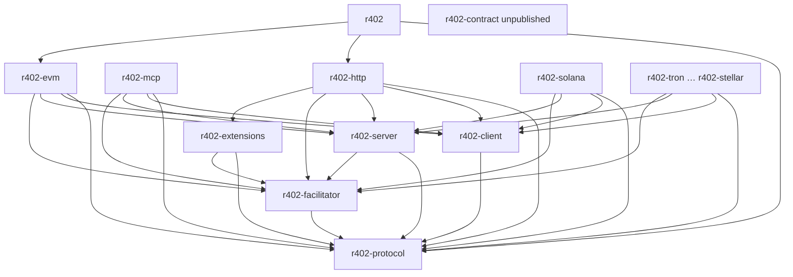

# r402 2026 设计审计与修正施工合同

| Field | Value |
| --- | --- |
| **Title** | 对 `docs/layout/*` 的法医审计，以及可实施的修正设计 |
| **Author** | TBD |
| **Date** | 2026-09-03 |
| **Status** | **Construction contract.** 384 enumerable `.rs`（非 CI 门）。HTTP shape B。三 SettlementMode KEEP。upto KEEP（EVM Permit2 + Solana escrow）。`r402-contract` unpublished。408 / `X402Route` / `into_layer` / 「Approved for construction」作废。 |
| **Workspace** | `/Users/xu/Desktop/qntx/r402` |
| **Ground truth HEAD** | `fb0e1cdfa4990a15cf6a78f7c5ee7e5c646f9b6a`（`origin/main`，workspace **0.17.1**，295 `.rs` / 86 256 LOC） |
| **Working tree** | 未提交 wipe + 空壳 crate + 部分 `r402-protocol` 填入；`Cargo.toml` **0.18.0** |
| **Official clone** | `/Users/xu/Desktop/x/x402` @ `0344bdf54bf962e758480e76088eb2dc3209a169`（`@x402/*` **2.24.0**） |
| **Aesthetic pins** | `/Users/xu/Desktop/qntx/qss`（2 crate / 30 `.rs` / 6 846 LOC）；`/Users/xu/Desktop/qntx/ccip`；多 crate 对照 `ovo`、`signer` |
| **SIWX** | `/Users/xu/Desktop/qntx/siwx` **0.5.0** |
| **Corrected `.rs` 合计** | **384**（可枚举；非 CI 门。禁名 + 合同测试 + 无 God 回归才是验收） |

核心问题：**「这个计划生成的文档是否准确严谨？」**

**短答：CURRENT_TREE 盘点准确。协议判断（V2、paymentFlow ≠ SettlementMode、upto KEEP、三 mode KEEP）正确。TARGET 408 / FILE_MAP / 「Approved for construction」不严谨。本文取代它们。**

施工以本目录为准。`TARGET_TREE.md` / `FILE_MAP.md` / `RULES.md` / `NAMES.md` 是本文修正树与规则的仓库拷贝。不要按记忆里的 408 树施工。

保留的产品决定：wipe 成空壳后自底向上、upto KEEP、三 SettlementMode KEEP、V2-only、`r402-core` 0.17.1 不 yank。作废：408 文件锁、机械 SPLIT、`X402Route`/`into_layer`、把 `r402-contract` 送上 crates.io。

---

## Audit Scope & Method

只读。未改 `crates/` 业务源。地面真相：

1. `git ls-tree -r HEAD` + `git show HEAD:path` + `wc -l`
2. 工作区 `find crates -name '*.rs'`、`git status`、`Cargo.toml`
3. `/Users/xu/Desktop/x/x402` `specs/` + `typescript/` + `go/`
4. `qss` / `ccip` / `ovo` / `signer` / `siwx` 工具链与 crate 形状
5. HEAD：`paygate.rs`、`middleware.rs`、`resource_server/mod.rs`、`error.rs`、`scheme/mod.rs`
6. `docs/layout/*` 与更旧的 `docs/{chain-parity-design,gap-checklist,parity-closure-design,structure-aesthetics-redesign}.md`

计数：物理行。God = 混杂职责且/或生产逻辑 ≳ 800 行。

---

## Verdict

| 维度 | 判定 |
| --- | --- |
| 准确？ | **部分准确。** CURRENT_TREE 对 HEAD **295/295、LOC 零误差**。x402 V2 pin、paymentFlow、官方无 `SettlementMode`、upto、SIWX/`EXTENSION-RESPONSES`/Cache-Control 缺失，均能对上。 |
| 严谨？ | **否（被审计的 layout）。** 408 锁、FILE_MAP glob 含糊、幸福路径写成 `X402Route`。 |
| 可实施？ | **本文修订后可实施。** 树可枚举（384 行表）。验收 = 禁名 + 合同测试 + 无 God 回归，**不是** `wc -l == 384`。 |
| 船就绪？ | **合同已写入 `docs/layout/`。** 业务代码仍禁止动，直到空壳 PR。 |

---

## Findings

严重度：P0 施工会走错；P1 合同/API；P2 过度设计；P3 次要。

### P0-1 — 工作区已经半施工，且偏离空壳合同

被审计 `docs/layout/DESIGN.md` Status 已是 **「Approved for construction (user 2026-09-03)」**。空壳规则在被审计 RULES：每个 TARGET crate 的 `lib.rs` 只有 `//!` + `crate_loads` 断言本包名；crate `Cargo.toml` 没有其它 r402 path 依赖。

磁盘已经违反：

- `git status`：346 `D` + 7 `M` + 23 `??`。HEAD 仍是 `fb0e1cd`（旧 16 crate 完整）。WT `find crates -name '*.rs'` = **26**。
- version **0.18.0**；`publish.yml` 含 **`r402-contract`**。
- `tests/fixtures/**` 已拷。
- `r402-protocol/src/{money.rs,scheme.rs,metrics.rs}` 已有业务（273+118+21）且 `Cargo.toml` 依赖 `rust_decimal`/`serde`/`thiserror`。
- umbrella stub `default = []`，与被审计 DESIGN 的 `default=["evm","http"]` 矛盾。

这是执行打穿合同，不是「等确认」句缺失。修正：`git tag pre-wipe-0.17.1 fb0e1cd`（**git 操作，不是 PR**；仓库今日无此 tag）；空壳 PR 只允许 `lib.rs` + `crate_loads`；protocol 三文件算填入泄漏，清掉后再走 protocol PR。

### P0-2 — `r402-contract` 被放进 crates.io 发布序

WT `publish.yml` packages 含 `r402-contract`。它只读 JSON 断言字符串，无用户。workspace 成员可留，**publish.yml 删除它**。

### P0-3 — TARGET 把 408 当成成功定义；装饰 SPLIT 有精确 drop 集

`TARGET_TREE.md` / `NAMES.md` 合计 **408**，表内自洽。数字自洽不是概念自洽。

**保留的单孩子**（双概念，不是装饰）：`payment_flow/extra.rs`（phases vs wire extra；父文件 779）、`wrapper/flow.rs`（mcp server 1231）、`exact/client/permit2.rs`（569）、`upto/server/escrow.rs`（679）、`settle/distribute.rs`（607）、`channel/open/accounts.rs`（713）。

**强制从 TARGET 删除的装饰行（精确 11 个）：**

| 删除 | HEAD 源 | 为何装饰 |
| --- | --- | --- |
| `r402-algorand/src/chain/account/asa.rs` | `types.rs` 457 | 改名后再切，无第二概念合同 |
| `r402-aptos/src/chain/account/fa.rs` | `types.rs` 417 | 同 |
| `r402-casper/src/chain/account/key.rs` | `types.rs` 854 God | 双概念未在设计期证明。TARGET 强制行只有 `account.rs`（casper 仍 17）。**填入 PR Q 必须拆**成有名字的第二概念模块；新孩子不改 384 |
| `r402-hedera/src/chain/account/token.rs` | `types.rs` 488 | |
| `r402-keeta/src/chain/account/id.rs` | `types.rs` 423 | |
| `r402-near/src/chain/account/nep.rs` | `types.rs` 420 | |
| `r402-stellar/src/chain/account/muxed.rs` | `types.rs` 540 | |
| `r402-tron/src/chain/account/tip.rs` | `types.rs` 511 | |
| `r402-xrpl/src/chain/account/classic.rs` | `types.rs` 543 | |
| `r402-stellar/src/chain/rpc/simulate.rs` | `rpc.rs` 493 | 非 God，无双概念写清 |
| `r402-tron/src/chain/provider/grid.rs` | `provider.rs` 522 | 同 |

另从不作为 **强制 TARGET 行**（实现 PR 若文件仍 >500 且有第二概念可拆，不预建）：`rpc/{algod,mirror,query,ledger}.rs`（581/703/569/704，未达 God ≳800）、`aptos/chain/codec/bcs.rs`（父 565）、`stellar/chain/xdr/ops.rs`（父 680）。

**强制保留的 God SPLIT：** `algorand/chain/codec/group.rs`（codec.rs 814）。TVM `chain/codec/{cell,w5,highload_v3,jetton}` 与 `provider/{toncenter,tonapi}` 是多概念，保留。

SPLIT 规则（唯一）：**TARGET 只预声明已证明双概念的孩子，或设计期已点名的 God SPLIT（如 `algorand/codec/group.rs` 814）。RPC/codec >500 与未点名 God（Casper `types.rs` 854）在填入 PR 拆，不预建 TARGET 行。** 「God 必须拆」= 填入 PR 义务，≠ TARGET 必须预先出现孩子路径。

408 验收数作废。修正合计 **384**（见 Corrected Target Tree）。

### P0-4 — 幸福路径曾把提案写成现状；本文锁定 HEAD 形状

HEAD（`middleware.rs`）：

```text
X402Middleware::try_new(url)?          // L179
  .with_scheme(...)                    // L88
  .with_base_url(...)                  // L110；文档默认 localhost（L28, L106）
  .with_price_tag(tag) -> X402Layer    // L121
  .with_settlement_mode(mode)          // L294，在 X402Layer 上
```

无 `X402Route`、无 `into_layer()`。`ResourceTemplate::resolve`（`paygate.rs` L256–265）在缺 `base_url` 时用 **`Host` 头**，再退回 `http://localhost`。

HEAD README `price_tag` **两参**（L52–55）；代码三参（`exact/server.rs` L54–58）。README 今天编不过。

**锁定形状 B（K15/K31）：** 无 `X402Route`。`with_price_tag` → `Result<X402Layer, BuildError>`。缺 `base_url` **构造期**失败，不在 `Layer::layer`、不在请求期、不读 `Host`。

### P1-1 — 被审计 FILE_MAP 覆盖不足；「42」与 payment_channels 指控不成立

算法（可复现）：HEAD `crates/**/*.rs`（295）中，crate 相对路径（`crates/<name>/` 之后，含 `src/…`）或全路径字符串是否作为 FILE_MAP.md **子串**出现。

| 量 | 值 |
| --- | --- |
| HEAD `.rs` | 295 |
| FILE_MAP 表第一列唯一路径 | **119** |
| 上述子串算法未命中 | **64** |

64 含大量 `exact/error.rs`、`exact/facilitator/settle.rs`、evm `auth_capture/*`、`batch_settlement/*`。被审计 FILE_MAP 用「共同模式」/`{mod,verify,settle}` brace 叙述，**不是**可 grep 的 named glob。

**Solana `upto/payment_channels/{channel,codec,instructions,open,program,voucher}.rs` 在 FILE_MAP 已逐文件映射**（改名为 `upto/channel/…`）。「只改了目录名政策，未逐文件」为假。`payment_channels/mod.rs` 未点名。

夹具：七个 spec_v2 JSON 只以 glob 出现，文件名未列。WT 已拷，合同仍应点名。

修正 FILE_MAP：每个 HEAD `.rs` ∈ 点名行 ∪ **named glob** ∪ DROP。见下文完整表。

### P1-2 — CURRENT_TREE 行数准确

295 路径、86 256 LOC、零 mismatch。God/junk 识别正确。漏标 700–800：`payment_flow.rs` 779、`settlement_batcher.rs` 734、`open.rs` 713、`offer.rs` 704（应拆，不必叫 God）。matching bypass 已关（`paygate.rs` L764）。

### P1-3 — 「qss-like」名不副实

qss：2 crate、30 `.rs`、6 846 行（准确）。多链对照是 `ovo-*` / `signer-*`。crate 名保持 `r402-*`。

### P1-4 — RULES vs qntx：edition/clippy 对；MSRV「对齐 qss」假

r402 MSRV **1.95**（aptos-sdk）。qss/ccip **1.85**。`avoid-breaking-exported-api` r402 false（greenfield 正确）。HashMap 禁令 r402 注释掉（保持）。

### P1-5 — 旧 `docs/*.md` 过时

`gap-checklist.md` 仍写 SVM upto deferred；HEAD 已有。`chain-parity-design.md` 写 0.16.0。`parity-closure-design.md` 把已合并的 matching 当待办。`structure-aesthetics-redesign.md` 写 `r402-svm`。PR 0 标 obsolete。

### P2-1 — `FacilitatorError::Transport` 是新行为

HEAD 变体：Verification / Settlement / Aborted / Onchain / Internal。HTTP 无 502。见 K12 实现细节。

### P2-2 / P2-3 — settlement 三 mode 空文件与 cors/cache 过薄

已从 TARGET 删除 `settlement/{sequential,concurrent,background,compatibility}.rs`。cors/cache 并入 `headers.rs`。`tests/cache.rs` 删除（断言并入 `tests/headers.rs`）。

### P3-1 / P3-2 — HEAD 16 crate vs WT 21 目录；`SettleResponse` 名保留

---

## Key Decisions

| ID | Decision | Rationale |
| --- | --- | --- |
| K1 | 地面真相 = `HEAD` `fb0e1cd`（0.17.1）。WT 半施工不是事实源。 | 旧 crate 只在 HEAD / tag。 |
| K2 | `git tag pre-wipe-0.17.1 fb0e1cd` 是 **git 操作，不进 PR 表**。仓库今日无此 tag。 | 夹具已在 WT；旧源在 HEAD。 |
| K3 | 拆 `r402-core` → protocol / client / server / facilitator / extensions。 | God crate。 |
| K4 | 12 链 crate 名保持 `r402-{evm,solana,…}`。 | 同 `signer-*`。 |
| K5 | `r402-http` 单 crate（Axum+reqwest）+ `r402-mcp`。 | 共享 `headers.rs`。 |
| K6 | 三 SettlementMode KEEP，与 `extra.paymentFlow` 正交。 | 官方未覆盖 authorization 流式 drain。 |
| K7 | upto KEEP（EVM Permit2 + Solana escrow）。其它链不发明。 | spec + TS 2.24 + HEAD。 |
| K8 | V2-only。 | 产品已 V2-only。 |
| K9 | 插件 = `register` / `with_scheme` / `with_hook` / `with_extension`。DROP `Sealed`、registry 三件套、`ChainRegistry`。 | |
| K10 | SIWX：402 携带 challenge；头 `SIGN-IN-WITH-X`；`siwx` 0.5；配置 origin；v1 无 MCP SIWX。实现细节见 HTTP/SIWX 节。 | spec Server↔Client。 |
| K11 | `EXTENSION-RESPONSES` 挂 enum 变体；Cache-Control `set_no_store` / `merge_private`。 | spec §7.2.1；TS #2990。 |
| K12 | `FacilitatorError::Transport` → HTTP **502**。有良好 JSON 的 4xx/5xx 仍 402。 | Fastify `FacilitatorResponseError` → 502（`index.ts` L513–515）。 |
| K13 | 畸形 `Payment-Signature` → **402**。 | TS `extractPayment` L1257–1267 catch → null → 未付款。 |
| K14 | Permit2 → **412**。 | HEAD `reason_to_status`。 |
| K15 | **HTTP 形状 B。** 无 `X402Route`、无 `into_layer`。`with_price_tag`/`with_price_tags`/`with_dynamic_price` → `Result<X402Layer, BuildError>`。缺 `base_url` 在 **这些方法里**失败（构造期）。永不读 `Host`，永不 `http://localhost`。`X402Layer` 在 Ok 之后仍有 `with_settlement_mode` / `with_resource` / `with_description` / `with_mime_type` / `with_hooks`。**`with_resource` 不豁免 `base_url`。** | HEAD Layer 链；Tower `Layer::layer` 无 Result。 |
| K16 | `Eip155Exact::price_tag` 三参。修 README 两参。 | 代码 L54–58 vs README L52–55。 |
| K17 | Umbrella `default=["evm","http"]` 打开各 crate `client`+`server`。落地在 **PR J**。J **Depends 含 G**：G 先让 `r402-http` 声明 `client`/`server`，J 才打开 umbrella 的 `http` feature。 | HEAD 只 `dep:`。空壳 `r402-http` 无 role feature。 |
| K18 | 禁名：`paygate`/`wire`/`types.rs`/`shared`/`r402-client` 根 `client.rs`。类型 `Paygate`→`Gate`。度量禁 `r402_paygate_*`。 | |
| K19 | SPLIT 规则见 P0-3。禁止预建 11 个装饰路径。 | |
| K20 | `r402-contract` **unpublished workspace 成员**（3 `.rs` 在 384 表内）。不删除。不进 `publish.yml`。 | 空壳阶段 JSON 合同测试需要独立 crate；umbrella 当时无 path dep。 |
| K21 | 规范钉 `0344bdf`。**HEAD 无 `vendor/`**（372 路径，0 条 `vendor/`）。wipe **不要** `git rm vendor/`。禁止再加入。 | |
| K22 | crates.io `r402-core` 0.17.1 不 yank。 | |
| K23 | MSRV **1.95** 因为 **aptos-sdk**，不是因为 qss/ccip（它们 1.85）。edition 2024，resolver 3。 | |
| K24 | `avoid-breaking-exported-api = false`。不用 HashMap 禁令。 | |
| K25 | MCP v1 不暴露 SettlementMode。Transport → tool `isError`。 | |
| K26 | Concurrent 插入 actual → 402 并 drop settle。Background strip。Sequential 才应用 actual。 | `paygate.rs` L932–934、L940、L953、L965–975、L1078–1086。 |
| K27 | Concurrent/Background × upfront/escrow = 500。检查全部 resolved accepts。 | |
| K28 | 空壳：每 crate 仅 `lib.rs`（`//!` + `crate_loads`）。禁止空壳写入 `money.rs`。 | WT 已违规。 |
| K29 | 不做 Concordium/Cardano/Canton/Starknet/Sui/A2A/CLI/ERC-7710/builder-code/offer-receipt/http-message-signatures/auth-hints。未知 extension roundtrip。bazaar advertise-only。 | |
| K30 | 继续 WT（保留夹具）。先收口空壳，再填。 | |
| K31 | 幸福路径 `.layer(x402.with_price_tag(...)?.with_settlement_mode(...))`。`tower::Layer` 只在 `X402Layer`。 | K15。 |
| K32 | 本文 384 文件表可枚举。CI **不得** `wc -l` 等于 384。实现 PR **可多** SPLIT God（Casper `account.rs` 在 PR Q 拆出的孩子不算少行）。**不可少强制行。禁止把强制孩子并回父文件**（`algorand/codec/group.rs` 强制，God 814）。 | RULE 8 / RULE 9。 |

---

## Settlement Modes Evaluation

定义：`paygate.rs` L108–116。调度：`middleware.rs` L447–449。模块文档 L9–17 与实现一致。

| Mode | 方法 | 顺序 | Receipt | Handler 失败 | upto actual |
| --- | --- | --- | --- | --- | --- |
| `Sequential`（default） | `handle_request` | verify → execute → settle | 贴 | cancel（settle 未启动） | 应用 |
| `Concurrent` | `handle_request_concurrent` | verify → (settle ∥ execute) → join | 贴 | drop `settle_handle`（L940、L953、L972） | **402** `SettlementAborted`（L965–975） |
| `Background` | `handle_request_background` | verify → spawn settle → execute → return | 不贴（L106、L998） | 已 spawn（detach） | strip 不失败（L1078–1086）；按签名 max |

官方 `typescript/`+`go/`+`specs/` 对 `SettlementMode` **零命中**。只有 `extra.paymentFlow`（spec §6.1 **L295–297**；`paymentFlow.ts` L18–34）：

| Flow | 顺序 | `/verify` |
| --- | --- | --- |
| `authorization` | verify → resource → settle → respond | 有 |
| `upfront` | settle → resource → respond | 无 |
| `escrow` | settle → resource → settle → respond | 无 |

Fastify `onSend`：**L406–515**（`processSettlement` L476；`FacilitatorResponseError` → **502** 在 L513–515）。handler 写完 body 才 settle。这是 Sequential authorization。

upto **禁止** upfront（`scheme_upto.md` L15–17）。auth-capture 是 scheme，不是 HTTP 等待策略。

**裁决：KEEP 三 mode。** 调度在 `r402-server/src/settlement.rs`（无 Axum）。HTTP Gate 三入口。MCP 不暴露。authorization × 三 mode；upfront/escrow 仅 Sequential。

```rust
pub fn schedule(flow: PaymentFlowPhases, mode: SettlementMode)
    -> Result<SettlementSchedule, IncompatibleSettlementMode>;

pub enum AfterHandler { WaitThenSettle, JoinSettle, SpawnSettle, EchoReceipt }

pub async fn finish(
    schedule: SettlementSchedule,
    settle: Option<impl Future<Output = Result<SettleResponse, FacilitatorError>> + Send>,
) -> Result<SettleResponse, FacilitatorError>;

pub async fn run<T, E>(
    schedule: SettlementSchedule,
    handler: impl Future<Output = Result<T, E>> + Send,
    settle: impl Future<Output = Result<SettleResponse, FacilitatorError>> + Send,
) -> ScheduledSettlement<T, E>;

pub enum ScheduledSettlement<T, E> {
    HandlerOkSettleOk { value: T, receipt: SettleResponse },
    HandlerErrDetach { error: E },
    SettleErr { value: T, error: FacilitatorError },
    Spawned { value: T },
}
```

禁止用一个 `run(handler, settle)` 覆盖 Sequential。`run` 不读 HTTP status、不读 overrides。

---

## Upto Evaluation

1. spec 一等：`specs/schemes/upto/`。用例「LLM token generation」。verify amount = max，settle amount = actual ≤ max。
2. TS 2.24：`mechanisms/evm/src/upto/`、`mechanisms/svm/src/upto/`。
3. HEAD：EVM `upto/facilitator/verify.rs` **1017**；Solana `upto/server.rs` 679、`settle.rs` 607。`crates/README.md` 漏写是文档 bug。
4. exact 不能事后下调金额。
5. 与 SettlementMode 正交：actual 仅 Sequential。

EVM upto = Permit2 witness（非 on-chain lock）。Solana upto = escrow 存款。安全模型不同。

**KEEP。** TARGET 含两条链的 `src/upto/`。`payment_channels/` → `upto/channel/`。

---

## Gap vs Official x402

Pin `@ 0344bdf`，Protocol Version **2**，CAIP-2，schemes `exact`/`upto`/`auth-capture`/`batch-settlement`。无 V1。Plugins 不必对齐。

### HEAD 已有

Wire V2；头发出 `Payment-*`（KEEP）；facilitator 三端点；`SupportedResponse.extensions: Vec<CompactString>`（`rpc.rs` L987）；paymentFlow；matching 走 `find_matching_requirements`（`paygate.rs` L764）；spendControls；$1；12 链（+Tron +Casper，无 Concordium）；EVM 四 scheme；SVM upto；MCP dual-format。SIWX 仅 `PaygateHooks::GrantAccess` 槽（`middleware.rs` L403）。

### 应做（实现细节）

**EXTENSION-RESPONSES（spec §7.2.1；`httpFacilitatorClient.ts` L256–325）。** 头值 base64 JSON object keyed by extension。decode 失败忽略。挂在 `VerifyResponse`/`SettleResponse` **变体**字段 `extension_responses`，**不**进买家 Wire，**不** merge 进 `extensions`。日志 allowlist：`status` / `rejectedReason` / `reason` / `code`。

**Cache-Control（TS Fastify #2990，`index.ts` L503–509 合并 `private`）。**

```rust
fn set_no_store(headers: &mut HeaderMap);      // 402/412/settle-fail：写入 no-store
fn merge_private(headers: &mut HeaderMap);     // 200 + Payment-Response：已有值则 `existing, private`，否则 `private`
```

**Transport → 502。**

```rust
pub enum FacilitatorTransportKind {
    Timeout,
    HttpStatus { status: u16 }, // 非 2xx 且 body 不是良好 verify/settle JSON
    MalformedSuccessBody,       // 2xx 但 JSON 不是 VerifyResponse/SettleResponse
}
```

4xx/5xx **带** 可解析的 `isValid`/`success` JSON → `Verification`/`Settlement` → **402**。超时、无 body 的非成功 HTTP、畸形成功 JSON → `Transport` → **502**。Client 自动重试仅 402。

**SIWX v1。**

- Challenge **写在 402** `PaymentRequired.extensions["sign-in-with-x"]`（spec 形状：`info.nonce` 32 hex、`issuedAt`、`expirationTime` 默认 issuedAt+5min、`supportedChains`）。v1 **无**独立 challenge 端点。
- 客户端把 proof 放 `SIGN-IN-WITH-X`（base64 JSON），**不是** `PaymentPayload.extensions`。
- `domain`/`uri` origin 对 **配置的 public origin**，永不 `Host`（spec L268、L315）。
- Nonce：`has_used_nonce` / `record_nonce` 成对；用过即拒 `invalid_siwx_nonce`。
- `PaidAddressStore`：key = **configured origin + request path**；值 = 已 `SettleResponse::Success` 的地址集合；v1 进程内 HashMap；无 Redis；无强制 TTL eviction（nonce 过期靠 `expirationTime`）。
- GrantAccess 当且仅当：CAIP-122 验签通过（`siwx`/`siwx-evm`/`siwx-svm` 0.5）**且**（`with_auth_only` **或** store 命中）。空 price tag 无 `with_auth_only` 仍是 layer bypass，不在 Gate。
- 错误码留在 `r402-extensions::siwx`（`invalid_siwx_*`），不进 facilitator `ErrorReason`。
- 验签失败/过期 → 当未付款继续 402（带新 challenge），不是 401/403。

**缺 `base_url`：** 构造期 `BuildError::MissingBaseUrl`。禁止 Host 回退（今日 `paygate.rs` L256–265）。

### 故意不做

builder-code、offer-receipt、http-message-signatures、auth-hints、A2A、Express/Hono/Next/paywall、Concordium、SVM/Cloudflare batch-settlement、MCP SIWX、bazaar discovery client。

畸形头：spec HTTP 表 400；TS 402。**锁 402。**

隐藏 bug 复验：matching 已关；`"missing X-PAYMENT"` 在 `public_api.rs` L51 / `offer.rs` L602；假 `facilitator` feature 在 HEAD `r402-http/README.md`；`Sealed` L28/L131–134；`ChainRegistry` 仅定义。

---

## External-behavior contract（一页）

### CLI / 文件

无 CLI。夹具：`tests/fixtures/spec_v2/` 七 JSON + 链 JSON/b64 + `tests/fixtures/contract/{headers,settlement_modes}.json`。

### Library — HEAD（0.17.1）

`r402 = { features = ["evm","http","client","server"] }` + `use r402_evm` / `r402_http`。`with_price_tag` → `X402Layer`。`price_tag` 三参（README 两参是 bug）。无 Route / into_layer / Transport / SIWX 类型。`Paygate` 公开。

### Library — TARGET（0.18）

```toml
[dependencies]
r402 = { version = "0.18", features = ["evm", "http"] }
axum = "0.8"
alloy-primitives = "1"
alloy-signer-local = "1"
reqwest = { version = "0.13", features = ["json"] }
anyhow = "1"
tokio = { version = "1", features = ["rt-multi-thread", "macros"] }
```

`http`/`evm` feature 打开对应 crate 的 `client`+`server`（K17，PR J 落地）。库用 thiserror。

```rust
fn paid_router() -> anyhow::Result<axum::Router> {
    use alloy_primitives::address;
    use axum::{Router, routing::get};
    use r402::evm::{Eip155Exact, USDC};
    use r402::http::server::{SettlementMode, X402Middleware};

    let x402 = X402Middleware::try_new("https://facilitator.example.com")?
        .with_base_url("https://api.example.com".parse()?)
        .with_scheme("eip155:*".parse()?, Eip155Exact);

    let app = Router::new().route(
        "/paid-content",
        get(handler).layer(
            x402.with_price_tag(Eip155Exact::price_tag(
                address!("0xYourPayToAddress"),
                USDC::base().amount(1_000_000u64),
                None,
            ))?
            .with_settlement_mode(SettlementMode::Sequential),
        ),
    );
    Ok(app)
}
```

无 `.into_layer()`。`with_price_tag` 的 `?` 是 `BuildError::MissingBaseUrl`。

```rust
async fn pay() -> anyhow::Result<reqwest::Response> {
    use alloy_signer_local::PrivateKeySigner;
    use r402::evm::Eip155ExactClient;
    use r402::http::{WithPayments, X402Client};
    use std::sync::Arc;

    let signer = Arc::new("0x...".parse::<PrivateKeySigner>()?);
    let client = reqwest::Client::new().with_payments(
        X402Client::new().register(Eip155ExactClient::new(signer)),
    );
    Ok(client.get("https://api.example.com/paid").send().await?)
}
```

类型链：

```text
X402Middleware::try_new(url)?
    .with_base_url(origin)             // 必填；缺则 with_price_tag 失败
    .with_scheme(pattern, Eip155Exact)
    .with_auth_only(siwx_cfg)          // 可选；在 Middleware 上
    .with_price_tag(tag)?              // Result<X402Layer, BuildError::MissingBaseUrl>
        .with_settlement_mode(mode)
        .with_resource(url)            // 钉死完整 resource URL；不豁免 base_url
        .with_description(s)
        .with_mime_type(s)
        .with_hooks(h)
// tower::Layer 只在 X402Layer。无 into_layer。无 X402Route。
```

`with_resource` 覆盖该路由的 `ResourceInfo.url`，**不**替代 `with_base_url`。未调 `with_base_url` 时 `with_price_tag` 仍返回 `Err(MissingBaseUrl)`。`r402::http::server` 再导出 `SettlementMode`。

### Wire

| 项 | 契约 |
| --- | --- |
| Version | `x402Version: 2` |
| 402 | `Payment-Required: <base64>` Title-Case |
| 重试 | `Payment-Signature` |
| 回执 | `Payment-Response` |
| SIWX | `SIGN-IN-WITH-X` |
| CORS expose | `Payment-Required, Payment-Response` |
| Cache-Control | 见上 |
| Facilitator | `/verify` `/settle` `/supported`；`extensions` array |
| MCP | `_meta["x402/payment"]`；tool `isError` dual format |
| JSON | camelCase，`deny_unknown_fields` |

| 情况 | 状态 |
| --- | --- |
| 未付款 / verify 失败 / settle 失败 / 畸形头 | 402 |
| Permit2 | 412 |
| 不兼容 mode / 缺 scheme | 500 |
| Transport | 502 |
| 成功 | 200 |

MUST keep：三 mode 语义；actual 仅 Sequential；Permit2 412；smart wallet 6492/1271/2098；12 链；EVM+Solana upto；spendControls $1。

锁死缺陷：X-PAYMENT 用语、假 facilitator feature、Sealed、localhost/Host 回退、畸形 402、Payment-* 发出、Transport 502、补 Cache-Control/EXTENSION-RESPONSES/SIWX、`Paygate`→`Gate`、README 三参。

---

## Architecture quality



缝正确。21 个成员、20 个发布包（contract unpublished）。不要合并回 `r402-core`。不要拆 `r402-axum`。

---

## Current disk state

| 层 | 状态 |
| --- | --- |
| `origin/main` `fb0e1cd` | 16 crate，295 `.rs`，86 256 LOC，0.17.1。行为 oracle。**无 `vendor/`**（372 路径）。 |
| WT | 旧源 staged `D`；21 个 TARGET 名目录 `??`；protocol 泄漏；0.18.0；publish 含 contract；umbrella `default=[]`。 |
| tag `pre-wipe*` | **不存在**。应对 `fb0e1cd` 打。 |

---

## Corrected CURRENT_TREE facts

HEAD 盘点可当事实：295 / 86 256，crate 合计与 CURRENT_TREE 一致。补丁：SettlementMode 在 `paygate.rs` L108–116；无 Transport；`with_price_tag`→`X402Layer`；`price_tag` 三参 vs README 两参；umbrella feature 只 `dep:`；GrantAccess 无 `with_auth_only`；extensions 已是 array；度量 `r402_paygate_background_settle_total`；无 Cache-Control / EXTENSION-RESPONSES；19 个非 rs 夹具。

---

## Corrected Target Tree

成功 = 禁名不在树 + `r402-contract` JSON 绿 + 无 God 回归 + **下列强制路径都存在**。`.rs` 合计 **384**。`~LOC` 是 review 上限。`lib.rs` 只 mods + `pub use`。

### 强制文件计数

| Crate | `.rs` | 相对被审计 TARGET |
| --- | ---: | --- |
| `r402-protocol` | 27 | 同 |
| `r402-client` | 9 | 同 |
| `r402-server` | 19 | 23−4 mode 装饰 |
| `r402-facilitator` | 10 | 同 |
| `r402-http` | 27 | 30−`cors.rs`−`cache.rs`−`tests/cache.rs` |
| `r402-mcp` | 9 | 同 |
| `r402-extensions` | 12 | 同 |
| `r402-contract` | 3 | 同（unpublished） |
| `r402-evm` | 57 | 同（God SPLIT + upto KEEP） |
| `r402-solana` | 41 | 同 |
| `r402-algorand` | 18 | 20−asa−algod；KEEP `codec/group.rs` |
| `r402-aptos` | 15 | 17−fa−bcs |
| `r402-casper` | 17 | 18−key |
| `r402-hedera` | 16 | 18−token−mirror |
| `r402-keeta` | 15 | 16−id |
| `r402-near` | 15 | 17−nep−query |
| `r402-stellar` | 17 | 20−muxed−simulate−ops |
| `r402-tron` | 16 | 18−tip−grid |
| `r402-tvm` | 24 | 同 |
| `r402-xrpl` | 16 | 18−classic−ledger |
| `r402` | 1 | 同 |
| **合计** | **384** | 被审计 408 |

### Workspace root

KEEP：`clippy.toml` `rustfmt.toml` `deny.toml` `workspace.lints` `.github/workflows/*` `LICENSE-*` `AGENTS.md` `CONTRIBUTING.md` `SECURITY.md`。`rust-toolchain.toml`：`channel=stable` + `components=["rustfmt","clippy"]` + `profile=minimal`。`Justfile all: fmt clippy-fix deny test doc-check`。无 Makefile。**无 `vendor/`；禁止加入。**

夹具（已在 WT）：

```text
tests/fixtures/spec_v2/payment_payload_eip3009.json
tests/fixtures/spec_v2/payment_required.json
tests/fixtures/spec_v2/settle_response_failure.json
tests/fixtures/spec_v2/settle_response_success.json
tests/fixtures/spec_v2/supported_response.json
tests/fixtures/spec_v2/verify_response_invalid.json
tests/fixtures/spec_v2/verify_response_valid.json
tests/fixtures/payment_proptest.proptest-regressions
tests/fixtures/algorand/spec_payment_group.json
tests/fixtures/aptos/extra.json
tests/fixtures/aptos/ts_encode_aptos_payload.json
tests/fixtures/hedera/extra.json
tests/fixtures/keeta/ts_block.b64
tests/fixtures/keeta/ts_payment_payload.json
tests/fixtures/near/ts_signed_delegate.json
tests/fixtures/stellar/extra_sponsored.json
tests/fixtures/stellar/ts_transaction.b64
tests/fixtures/tvm/extra_sponsored.json
tests/fixtures/xrpl/ts_payment_requirements.json
tests/fixtures/contract/headers.json
tests/fixtures/contract/settlement_modes.json
```

`headers.json` / `settlement_modes.json` schema 保持被审计 TARGET（含 502 与三 mode 字符串）。Forbidden：`Makefile`、`vendor/`、`#[ignore]` 锁未存在类型。

### `crates/r402` — 1

`src/lib.rs` ~60：`pub use r402_evm as evm`；`pub use r402_http as http`；再导出 `SettlementMode`。`Cargo.toml` 在 PR J：`default=["evm","http"]`；`http = ["dep:r402-http","r402-http/client","r402-http/server"]`（evm 同理）。空壳阶段 `default=[]`、无 path dep（K28）。

### `crates/r402-contract` — 3 unpublished

`src/lib.rs`；`tests/headers.rs`；`tests/modes.rs`。零 r402 path 依赖。

### `crates/r402-protocol` — 27

Forbidden：tokio、HTTP、链 RPC、`wire/`、`ChainRegistry`。

| Path | ~LOC |
| --- | ---: |
| `src/lib.rs` | 40 |
| `src/money.rs` | 250 |
| `src/metrics.rs` | 80 |
| `src/error.rs` | 200 |
| `src/error/reason.rs` | 250 |
| `src/error/problem.rs` | 150 |
| `src/network.rs` | 80 |
| `src/network/id.rs` | 150 |
| `src/network/pattern.rs` | 150 |
| `src/network/token.rs` | 120 |
| `src/scheme.rs` | 200 |
| `src/extension.rs` | 350 |
| `src/payment.rs` | 40 |
| `src/payment/codec.rs` | 270 |
| `src/payment/extensions.rs` | 220 |
| `src/payment/resource.rs` | 150 |
| `src/payment/requirements.rs` | 250 |
| `src/payment/required.rs` | 120 |
| `src/payment/payload.rs` | 150 |
| `src/payment/price.rs` | 80 |
| `src/payment/verify.rs` | 350 |
| `src/payment/settle.rs` | 350 |
| `src/payment/supported.rs` | 150 |
| `src/payment/overrides.rs` | 120 |
| `tests/public_api.rs` | 200 |
| `tests/spec_fixtures.rs` | 170 |
| `tests/payment_proptest.rs` | 370 |

`FacilitatorError::Transport { kind: FacilitatorTransportKind }`。变体上 `extension_responses`。度量名 `r402_background_settle_total`。

### `crates/r402-client` — 9

Forbidden：HTTP、Axum、crate-root `client.rs`。

`src/{lib,register,select,policy,spend,hooks,candidate}.rs`；`tests/{spend,select}.rs`。SpendControls 默认 $1。

### `crates/r402-server` — 19

Forbidden：reqwest、Axum、`resource_server/`、`settlement/{sequential,concurrent,background,compatibility}.rs`。

| Path | ~LOC |
| --- | ---: |
| `src/lib.rs` | 40 |
| `src/resource.rs` | 350 |
| `src/verify.rs` | 300 |
| `src/settle.rs` | 350 |
| `src/required.rs` | 250 |
| `src/matching.rs` | 200 |
| `src/cancel.rs` | 200 |
| `src/scheme.rs` | 200 |
| `src/payment_flow.rs` | 250 |
| `src/payment_flow/extra.rs` | 250 |
| `src/settlement.rs` | 250 |
| `src/settlement/tracker.rs` | 180 |
| `src/hooks.rs` | 40 |
| `src/hooks/resource.rs` | 250 |
| `src/hooks/policy.rs` | 350 |
| `src/hooks/snapshot.rs` | 250 |
| `tests/payment_flow.rs` | 200 |
| `tests/settlement.rs` | 250 |
| `tests/hooks.rs` | 200 |

兼容性函数住在 `settlement.rs`。`pub use settlement::SettlementMode`。

### `crates/r402-facilitator` — 10

`src/{lib,facilitator,hooks,cache,pending}.rs`；`src/http.rs`；`src/http/{client,auth,retry}.rs`；`tests/http.rs`。

`http/client.rs` 解析 EXTENSION-RESPONSES。GET `/supported` 仅 429 重试。Transport 三态见 K12。

### `crates/r402-http` — 27

Forbidden：`paygate.rs`、`middleware.rs`、`cors.rs`、`cache.rs`、`X402Route`、`into_layer`。`server.rs` `pub use SettlementMode`。

| Path | ~LOC | belongs |
| --- | ---: | --- |
| `src/lib.rs` | 40 | 再导出 X402Client, WithPayments, X402Middleware, SettlementMode |
| `src/headers.rs` | 120 | Payment-*、SIGN-IN-WITH-X、`X402_EXPOSED_HEADERS`、`set_no_store`、`merge_private` |
| `src/buyer.rs` | 40 | feature client |
| `src/buyer/retry.rs` | 250 | 仅 402 重试 |
| `src/buyer/signature.rs` | 80 | |
| `src/server.rs` | 40 | feature server |
| `src/server/builder.rs` | 250 | X402Middleware；`with_base_url`；`with_auth_only`；`with_price_tag` → `Result<X402Layer, BuildError>`。声明 feature `client`/`server`（空壳无此 feature；G 起有） |
| `src/server/layer.rs` | 250 | X402Layer：`with_settlement_mode` / `with_resource` / `with_description` / `with_mime_type` / `with_hooks`。Layer impl。空 tag bypass。`with_resource` 不豁免 `base_url` |
| `src/server/gate.rs` | 250 | 三入口薄分发。`Gate`/`GateError`/`GateHooks` |
| `src/server/verify.rs` | 220 | 步骤 1–5 |
| `src/server/fail.rs` | 150 | 步骤 7–8；Transport 502 |
| `src/server/receipt.rs` | 150 | 步骤 11–12 |
| `src/server/pricing.rs` | 130 | |
| `src/server/hooks.rs` | 100 | GrantAccess 槽 |
| `src/server/overrides.rs` | 250 | |
| `src/server/siwx.rs` | 200 | feature siwx；实现 GrantAccess |
| `tests/sequential.rs` | 200 | |
| `tests/concurrent.rs` | 200 | overrides → 402 |
| `tests/background.rs` | 200 | strip；无 Payment-Response |
| `tests/headers.rs` | 150 | 头名 + Cache-Control + CORS |
| `tests/sidechannel.rs` | 120 | EXTENSION-RESPONSES 不进买家 |
| `tests/boundary.rs` | 150 | 502 vs 402 vs 500 |
| `tests/overrides.rs` | 150 | Sequential actual |
| `tests/siwx.rs` | 200 | 零 `/verify`；永不 Host |
| `tests/upfront.rs` | 120 | 一次 `/settle` |
| `tests/build.rs` | 80 | `with_price_tag` → MissingBaseUrl |
| `tests/buyer.rs` | 150 | 402 重试；412/502 不重试 |

16 src + 11 tests = **27**。

### Gate 共享步骤（三入口；Concurrent/Background PR 不得复制 Sequential verify）

**Sequential `handle_request`：**

1. **GateHooks GrantAccess**（HTTP Sequential PR = 槽；SIWX PR 的 `siwx.rs` 实现）。空 tag bypass 在 `layer.rs`/`builder.rs`，不在 Gate。
2. compatibility（Concurrent/Background × upfront/escrow = 500）
3. ResourceServer verify
4. skip_handler → inline settle
5. settle-before if `phases.settle_before_handler`（upfront/escrow deposit）
6. call inner
7. `Ok(Response)` 4xx/5xx 当失败。**永不进 `run()`/`finish()`。**
8. 失败 → cancel-settle + failure-path Payment-Response；return
9. Sequential 成功 → 应用 Settlement-Overrides / UptoActualAmount
10. after-handler：`settle_after_handler` → `finish(WaitThenSettle, settle_fut)`；upfront → `finish(EchoReceipt, None)`；**escrow → `finish(WaitThenSettle, 第二次 settle)`**
11. 贴 Payment-Response iff Attach
12. Cache-Control（`set_no_store` / `merge_private`）；Transport → 502；isValid:false → 402；MissingScheme → 500

**Concurrent `handle_request_concurrent`：** 步骤 1–5 同（`verify.rs`）。然后：

6. 包装 inner（**调用 `run` 之前**）：`Ok(Response)` 4xx/5xx → `Err`；含 overrides/`UptoActualAmount` → `Err(SettlementAborted)`。未 poll 的 settle 按签名 max。
7. `run(JoinSettle, handler, settle)`。handler `Err` → `HandlerErrDetach` 并 **drop settle、不 await**。
8. `HandlerErrDetach(SettlementAborted)` → **402**；其它 `HandlerErrDetach` → cancel + 错误响应；`SettleErr` → 402；`HandlerOkSettleOk` → 步骤 11–12。

**Background `handle_request_background`：** 步骤 1–5 同。然后：

6. 包装 inner：仅 4xx/5xx → `Err`。不把 overrides 变 Err。settle 按签名 max。
7. `run(SpawnSettle, …)` → `Spawned { value: Response }`
8. 在该 Response 上 strip overrides/`UptoActualAmount`；不因此 402。
9. 不贴 Payment-Response。cache：无 receipt 不强制 private。

畸形 Payment-Signature → 402。

### `crates/r402-mcp` — 9

`src/{lib,meta,tool,error,buyer}.rs`；`src/wrapper.rs`；`src/wrapper/flow.rs`；`tests/{tool,wrapper}.rs`。

### `crates/r402-extensions` — 12

`src/{lib,bazaar,payment_id,eip2612,erc20}.rs`；`src/siwx.rs`；`src/siwx/{advertise,proof,origin,paid}.rs`；`tests/{bazaar,siwx}.rs`。`origin.rs`：永不 Host。`paid.rs`：PaidAddressStore。

### `crates/r402-evm` — 57（upto KEEP）

| Path | ~LOC |
| --- | ---: |
| `src/lib.rs` | 80 |
| `src/error.rs` | 100 |
| `src/asset.rs` | 100 |
| `src/permit2.rs` | 150 |
| `src/signature.rs` | 130 |
| `src/signer.rs` | 50 |
| `src/eip2612.rs` | 180 |
| `src/erc20.rs` | 120 |
| `src/networks.rs` | 80 |
| `src/networks/table.rs` | 250 |
| `src/networks/usdc.rs` | 250 |
| `src/chain/mod.rs` | 40 |
| `src/chain/account.rs` | 250 |
| `src/chain/provider.rs` | 300 |
| `src/chain/nonce.rs` | 100 |
| `src/chain/contracts.rs` | 40 |
| `src/exact/mod.rs` | 60 |
| `src/exact/payload.rs` | 360 |
| `src/exact/client.rs` | 350 |
| `src/exact/client/permit2.rs` | 220 |
| `src/exact/server.rs` | 90 |
| `src/exact/facilitator/mod.rs` | 350 |
| `src/exact/facilitator/verify.rs` | 400 |
| `src/exact/facilitator/settle.rs` | 370 |
| `src/exact/facilitator/contract.rs` | 90 |
| `src/exact/facilitator/signature.rs` | 50 |
| `src/upto/mod.rs` | 100 |
| `src/upto/payload.rs` | 310 |
| `src/upto/server.rs` | 330 |
| `src/upto/client.rs` | 280 |
| `src/upto/client/signing.rs` | 170 |
| `src/upto/client/eip2612.rs` | 180 |
| `src/upto/facilitator/mod.rs` | 250 |
| `src/upto/facilitator/verify.rs` | 350 |
| `src/upto/facilitator/verify_witness.rs` | 350 |
| `src/upto/facilitator/verify_permit2.rs` | 320 |
| `src/upto/facilitator/settle.rs` | 150 |
| `src/upto/facilitator/contract.rs` | 110 |
| `src/auth_capture/mod.rs` | 150 |
| `src/auth_capture/payload.rs` | 200 |
| `src/auth_capture/client.rs` | 250 |
| `src/auth_capture/server.rs` | 100 |
| `src/auth_capture/facilitator.rs` | 200 |
| `src/auth_capture/verify.rs` | 200 |
| `src/auth_capture/nonce.rs` | 100 |
| `src/batch_settlement/mod.rs` | 120 |
| `src/batch_settlement/payload.rs` | 220 |
| `src/batch_settlement/client.rs` | 180 |
| `src/batch_settlement/server.rs` | 90 |
| `src/batch_settlement/facilitator.rs` | 160 |
| `src/batch_settlement/verify.rs` | 100 |
| `src/batch_settlement/channel.rs` | 130 |
| `src/batch_settlement/store.rs` | 120 |
| `src/batch_settlement/voucher.rs` | 150 |
| `tests/exact.rs` | 200 |
| `tests/upto.rs` | 200 |
| `tests/onchain_deployment.rs` | 226 |

`price_tag(pay_to, asset, transfer_method: Option<AssetTransferMethod>)` 三参。

### `crates/r402-solana` — 41（upto KEEP）

Forbidden：`shared.rs`、`payment_channels/`。

| Path | ~LOC |
| --- | ---: |
| `src/lib.rs` | 70 |
| `src/networks.rs` | 80 |
| `src/networks/table.rs` | 250 |
| `src/networks/usdc.rs` | 200 |
| `src/chain/mod.rs` | 30 |
| `src/chain/account.rs` | 250 |
| `src/chain/provider.rs` | 300 |
| `src/chain/rpc.rs` | 90 |
| `src/exact/mod.rs` | 50 |
| `src/exact/payload.rs` | 250 |
| `src/exact/error.rs` | 120 |
| `src/exact/client.rs` | 300 |
| `src/exact/server.rs` | 130 |
| `src/exact/facilitator/mod.rs` | 180 |
| `src/exact/facilitator/verify.rs` | 350 |
| `src/exact/facilitator/settle.rs` | 200 |
| `src/exact/facilitator/config.rs` | 110 |
| `src/exact/facilitator/memo.rs` | 110 |
| `src/exact/facilitator/smart_wallet.rs` | 250 |
| `src/upto/mod.rs` | 60 |
| `src/upto/payload.rs` | 110 |
| `src/upto/error.rs` | 70 |
| `src/upto/client.rs` | 260 |
| `src/upto/server.rs` | 350 |
| `src/upto/server/escrow.rs` | 330 |
| `src/upto/facilitator/mod.rs` | 200 |
| `src/upto/facilitator/verify.rs` | 250 |
| `src/upto/facilitator/settle.rs` | 300 |
| `src/upto/facilitator/settle/distribute.rs` | 300 |
| `src/upto/facilitator/config.rs` | 80 |
| `src/upto/facilitator/storage.rs` | 80 |
| `src/upto/channel/mod.rs` | 50 |
| `src/upto/channel/account.rs` | 170 |
| `src/upto/channel/codec.rs` | 200 |
| `src/upto/channel/instructions.rs` | 220 |
| `src/upto/channel/open.rs` | 350 |
| `src/upto/channel/open/accounts.rs` | 350 |
| `src/upto/channel/program.rs` | 140 |
| `src/upto/channel/voucher.rs` | 90 |
| `tests/exact.rs` | 200 |
| `tests/upto.rs` | 200 |

### Exact-only — 共同骨架

features：`client, server, facilitator, telemetry, full`。Forbidden：`types.rs`、`hex.rs`、crate-root `provider.rs`、`codecs/`、上列 11 个装饰路径。`exact/client.rs` / `exact/facilitator/verify.rs`：400–600 豁免。

每个 crate默认文件：`src/lib.rs`、`src/networks.rs`、`src/chain/mod.rs`、`src/chain/account.rs`、`src/exact/{mod,payload,error,client,server}.rs`、`src/exact/facilitator/{mod,verify}.rs`、`tests/exact.rs`。有 RPC 的加 `src/chain/rpc.rs`（单文件）。有 provider 的加 `src/chain/provider.rs`。有 settle 的加 `facilitator/settle.rs`（Casper 无）。

#### `r402-algorand` — 18

`src/lib.rs`、`src/networks.rs`、`src/chain/{mod,account,provider,rpc,signer,codec}.rs`、`src/chain/codec/group.rs`、`src/exact/{mod,payload,error,client,server}.rs`、`src/exact/facilitator/{mod,verify,settle}.rs`、`tests/exact.rs`。夹具 `spec_payment_group.json`。

#### `r402-aptos` — 15

`src/lib.rs`、`src/networks.rs`、`src/chain/{mod,account,provider,codec}.rs`、`src/exact/{mod,payload,error,client,server}.rs`、`src/exact/facilitator/{mod,verify,settle}.rs`、`tests/exact.rs`。

#### `r402-casper` — 17

`src/lib.rs`、`src/networks.rs`、`src/chain/{mod,motes,codec,account}.rs`、`src/exact/{mod,payload,error,eip712,client,server}.rs`、`src/exact/facilitator/{mod,config,transport,verify}.rs`、`tests/exact.rs`。Forbidden：`hex.rs`。Env：`R402_CASPER_FACILITATOR_URL`。`account.rs` 对应 HEAD `types.rs` 854：TARGET **不**预声明 `account/key.rs`；PR Q 按 RULE 9 在填入时拆出有名字的第二概念文件（不改本表 17 / 合计 384）。

#### `r402-hedera` — 16

`src/lib.rs`、`src/networks.rs`、`src/chain/{mod,account,provider,tx,rpc}.rs`、`src/exact/{mod,payload,error,client,server}.rs`、`src/exact/facilitator/{mod,verify,settle}.rs`、`tests/exact.rs`。

#### `r402-keeta` — 15

`src/lib.rs`、`src/networks.rs`、`src/chain/{mod,account,provider}.rs`、`src/exact/{mod,payload,error,client,server}.rs`、`src/exact/facilitator/{mod,verify,settle,queue}.rs`、`tests/exact.rs`。

#### `r402-near` — 15

`src/lib.rs`、`src/networks.rs`、`src/chain/{mod,account,provider,rpc}.rs`、`src/exact/{mod,payload,error,client,server}.rs`、`src/exact/facilitator/{mod,verify,settle}.rs`、`tests/exact.rs`。

#### `r402-stellar` — 17

`src/lib.rs`、`src/networks.rs`、`src/chain/{mod,account,provider,rpc,signer,xdr}.rs`、`src/exact/{mod,payload,error,client,server}.rs`、`src/exact/facilitator/{mod,verify,settle}.rs`、`tests/exact.rs`。

#### `r402-tron` — 16

`src/lib.rs`、`src/networks.rs`、`src/chain/{mod,account,contracts,provider}.rs`、`src/exact/{mod,payload,error,client,server}.rs`、`src/exact/facilitator/{mod,verify,settle,signature}.rs`、`tests/exact.rs`。无 invented `facilitator/tests.rs`。

#### `r402-tvm` — 24

`src/lib.rs`、`src/networks.rs`、`src/chain/{mod,account,provider,rpc,defaults}.rs`、`src/chain/provider/{toncenter,tonapi}.rs`、`src/chain/codec/{mod,cell,w5,highload_v3,jetton}.rs`、`src/exact/{mod,payload,error,client,server}.rs`、`src/exact/facilitator/{mod,verify,settle,batcher}.rs`、`tests/exact.rs`。Forbidden：crate-root `provider.rs`、`trace.rs`、`codecs/`。

#### `r402-xrpl` — 16

`src/lib.rs`、`src/networks.rs`、`src/chain/{mod,account,codec,provider,rpc}.rs`、`src/exact/{mod,payload,error,client,server}.rs`、`src/exact/facilitator/{mod,verify,settle}.rs`、`tests/exact.rs`。

### 不得存在

`crates/r402-core/`；`resource_server/`；`paygate.rs`；`middleware.rs`；`wire/`；`types.rs` 袋子；`shared.rs`；`X402Route`；`into_layer`；`vendor/`；11 个装饰路径；`settlement/{sequential,concurrent,background,compatibility}.rs`；`server/{cors,cache}.rs`。upto KEEP 故 `upto/` 必须存在于 evm/solana。

---

## Corrected FILE_MAP

动作：REWRITE / SPLIT / DROP。不是 `git mv`。覆盖算法：HEAD 每个 `crates/**/*.rs` 必须命中下面 **点名行、named glob、或 DROP**。夹具点名见根树。

**覆盖声明：** HEAD 295 `.rs` = 下列并集，余 0。named glob 的 brace 按 Rust glob 展开（每个名字一文件）。

### Umbrella

| Old | Action | New |
| --- | --- | --- |
| `crates/r402/src/lib.rs` | REWRITE | `crates/r402/src/lib.rs`（不再 `pub use r402_core::*`） |

### `r402-core`（30，全点名）

| Old | Action | New |
| --- | --- | --- |
| `src/lib.rs` | DROP | |
| `src/amount.rs` | REWRITE | `r402-protocol/src/money.rs` |
| `src/cache.rs` | REWRITE | `r402-facilitator/src/cache.rs` |
| `src/chain.rs` | SPLIT | `r402-protocol/src/network.rs` + `network/{id,pattern,token}.rs`；DROP `ChainRegistry` |
| `src/client.rs` | SPLIT | `r402-client/src/{register,select,policy,spend,hooks,candidate}.rs` |
| `src/error.rs` | SPLIT | `r402-protocol/src/error.rs` + `error/{reason,problem}.rs` + Transport |
| `src/extensions/mod.rs` | REWRITE | `r402-protocol/src/extension.rs` |
| `src/extensions/bazaar.rs` | REWRITE | `r402-extensions/src/bazaar.rs` |
| `src/extensions/eip2612.rs` | REWRITE | `r402-extensions/src/eip2612.rs` |
| `src/extensions/erc20_approval.rs` | REWRITE | `r402-extensions/src/erc20.rs` |
| `src/extensions/payment_id.rs` | REWRITE | `r402-extensions/src/payment_id.rs` |
| `src/facilitator.rs` | SPLIT | `r402-facilitator/src/{facilitator,hooks}.rs` |
| `src/metrics.rs` | SPLIT | 名字 → protocol `metrics.rs`；`record_*` → 调用点 |
| `src/pending_settlement.rs` | REWRITE | `r402-facilitator/src/pending.rs` |
| `src/resource_server/mod.rs` | SPLIT | `r402-server/src/{resource,verify,settle,required,matching,cancel}.rs` |
| `src/resource_server/hook_policy.rs` | SPLIT | `r402-server/src/hooks/{policy,snapshot}.rs` |
| `src/resource_server/hooks.rs` | REWRITE | `r402-server/src/hooks/resource.rs` |
| `src/resource_server/payment_flow.rs` | SPLIT | `payment_flow.rs` + `payment_flow/extra.rs` |
| `src/resource_server/scheme.rs` | REWRITE | `r402-server/src/scheme.rs` |
| `src/scheme/mod.rs` | REWRITE | `r402-protocol/src/scheme.rs`；DROP `Sealed` |
| `src/scheme/client.rs` | SPLIT | `r402-client/src/{candidate,select}.rs` |
| `src/scheme/registry.rs` | DROP | |
| `src/wire/mod.rs` | DROP | |
| `src/wire/codec.rs` | REWRITE | `payment/codec.rs` |
| `src/wire/extensions.rs` | REWRITE | `payment/extensions.rs` |
| `src/wire/offer.rs` | SPLIT | `payment/{resource,requirements,required,payload,price}.rs` |
| `src/wire/rpc.rs` | SPLIT | `payment/{verify,settle,supported,overrides}.rs` |
| `tests/public_api.rs` | REWRITE | `r402-protocol/tests/public_api.rs` |
| `tests/spec_fixtures.rs` | REWRITE | 读 workspace spec_v2 |
| `tests/wire_proptest.rs` | REWRITE | `tests/payment_proptest.rs` |

### `r402-http`（10，全点名）

| Old | Action | New |
| --- | --- | --- |
| `src/lib.rs` | REWRITE | `src/lib.rs` |
| `src/client.rs` | SPLIT | `buyer.rs` + `buyer/{retry,signature}.rs` |
| `src/server/mod.rs` | REWRITE | `src/server.rs` |
| `src/server/paygate.rs` | SPLIT | `server/{gate,verify,fail,receipt}.rs` + `r402-server/src/settlement.rs` + `settlement/tracker.rs` |
| `src/server/middleware.rs` | SPLIT | `server/builder.rs` + `server/layer.rs`（无 Route） |
| `src/server/facilitator.rs` | SPLIT | `r402-facilitator/src/http/{client,auth,retry}.rs` |
| `src/server/hooks.rs` | REWRITE | `server/hooks.rs` |
| `src/server/pricing.rs` | REWRITE | 同 |
| `src/server/tracker.rs` | REWRITE | `r402-server/src/settlement/tracker.rs` |
| `src/server/upto.rs` | REWRITE | `server/overrides.rs` |

### `r402-mcp`（5）

`lib.rs` REWRITE；`encode.rs` → `tool.rs`；`error.rs` REWRITE；`client.rs` → `buyer.rs`；`server.rs` SPLIT → `wrapper.rs` + `wrapper/flow.rs`。常量 → `meta.rs`。

### `r402-evm` named glob

| Glob / Old | Action | New |
| --- | --- | --- |
| `src/{lib,error,asset,permit2,eip2612,signature,signer}.rs` | REWRITE | 同名（`erc20_approval.rs` → `erc20.rs`） |
| `src/networks.rs` | SPLIT | `networks.rs` + `networks/{table,usdc}.rs` |
| `src/chain/{mod,provider,nonce,contracts}.rs` | REWRITE | 同 |
| `src/chain/types.rs` | REWRITE | `src/chain/account.rs` |
| `src/exact/{mod,client,server}.rs` | REWRITE | 同；client SPLIT + `client/permit2.rs` |
| `src/exact/types.rs` | REWRITE | `exact/payload.rs` |
| `src/exact/facilitator/{mod,verify,settle,contract,signature}.rs` | REWRITE | 同 |
| `src/upto/{mod,server}.rs` | REWRITE | 同 |
| `src/upto/types.rs` | REWRITE | `upto/payload.rs` |
| `src/upto/client/{mod,signing,eip2612}.rs` | REWRITE | `upto/client.rs` + `client/{signing,eip2612}.rs` |
| `src/upto/facilitator/{mod,settle,contract}.rs` | REWRITE | 同 |
| `src/upto/facilitator/verify.rs` | SPLIT | `verify.rs` + `verify_witness.rs` + `verify_permit2.rs` |
| `src/auth_capture/{mod,client,server,facilitator,verify,nonce}.rs` | REWRITE | 同 |
| `src/auth_capture/types.rs` | REWRITE | `auth_capture/payload.rs` |
| `src/batch_settlement/{mod,client,server,facilitator,verify,channel,store,voucher}.rs` | REWRITE | 同 |
| `src/batch_settlement/types.rs` | REWRITE | `batch_settlement/payload.rs` |
| `tests/onchain_deployment.rs` | REWRITE | 同 |

### `r402-solana` named glob

| Glob / Old | Action | New |
| --- | --- | --- |
| `src/{lib,networks}.rs` | networks SPLIT | `networks.rs` + `{table,usdc}.rs` |
| `src/chain/{mod,provider,rpc}.rs` | REWRITE | 同 |
| `src/chain/types.rs` | REWRITE | `account.rs` |
| `src/exact/{mod,error,client,server}.rs` | REWRITE | 同 |
| `src/exact/types.rs` | REWRITE | `payload.rs` |
| `src/exact/facilitator/{mod,verify,config,memo,smart_wallet}.rs` | REWRITE | 同；mod SPLIT 抽出 `settle.rs` |
| `src/upto/{mod,error,client,server}.rs` | REWRITE | server SPLIT + `server/escrow.rs` |
| `src/upto/types.rs` | REWRITE | `payload.rs` |
| `src/upto/shared.rs` | DROP | 吸收进 `upto/channel/{account,codec,voucher}.rs` |
| `src/upto/facilitator/{mod,verify,settle,config,storage}.rs` | REWRITE | settle SPLIT + `settle/distribute.rs` |
| `src/upto/payment_channels/mod.rs` | REWRITE | `upto/channel/mod.rs` |
| `src/upto/payment_channels/channel.rs` | REWRITE | `upto/channel/account.rs` |
| `src/upto/payment_channels/codec.rs` | REWRITE | `upto/channel/codec.rs` |
| `src/upto/payment_channels/instructions.rs` | REWRITE | `upto/channel/instructions.rs` |
| `src/upto/payment_channels/open.rs` | SPLIT | `upto/channel/open.rs` + `open/accounts.rs` |
| `src/upto/payment_channels/program.rs` | REWRITE | `upto/channel/program.rs` |
| `src/upto/payment_channels/voucher.rs` | REWRITE | `upto/channel/voucher.rs` |

### Exact-only named glob

对 `{algorand,aptos,hedera,keeta,near,stellar,tron,xrpl}`（Casper/TVM extras 另列）：

| Glob | Action | New |
| --- | --- | --- |
| `src/lib.rs` | REWRITE | 同 |
| `src/networks.rs` | REWRITE | 同 |
| `src/chain/mod.rs` | REWRITE | 同 |
| `src/chain/types.rs` | REWRITE | `src/chain/account.rs`（**不**预建 `account/<noun>.rs`） |
| `src/chain/provider.rs` | REWRITE | 同（tron 不预建 `provider/grid.rs`） |
| `src/chain/rpc.rs` | REWRITE | 同（不预建 `rpc/<svc>.rs`） |
| `src/exact/{mod,error,client,server}.rs` | REWRITE | 同 |
| `src/exact/types.rs` | REWRITE | `payload.rs` |
| `src/exact/facilitator/{mod,verify,settle}.rs` | REWRITE | 同 |
| `src/exact/facilitator/tests.rs` | REWRITE | `tests/exact.rs`（tron 无此文件：skip） |

**Casper extras：** `src/hex.rs` DROP → `chain/codec.rs`；`src/motes.rs` → `chain/motes.rs`；`src/exact/eip712.rs` REWRITE；`src/exact/verify.rs` → `facilitator/verify.rs`；`src/exact/facilitator/{mod,config,transport}.rs` REWRITE。无 settle.rs。

**Algorand extras：** `src/chain/codec.rs` SPLIT → `codec.rs` + `codec/group.rs`（God 814）；`src/chain/signer.rs` REWRITE；`src/chain/rpc.rs` REWRITE 单文件。

**TVM extras：** `src/provider.rs` DROP merge 进 `chain/provider.rs` + `provider/{toncenter,tonapi}.rs`；`src/trace.rs` DROP；`src/codecs/mod.rs` → `chain/codec/mod.rs`；`src/codecs/common.rs` → `chain/codec/cell.rs`；`src/codecs/{w5,highload_v3,jetton}.rs` → `chain/codec/`；`src/lib.rs` DEFAULT_* → `chain/defaults.rs`；`src/exact/settlement_batcher.rs` → `facilitator/batcher.rs`。

**其它点名：** hedera `chain/tx.rs`；keeta `facilitator/queue.rs`；stellar `chain/{signer,xdr}.rs`（xdr 单文件）；tron `chain/contracts.rs`、`facilitator/signature.rs`；xrpl `chain/codec.rs`。

夹具 19 个：根树已点名，REWRITE/拷到 `tests/fixtures/`（WT 已有）。

### DROP（结构）

`r402-core` crate；`Sealed`；registry 三件套；`ChainRegistry`；`casper/hex.rs`；tvm 根 `provider.rs`/`trace.rs`/`codecs/` 名；`solana/upto/shared.rs`；`payment_channels/` 名；各链 `facilitator/tests.rs` 袋子；V1 头字符串；假 `facilitator` feature；localhost/Host 默认；`Paygate*` 类型；**不要** `git rm vendor/`（HEAD 无此目录）。

**不要 DROP：** Tron、Casper、两条 upto、EVM auth-capture/batch-settlement、三 mode、Permit2→412。

---

## RULES（闭合集）

违规即拒。不添加兼容路径。

### Workspace

1. 根 `Cargo.toml` 只有 workspace。根上没有 `[package]`。
2. members 平铺 `crates/`。禁止 crate-in-crate。
3. `edition = "2024"`，`resolver = "3"`，`rust-version = "1.95"`（**因为 aptos-sdk，不是因为 qss/ccip 的 1.85**）。
4. binary：解析、调 library、打印。library `thiserror`；`anyhow` 只在 binary。
5. CI：`qntx/workflows/.../ci-rust.yml@v2`，`deny: true`，`apt-packages: protobuf-compiler`。Clippy：`cargo +nightly clippy --workspace --all-targets --all-features -- -D warnings`。rustfmt：`cargo +nightly fmt --all -- --config unstable_features=true,group_imports=StdExternalCrate,imports_granularity=Module`。`just all` = fmt + clippy-fix + deny + test + **doc-check**。
6. wipe 后只存在本文 TARGET 名字的 crate。禁止第二个 `r402-http`、`r402-*-legacy`、`reference/` members、与旧 `r402-core` 双编译。行为 oracle = tag `pre-wipe-0.17.1` **= `fb0e1cd`**（git 操作，在任何 wipe commit 之前打）。

KEEP 空壳：`clippy.toml`、`rustfmt.toml`、`deny.toml`、`workspace.lints`、`.github/workflows/*`、`LICENSE-*`、`AGENTS.md`、`CONTRIBUTING.md`、`SECURITY.md`。`rust-toolchain.toml`：`components` + `profile=minimal`。`Justfile` 保留 doc-check。**禁止加入 `vendor/`。不要 `git rm vendor/`。**

wipe **按目录** `git rm -r crates/r402 crates/r402-core …`（16 个旧名；WT 若已删则跳过）。禁止 `git rm crates/*`。空壳每个 `lib.rs`：`//!` + `crate_loads` 断言本包名。空壳 `Cargo.toml` 无其它 r402 path 依赖。`publish.yml` **不含** `r402-contract`。

### Crate placement

| 代码 | Crate |
| --- | --- |
| JSON 信封、CAIP-2、ErrorReason、scheme markers、金额、度量名字、ChainProvider、Extension trait、Transport | `r402-protocol` |
| Buyer register/select/spendControls | `r402-client` |
| Resource server、paymentFlow、SettlementMode scheduler、server hooks | `r402-server` |
| Facilitator trait、TtlSet、pending、远程 HTTP client、EXTENSION-RESPONSES | `r402-facilitator` |
| HTTP 头、Axum layer、reqwest buyer、CORS、Cache-Control、overrides 头、SIWX GrantAccess | `r402-http` |
| JSON 合同断言 | `r402-contract`（unpublished） |
| MCP | `r402-mcp` |
| 扩展实现 | `r402-extensions` |
| EIP-155 | `r402-evm` |
| Solana | `r402-solana` |
| 其它链 | `r402-{chain}` |
| re-export | `r402` |

依赖方向（禁止反转）：

```
client        → protocol
facilitator   → protocol
server        → protocol, facilitator
extensions    → protocol, facilitator
http          → protocol, client, server, facilitator, extensions
mcp           → protocol, client, server, facilitator
chain crates  → protocol, client, server, facilitator
umbrella      → 已启用 members
contract      → （无 r402 path 依赖）
```

链 crate 不得依赖 `r402-http`/`r402-mcp`。`r402-server`/`r402-facilitator` 不得依赖 `r402-extensions`。

### Module shape

7. `lib.rs`：只 `mod` 和 `pub use`。MCP keys 在 `meta.rs`。
8. `foo.rs` + `foo/` 仅当出现第二个文件。不为单孩子建目录。禁止预建 P0-3 的 11 个装饰路径。**禁止把 TARGET 强制孩子并回父文件**（`algorand/codec/group.rs` 必须存在）。实现 PR 可以 **新增** 孩子（God 填入时拆），不可删除强制行。
9. 一文件一概念。生产 ~300–400 行或第二概念 → 拆。TARGET **点名的** SPLIT 强制存在。豁免：exact-only `exact/client.rs` 与 `exact/facilitator/verify.rs` 改写后 400–600。RPC/codec >500 **可以**在实现 PR 拆，不强制 TARGET 行。God（≳800）**必须在该 crate 填入 PR 里**拆成有名字的第二概念模块。「必须拆」是填入义务，**不是** TARGET 预声明孩子的义务。未在设计期证明双概念的 God（Casper HEAD `types.rs` 854）TARGET 只列 `account.rs`；PR Q 拆出的文件不改 casper 17 / 合计 384。
10. 单元测试跟模块或 `tests/`。禁止 `src/**/facilitator/tests.rs`。
11. 两域共享 → 有名字的模块（`error`、`network`、`money`）。

### Banned names

永不创建：`utils`、`helpers`、`common`、`misc`、`data`、`tools`、`core2`、`lib2`、`functions`、`stuff`、`tmp`、`new_`、`old_`、`fix_`、`shared`。

永不作为文件/文件夹：`wire`、`paygate`、`middleware.rs`（类型 `X402Middleware` 允许）、`adapter.rs`、`types.rs` 袋子、`dyn_*.rs`、`encode.rs`、`r402-client` 根 `client.rs`、`resource_server/`、crate-root `hex.rs`/`trace.rs`、平级 `codecs/`。

禁止类型：`Paygate`、`PaygateHooks`、`PaygateError`、`X402Route`。用 `Gate`/`GateHooks`/`GateError`。无 `into_layer`。

度量禁止 `r402_paygate_*`。Background 计数器 `r402_background_settle_total`。

### Domain cuts inside a chain crate

```
src/chain/             primitives, RPC, codec, account — 无 scheme 名
src/exact/             仅 exact
src/upto/              仅 EVM、Solana。KEEP。
src/auth_capture/      仅 EVM
src/batch_settlement/  仅 EVM
src/networks/          仅当 >1 孩子（evm/solana 表）
```

Scheme 骨架：`exact/{mod,payload,error,client,server}.rs` + `facilitator/{mod,verify,settle}.rs`。

### Settlement modes vs paymentFlow

两域。禁止折叠。

| 名字 | Crate | 闭集 | 含义 |
| --- | --- | --- | --- |
| `PaymentFlowName` | `r402-server` | authorization / upfront / escrow | 链上价值相对 handler 何时移动 |
| `SettlementMode` | `r402-server` `src/settlement.rs` | Sequential / Concurrent / Background | authorization 的 after-handler settle，HTTP 何时等待 |

官方无 SettlementMode。三 mode KEEP。

12. Sequential/Concurrent/Background 代码住在 `settlement.rs` + `tracker.rs`，不在 HTTP gate 文件里。公开 API：`schedule` + `finish`（Sequential）+ `run`（Concurrent/Background）。无 Axum。
13. 两条调用点，禁止合成一个 `run` 给 Sequential。Sequential：Gate 跑 inner → 4xx 永不进 scheduler → 成功则 `finish`。Concurrent：Gate 先把 4xx/overrides 变成 Err，再 `run(JoinSettle)`；handler Err 立即 Detach 并 drop settle。Background：`run(SpawnSettle)` 后 strip。`run`/`finish` 不 verify、不 settle-before、不 cancel。Upfront Sequential：`EchoReceipt`，`finish(..., None)`。Escrow Sequential：settle-before + `finish(WaitThenSettle, 第二次 settle)`。MCP v1 不暴露 SettlementMode。
14. Concurrent/Background 对 upfront/escrow 非法。检查所有 resolved accepts。
15. actual 仅 Sequential。Concurrent：`run` 前标 Err(SettlementAborted)。Background：strip，不失败。
16. Background 不贴 Payment-Response。Concurrent handler 失败 detach。Sequential handler 失败 cancel。

### Plugins

无 `Plugin` 超 trait。无 `SettlementModePlugin`。无 `SchemeBuilder`/`SchemeRegistry`/`SchemeBlueprint`。`*Facilitator::try_new(provider)`。

17. 不要给 `SchemeClient` 加回 `Sealed`。
18. 不要加零调用者的 trait。DROP `ChainRegistry`。
19. SIWX：`siwx`/`siwx-evm`/`siwx-svm` 0.5。origin 必填。永不 Host。store key = configured origin + path。只 record Success。`with_auth_only`。feature `siwx`。v1 内存 store。challenge 在 402 extensions。错误码在 `r402-extensions::siwx`。
20. 不为 EIP-712/3009 依赖 `qntx/signer`。
21. 第三方链清单：`SchemeId` + `SchemeClient` + `SchemeNetworkServer` + `Facilitator` + `try_new`。

v1 不实现 builder-code / offer-receipt / http-message-signatures / auth-hints。未知 extension key roundtrip。

### Public API

22. 小公开面；其余 `pub(crate)`。
23. 公开函数返回 owned。
24. enum + newtype。禁止 `String`/`bool` 冒充 SettlementMode / PaymentFlowName。
25. Wire：`camelCase` + `deny_unknown_fields`。`GET /supported.extensions` 是 array。`extension_responses` 在变体上。
26. Umbrella 再导出幸福路径。只依赖 `r402` 时 `r402::evm` / `r402::http::server`。`with_price_tag` → `Result<X402Layer, BuildError>`。缺 `with_base_url` → `BuildError::MissingBaseUrl`（构造期）。`tower::Layer` 只在 `X402Layer`。`Eip155Exact::price_tag` 三参。消费方 binary 列出 anyhow/reqwest/alloy-signer-local。
27. ResourceServer builder：`with_scheme`/`register_scheme`、`with_hook`/`add_hook`、`with_extension`。
28. Umbrella feature 名保持 `ext-bazaar` / `ext-payment-id` / `ext-eip2612` / `ext-erc20-approval` / `all-extensions` / `cache`。加 `ext-siwx`。`default=["evm","http"]` 打开 client+server（PR J，Depends 含 G）。

### HTTP / MCP wire

29. 头：`Payment-Signature`、`SIGN-IN-WITH-X`、`Payment-Required`、`Payment-Response`。发出 Title-Case `Payment-*`。不把 SIWX / EXTENSION-RESPONSES 当买家响应头。Expose = `Payment-Required, Payment-Response`。Cache-Control：`set_no_store` / `merge_private`。
30. 状态：未付款/无效/畸形 → 402。Permit2 → 412。仅 Transport → 502。isValid false / scheme 失败 → 402。MissingScheme / IncompatibleSettlementMode / PaymentRequiredBuild → 500。Client 仅 402 重试。MCP 永不发 HTTP 502。
31. Facilitator：`POST /verify`、`POST /settle`、`GET /supported`。path-keyed auth。只对 `/supported` 429 重试。解析 EXTENSION-RESPONSES 到变体。
32. MCP：`_meta["x402/payment"]` / `_meta["x402/payment-response"]`；402 = tool isError dual format。Client 可解析 JSON-RPC 402 与 -32042；server 不发那些码。MCP SIWX v1 不做。

### Language / safety

33. 非测试：无 unwrap/expect/panic。例外：已证明 ASCII 的 header insert 可 expect+allow，或返回 Result。
34. `unsafe_code = "deny"`。
35. 无未使用的 trait 金字塔。无 SchemeBuilder。
36. Features：`client`/`server`/`facilitator`/`telemetry`/`cache`/`metrics`。`r402-http` 加 `siwx`。

### Tests

37. 夹具在 `tests/fixtures/`。`r402-contract` 只读 JSON，零 r402 类型，禁止 `#[ignore]`。行为 oracle = tag `pre-wipe-0.17.1`。
38. 新实现必须通过那些测试。禁止 copy 旧文件让测试绿。
39. `tests/fixtures/spec_v2/` 七个点名 JSON。round-trip bit-compatible。

### Docs / names

40. 文件夹名是领域名词。
41. README 幸福路径：`.with_price_tag(...)?`，无 `into_layer`。
42. 不保留旧模块路径兼容。
43. 禁止 `git mv` 旧文件进 TARGET。REWRITE。
44. 空壳 PR 的 `src/` 只有 `lib.rs`。出现 `money.rs` 即拒。
45. `r402-contract` 不出现在 `publish.yml`。
46. CI 不得把 `.rs` 计数当作门。

---

## Observability

`r402-protocol/src/metrics.rs`：`r402_facilitator_{verify,settle}_{total,duration_seconds}`、`r402_settlement_cache_reserve_total`、`r402_background_settle_total`。telemetry → tracing，mode 当 field。禁止 payer 高基数。EXTENSION-RESPONSES 日志 allowlist。Alert：Background in_flight、settlement_pending、412、502。

---

## Security & Privacy

| 风险 | Sev | 缓解 |
| --- | --- | --- |
| Replay | High | SettlementCache + nonce |
| settlement_pending 二次广播 | High | PendingSettlementStore |
| Concurrent detach | Med | 产品；文档化 |
| Background 无 receipt | Med | tracker drain |
| LLM drain | High | Concurrent/Background；upto actual 仅 Sequential |
| SIWX 伪造/首访跳过 | High | CAIP-122；nonce；store 仅 Success；origin 不绑 Host；不经 facilitator |
| EXTENSION-RESPONSES 泄漏 | High | encode skip；表征 |
| 共享缓存 | Med | no-store / merge_private |
| unsafe | — | deny |
| 0.18 空壳误发 | High | publish 无 contract；不可 tag v0.18.0 直到有行为 |

Hook 不得改 SettleResponse 的 `success`/`transaction`/`network`/`payer`。

---

## Rollout Plan

1. **现在（非 PR）：** `git tag pre-wipe-0.17.1 fb0e1cd`。
2. 用户确认本文 → PR 0 替换 `docs/layout/*`。
3. 收口脏 WT 成空壳。
4. JSON 合同绿。
5. 自底向上：protocol → facilitator → client/server → HTTP Sequential（**最小 HTTP E2E**）→ Concurrent/Background → EVM exact **in-process facilitator 测试** → upto → 其余链（一条绿再下一条）→ MCP → extensions/SIWX → umbrella README。
6. `r402-core` 0.17.1 不 yank。

---

## Alternatives Considered

- A1 单 crate：否。A2 原地改：否，wipe。A3 `reference/`：否，tag `fb0e1cd`。A4 折叠 SettlementMode：否。A5 DROP upto：否。A6 镜像 TS 包：否。A7 408 CI 门：否。A8 发布 contract：否。A8′ 删除 `r402-contract` 成员：否，K20 unpublished 成员。A9 畸形 400：否，402。A10 MSRV 1.85：否，aptos-sdk 要 1.95。A11 `X402Route`：否，形状 B。A12 TARGET 预声明 Casper `account/key.rs`：否；填入 PR 再拆。

---

## Open Questions

upto、三 mode、V2、wipe、不 yank、HTTP 形状 B、`r402-contract` unpublished 成员 **已锁**。

1. **脏工作区。** 继续 WT 还是丢未提交改动从 `fb0e1cd` 重做？推荐继续 WT，清 protocol 泄漏。

克隆 `main` 越过 `0344bdf` 且改头名/状态/SIWX origin/paymentFlow 表：停，更新本文。

---

## Risks

| Risk | Sev | Mitigation |
| --- | --- | --- |
| wipe 后无旧实现 | High | tag `fb0e1cd` |
| 表征锁旧类型 | High | contract 禁止 `r402_*` |
| 把 384 当 CI 门 | High | RULE 46 |
| SettlementMode 抽走后 HTTP 漏边 | High | fake Facilitator 三 mode 先于链 |
| SIWX 做成 facilitator 流 | High | GrantAccess 零 `/verify` |
| EXTENSION-RESPONSES 泄漏 | High | encode skip |
| 0.18 空壳被 tag | High | 禁止 v0.18.0 直到有行为 |
| `git mv` God | High | review 拒 |

---

## References

- `/Users/xu/Desktop/x/x402/specs/x402-specification-v2.md` §6.1 L295–297、§7.2.1、§9
- HTTP `specs/transports-v2/http.md`；MCP `specs/transports-v2/mcp.md`
- upto `specs/schemes/upto/`；SIWX `specs/extensions/sign-in-with-x.md` L260–315
- TS `paymentFlow.ts` L18–34；`x402HTTPResourceServer.ts` `extractPayment` L1257–1267
- Fastify `onSend` L406–515（502 在 L513–515）
- `httpFacilitatorClient.ts` L256–325
- HEAD `paygate.rs` SettlementMode L108–116；resolve Host L256–265；matching L764；Concurrent L940/L953/L965–975；Background L1078–1086
- 被审计 `docs/layout/*`（PR 0 替换）
- qss/ccip/ovo/signer/siwx；`Agents.md`

---

## PR Plan

每 PR 独立可审、CI 绿。无双编译。无 `.rs` 计数门。

**在任何 PR 之前（git，非 PR）：** `git tag pre-wipe-0.17.1 fb0e1cd && git push origin pre-wipe-0.17.1`。

假设 Open Question 1 = 继续 WT。

| PR | Title | Files | Depends | Description |
| ---: | --- | --- | --- | --- |
| 0 | docs: replace layout contract | `docs/layout/{CURRENT_TREE,TARGET_TREE,FILE_MAP,RULES,NAMES,DESIGN,README}.md`；标 obsolete `docs/{gap-checklist,chain-parity-design,parity-closure-design,structure-aesthetics-redesign}.md` | 用户确认本文 | **从本文拷贝树与 RULES。** 去掉 Approved。不是凭记忆重写。无业务代码。 |
| A | chore: freeze empty TARGET shell | 清 `r402-protocol` 的 money/scheme/metrics 回空 `lib.rs`；`publish.yml` 去掉 `r402-contract`；umbrella `default=[]`、无 path dep；`crates/README.md` 标明 unpublished contract | 0 | 空壳不变量。`cargo test --workspace` = crate_loads + contract JSON。禁止 `v0.18.0` tag。 |
| B | test: characterize HTTP/settlement JSON | `tests/fixtures/contract/*.json` | A | 头名、状态码（含 502）、三 mode。无 r402 类型。 |
| C | feat: r402-protocol | protocol 27 文件 | A | Wire、CAIP、ErrorReason、Transport、metrics 名、Extension、`extension_responses`。无 tokio。去 X-PAYMENT。 |
| D | feat: r402-facilitator | trait + HTTP client + TtlSet + EXTENSION-RESPONSES | C | 参考 `git show pre-wipe-0.17.1:crates/r402-http/src/server/facilitator.rs`。Transport 三态。 |
| E | feat: r402-client | spendControls + register | C | 默认 $1。 |
| F | feat: r402-server + finish/run | ResourceServer、paymentFlow、`settlement.rs`+`tracker.rs` | D, E | Sequential 测 `finish`；Concurrent/Background 测 `run`。无 HTTP。无三个 mode 装饰文件。 |
| G | feat: r402-http Sequential server | headers（CORS+Cache-Control）、builder、layer、gate+verify/fail/receipt、overrides；`r402-http` Cargo feature `client`/`server` | F | **最小 HTTP E2E**（Sequential + fake facilitator）。声明 `client`/`server` feature（J 的 umbrella `http` 依赖它们）。`with_price_tag` → `Result`。`X402Layer` 保留 `with_resource`/`with_description`/`with_mime_type`/`with_hooks`。GrantAccess 槽。Transport 502。upfront EchoReceipt；escrow 两次 settle。Concurrent/Background 入口尚未接。 |
| H | feat: r402-http buyer | buyer + retry + `tests/buyer.rs` | D, E | 仅 402 重试。 |
| I | feat: r402-http Concurrent + Background | 另两 Gate 入口；复用 verify/fail/receipt | G | **禁止复制 Sequential verify。** Concurrent overrides → 402。Background strip。 |
| J | feat: r402-evm exact | `src/exact/` `chain/` `networks/`；umbrella `default=["evm","http"]` | **C–F, G** | **in-process facilitator 测试**（非 HTTP paid-route E2E；HTTP E2E 仍是 G）。`try_new(provider)`。三参 `price_tag`。**落地 K17：** 打开 `r402-http/client`+`server`（G 已声明这些 feature）与 `r402-evm/client`+`server`。G 之前禁止 umbrella `http` feature。 |
| K | feat: r402-evm upto + Permit2 412 | `src/upto/**` | J | KEEP upto。Sequential actual。 |
| L | feat: r402-evm auth-capture + batch-settlement | 对应目录 | J | |
| M | feat: r402-solana exact | exact + 抽出 settle.rs | C–F | |
| N | feat: r402-solana upto escrow | `src/upto/` + `channel/` | M, F | KEEP。无 `shared.rs`。 |
| O | feat: r402-algorand exact | 骨架 + `codec/group.rs` | J | 链 PR **一条 merge 绿再下一条**（可平行开发，merge 序 O→X 以便 bisect）。 |
| P | feat: r402-aptos exact | | J | 依赖 J 仅作「第一条链样板已绿」。 |
| Q | feat: r402-casper exact | 无 hex.rs；`account.rs` 填入时按 RULE 9 拆 God（孩子不预声明） | J | |
| R | feat: r402-hedera exact | | J | |
| S | feat: r402-keeta exact | | J | |
| T | feat: r402-near exact | | J | |
| U | feat: r402-stellar exact | | J | |
| V | feat: r402-tron exact | | J | |
| W | feat: r402-tvm exact | 无根 provider/trace/codecs | J | |
| X | feat: r402-xrpl exact | | J | |
| Y | feat: r402-mcp | | F | paymentFlow only。Transport → tool isError。 |
| Z | feat: r402-extensions | bazaar / payment-id / eip2612 / erc20 | D, F | advertise-only bazaar。 |
| AA | feat: SIWX | extensions `siwx/` + http `server/siwx.rs` | Z, G | `siwx` 0.5；402 challenge；origin 必填；`with_auth_only`；零 `/verify`。 |
| AB | feat: umbrella README + 幸福路径 type-check | `crates/r402` README、根 README | H, I, **K**, L, N, O–Y, AA | 修两参 README。验收禁名 + 合同测试。K17 已在 J，本 PR 不重做 default。 |

最小 HTTP server E2E = **G**。最小 buyer = H。最小链 in-process = **J**。三 mode HTTP = I。EVM upto 必须在 AB 之前（AB depends on K）。
