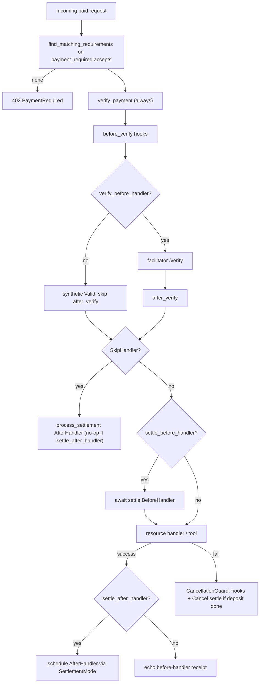

> **Obsolete.** Not the construction contract. Implement from [`docs/layout/`](layout/README.md) (384 enumerable files, HTTP shape B, three SettlementModes KEEP, upto KEEP, `r402-contract` unpublished). Matching bypass is already closed at HEAD `fb0e1cd`.

# r402 Protocol/SDK Parity Closure vs Official x402 V2

| Field | Value |
| --- | --- |
| **Title** | r402 protocol/SDK parity-closure design and execution plan |
| **Author** | r402 maintainers |
| **Date** | 2026-09-02 |
| **Status** | Draft (rev 7) |
| **Source of truth** | Official clone `/Users/xu/Desktop/x/x402` (TS `@x402/core` + Go `go/` + `specs/`) |
| **Implementation** | `/Users/xu/Desktop/qntx/r402` (crates `r402-core`, `r402-http`, `r402-mcp`, mechanism crates) |
| **Workspace rules** | `/Users/xu/Desktop/qntx/r402/Agents.md` — no backward-compat layers; simplest implementation that meets current requirements |

---

## Overview

Official x402 V2 (TS `typescript/packages/core`, Go `go/`, spec `specs/x402-specification-v2.md`) defines a resource-server that (1) matches `PaymentPayload.accepted` against advertised `accepts` by **full core-field equality plus extra subset**, (2) resolves `extra.paymentFlow` / `extra.assetTransferMethod` from a per-scheme ATM table, (3) orchestrates **verify / settle-before-handler / handler / settle-after-handler / cancel** from a closed `PAYMENT_FLOWS` table, (4) enforces **hook mutation policy** on 402 enrichment and settle-response core fields, and (5) treats `settlement_pending` as a non-terminal settle failure that **must** carry a non-empty `transaction`.

r402 already has the V2 wire types, a transport-agnostic `ResourceServer` (`verify_payment` → single `settle_payment`), HTTP `SettlementMode::{Sequential, Concurrent, Background}`, MCP dual-format 402, and a remote `FacilitatorClient`. It does **not** implement official matching, paymentFlow/SettlePhase, hook policy, `settlement_pending` + `Failure.transaction`, default-on `spendControls`, or scheme-table routing. HTTP's three settlement modes are a **latency scheduler for the after-handler settle**, not a substitute for `paymentFlow`. This design keeps those three modes and composes them with official flows.

HTTP matching today **bypasses** `ResourceServer::find_matching_requirements` (`Paygate::match_requirements` + `PriceTag: PartialEq<PaymentRequirements>`). That 5-field matcher is deleted in PR 1. After PR 3, unpaid 402 and paid matching share **one** `create_payment_required_response` output (`payment_required.accepts`) — not a raw `PriceTag.requirements` clone. `verifyBeforeHandler` skip lives **inside** `verify_payment`, not in the transport. Every advertised accept requires a registered `SchemeNetworkServer` before HTTP/MCP will serve it (HTTP: app registers on a layer-owned `ResourceServer`, PR 5; MCP: `try_new` on a pre-registered server, PR 6). Concurrent and Background are **illegal** with upfront and with escrow; that check runs on **all** resolved accepts, not only the matched one. The empty-`schemes` always-facilitator path in `verify_payment` stays until PR 6 updates every caller.

Work is ordered: protocol correctness (matching, errors, hooks, settle-phase types) → scheme table → HTTP/MCP orchestration → facilitator client policy → spendControls (after default-asset rows + every `SchemeClient::find_default_asset`) → SVM `upto` → engineering baseline. Plugins are out of scope. V1 is not a parity target.

---

## Background & Motivation

### Official V2 control plane (read)

- Spec: `specs/x402-specification-v2.md` §5.3.2 (`SettleResponse.transaction` required; MUST be non-empty when `errorReason` is `settlement_pending`), §6.1 (`extra.paymentFlow` / `extra.assetTransferMethod` reserved), §9 (`settlement_pending`).
- HTTP transport: `specs/transports-v2/http.md` — `PAYMENT-REQUIRED` / `PAYMENT-SIGNATURE` / `PAYMENT-RESPONSE` (HTTP header names are case-insensitive; r402 uses `Payment-Required` etc.).
- MCP transport: `specs/transports-v2/mcp.md` — payment-required is an `isError: true` **tool result** with dual `structuredContent` + `content[0].text`. Spec does **not** mention JSON-RPC `-32042` or code `402`.
- TS core: `typescript/packages/core/src/server/{hookPolicy,paymentFlow,x402ResourceServer}.ts`, HTTP adapter `http/x402HTTPResourceServer.ts`, facilitator client `http/httpFacilitatorClient.ts`, client `client/x402Client.ts`.
- Go core: `go/{server.go,server_hook_policy.go,payment_flow.go,server_hooks.go,client.go,errors.go}`, HTTP `go/http/{server.go,facilitator_client.go}`, MCP `go/mcp/server.go`.

### r402 current control plane (read)

- `crates/r402-core/src/resource_server/mod.rs` — `ResourceServer::{find_matching_requirements, verify_payment, settle_payment}`; no scheme table, no `SettlePhase`, one settle. `CancellationGuard` only fires `on_verified_payment_canceled`.
- `crates/r402-core/src/wire/offer.rs` — `PaymentRequirements::matches_payload_accepted` compares `scheme/network/amount/asset/payTo` only. `PriceTag: PartialEq<PaymentRequirements>` L564–577 is the same 5-field matcher (“`max_timeout_seconds` and `extra` are deliberately ignored”).
- `crates/r402-http/src/server/paygate.rs` — `verify_only` L562 calls `match_requirements` L1138–1146 (`PriceTag == payload.accepted`), **not** `ResourceServer::find_matching_requirements`. `error_response` L455–462 builds `PaymentRequired::new(...).with_accepts(self.accepts.iter().map(|pt| pt.requirements.clone()))`. `enrich_accepts` L523–540 runs `PriceTag::enrich`. Concurrent/Background spawn after-handler settle immediately after verify (L714, L830) and `drop(settle_handle)` on handler error.
- `crates/r402-mcp/src/server.rs` — uses `ResourceServer::find_matching_requirements`; always verify → tool → one settle. `payment_required_result` clones `config.accepts`.
- `crates/r402-core/src/client.rs` — no `spendControls`; no `extra.paymentFlow` filter.
- `crates/r402-http/src/server/facilitator.rs` — flat `HeaderMap` in `send_and_parse` L437–447; 10-minute `/supported` cache; retry 429 **and** 5xx with `200_u64 << attempt`.
- Facilitator-level `assert_requirements_match` copies the stale 5-field Go comment: `r402-evm/src/exact/facilitator/verify.rs` L87–110, `r402-tron/src/exact/facilitator/verify.rs` L42+, `r402-casper/src/exact/verify.rs` L125–148.

### Pain

HTTP never sees official matching even if core's function is fixed. Official clients echoing `accepted` (including `maxTimeoutSeconds` and static `extra`) are accepted by r402 HTTP today and rejected by official servers. SVM `upto` (escrow, two settles) cannot be expressed. A facilitator returning `settlement_pending` with a broadcast hash is deserialized as `Failure` with empty `transaction`. Default-on spend caps are absent.

---

## Goals & Non-Goals

### Goals

1. Official V2 matching on **every** transport: core-field equality including `maxTimeoutSeconds`; server-declared `extra` is a subset of `accepted.extra`; scheme `dynamicExtraFields` omitted. HTTP calls `ResourceServer::find_matching_requirements` on the same requirement list used to build the 402.
2. Official hook mutation policy on 402 enrichment and settle-response core fields. One enrich pipeline: `create_payment_required_response`.
3. Official `paymentFlow` ∈ `{authorization, upfront, escrow}` + `SettlePhase` ∈ `{before-handler, after-handler, cancel}`, composed with existing HTTP `SettlementMode::{Sequential, Concurrent, Background}` **without deleting the three modes**. Concurrent/Background are authorization-only.
4. Spec §9 `settlement_pending`: `ErrorReason` variant, `SettleResponse::Failure.transaction`, non-empty hash required, single identical retry in `ResourceServer`. A facilitator MUST NOT emit `settlement_pending` unless it reads/writes `PendingSettlementStore` on that path.
5. Default-on client `spendControls` **only after** every in-tree `SchemeClient` implements `find_default_asset`. Client-side drop of unrecognized `extra.paymentFlow`, authorization preference.
6. Facilitator HTTP client: path-keyed auth (TS `looksFlat` heuristic), `None` cache by default, retry **only** HTTP 429 (Retry-After + 1s exponential base).
7. MCP: orchestrate paymentFlow phases. Client-side parse of TS JSON-RPC `402` / `-32042` via `rmcp::ServiceError::McpError(ErrorData)`; server continues to emit spec/Go tool-result 402s.
8. Core surface required for SVM `upto` escrow. SVM `upto` mechanism crate is a follow-on PR.

### Non-Goals

- **Plugins.** `@x402/fetch`, `@x402/axios`, Express/Hono/Fastify/Next adapters, paywall UI, r402 plugin packages.
- **V1 interop.**
- **Tron / Casper as official.** Keep as r402-only extensions.
- **Concordium crate in this plan.** `concordium_base` / `concordium-rust-sdk` are crates.io `license = non-standard` (`docs/chain-parity-design.md` L667–669; `deny.toml`).
- **ERC-7710.** Unimplemented on both sides.
- **Replacing `SettlementMode` with `paymentFlow`.**
- **Compatibility shims, fallbacks, migrations.**
- **Live mainnet e2e farm** as a merge blocker.
- **Authorization fallback when no scheme is registered.** Official `getPaymentFlow` throws (`x402ResourceServer.ts` L1139–1143); Go MCP `NewPaymentWrapper` panics (`go/mcp/server.go` L45–58). r402 requires a registered `SchemeNetworkServer` for every accept once HTTP/MCP start registering (PR 5: layer-owned `ResourceServer`; PR 6: `try_new`). PR 4b’s empty-`schemes` always-facilitator path is a **temporary verify implementation** so `cargo test --workspace` still passes; it is deleted **only in PR 6** after every `verify_payment` caller registers a scheme. It is not “missing scheme ⇒ authorization”.

---

## Evidence tables

Legend: **implement** / **defer** / **keep** (r402-intentional) / **refute**.

### Protocol correctness

| ID | Gap | Official | r402 | Decision |
| --- | --- | --- | --- | --- |
| G1 | Matching ignores `maxTimeoutSeconds` and `extra`; HTTP uses a second 5-field matcher | TS `findMatchingRequirements` + `paymentRequirementsMatchAccepted` (`x402ResourceServer.ts` L1515–1540, L2101–2120). Go `FindMatchingRequirements` (`go/server.go` L830–873). TS HTTP matches **enriched** `paymentRequired.accepts` after `createPaymentRequiredResponse` (`x402HTTPResourceServer.ts` L589–623). Go HTTP matches the pre-enrich `requirements` slice (`go/http/server.go` L700–701). | Core: `matches_payload_accepted` (`offer.rs` L260–274). HTTP: `Paygate::match_requirements` (`paygate.rs` L1138–1146) via `PriceTag: PartialEq` (`offer.rs` L564–577). MCP: `ResourceServer::find_matching_requirements`. Facilitator: `assert_requirements_match` in evm/tron/casper (stale “Go ignores maxTimeout/extra” comment). | **implement** official extra-subset + maxTimeout equality. HTTP/MCP both match the **402 list** (TS): after PR 3 that list is `create_payment_required_response` output, not a `PriceTag` clone. Delete `PriceTag: PartialEq`. Flip facilitator `assert_requirements_match` in PR 1. Pin Go `objectContainsSubset` null-skip, not TS `undefined`. |
| G2 | No `settlement_pending`; Failure has no `transaction` | Spec §5.3.2 / §9. `settleWithPendingRetry` (TS L1576–1597, Go L1305–1344). Mechanism `PendingSettlementStore` (`go/pending_settlement_store.go`). | `ErrorReason` has no variant. `Failure` has no `transaction`; wire forces `""`. `from_facilitator_error` (`rpc.rs` L481–492) builds Failure without transaction. | **implement.** Failure.transaction; retry once. Facilitators MUST NOT emit the code without a store. |
| G3 | Hook mutation policy missing | `hookPolicy.ts` / `go/server_hook_policy.go`. Official `SchemeNetworkServer` has `enrichPaymentRequiredResponse` / `enrichSettlementPayload` / `enrichSettlementResponse` (`types/mechanisms.ts` L260–262). | Lifecycle hooks only. `PriceTag::enricher` (`offer.rs` L501–545). `Extension::advertise` attaches `PaymentRequired.extensions`, not accepts extra. | **implement** hook_policy + one 402 pipeline. Scheme enrich lives on `SchemeNetworkServer`; migrate `PriceTag::enricher` into that pipeline (no second channel). |
| G4 | No `paymentFlow` / `SettlePhase` / scheme table | `PAYMENT_FLOWS` (`paymentFlow.ts` L18–34). `verifyPayment` always runs `beforeVerify`; skips facilitator when `!verifyBeforeHandler`; returns `{isValid:true}` **without** `afterVerify` (TS L1048–1052; Go L1208–1210 — pin the code, not the TS comment at L990–992). `getPaymentFlow` throws if no scheme. | `ResourceServer` has facilitator + hooks only. `verify_payment` always calls the facilitator. | **implement.** Skip of facilitator `/verify` is inside `verify_payment`. Require scheme registration; no authorization fallback. |
| G5 | Client does not drop unrecognized `paymentFlow` | TS `x402Client.ts` L722–762; Go `client.go` L297–369. | `PaymentClient::create_payment_inner` (`client.rs` L404–425). | **implement.** |
| G6 | `spendControls` absent | Default-on `$1` + default-asset allowlist. `findDefaultAsset` on `SchemeNetworkClient` (`types/mechanisms.ts` L90–95). | No matches. `MoneyAmount` already exists (`amount.rs`). 15 in-tree `SchemeClient` impls (evm exact/upto/auth-capture/batch, solana, aptos, algorand, hedera, keeta, near, stellar, tron, xrpl, tvm, casper) + core `StubScheme`. | **implement default-on only in the PR that lands `find_default_asset` on every listed impl.** USD cap: `MoneyAmount` + `DefaultAssetInfo.decimals`. |
| G7 | Verify/Settle wire rejects official `extra` | Spec §5.4.2 extra; TS `SettleResponse.extra?`. | `deny_unknown_fields` without `extra`. | **implement** optional `extra`; keep deny on unknown top-level keys. |

### Transport

| ID | Gap | Official | r402 | Decision |
| --- | --- | --- | --- | --- |
| G8 | HTTP settlement model | `processHTTPRequest` + `processSettlement(phase)`. SkipHandler → `processSettlement(..., "after-handler")` which **no-ops** when `!settleAfterHandler` (`x402HTTPResourceServer.ts` L995–1010, L793–817). `validateRouteConfiguration` walks **every** option (`L1113+`). Official HTTP server **owns** `x402ResourceServer` with `register()`. | Three `Paygate` methods: verify → one after-handler settle. `X402Layer` holds a facilitator (`middleware.rs` L293–300); per request `Paygate::builder(facilitator)` → `ResourceServer::new` (`paygate.rs` L343–345, `middleware.rs` L499–505). `builder_from_server` exists (`paygate.rs` L365–374) unused by the layer. MCP already takes `ResourceServer` (`r402-mcp` L156–164). | **implement composition.** Layer owns `ResourceServer`; `call` uses `builder_from_server`. Mode check on **all** tags after scheme lookup. Concurrent/Background + any upfront/escrow tag → HTTP **500**. |
| G9 | HTTP headers | Spec `PAYMENT-*`. | `Payment-*`. | **keep.** Case-insensitive. |
| G10 | MCP always after-handler settle | Go `Wrap` + `NewPaymentWrapper` requires scheme + `ResolvePaymentFlow`. | `invoke`: one settle. | **implement** Go Wrap. `try_new` requires a registered scheme per accept. |
| G11 | MCP JSON-RPC `402` / `-32042` | Spec: tool result. TS client: `McpError`. rmcp 3.1: `ServiceError::McpError(ErrorData { code: ErrorCode(i32), data })` (`rmcp-3.1.4/src/service.rs` L54, L79–81; `model.rs` L542, L565–575). `RunningService::call_tool` → `Result<CallToolResult, ServiceError>`. | `McpToolCaller::call_tool` → `Result<CallToolResult, String>` (`client.rs` L21–26). `MCP_PAYMENT_REQUIRED_CODE = 402` (`lib.rs` L32) is a constant only. | **implement client extract** via `ServiceError::McpError`. Do **not** emit JSON-RPC 402 from the server. Add `JSONRPC_PAYMENT_REQUIRED_CODE = -32042`. |
| G12 | Facilitator auth / cache / retry | TS path-keyed `createAuthHeaders`; `looksFlat` = `!hasPathKey && some value is not a header object` (`httpFacilitatorClient.ts` L600–614). Retry 429 only + Retry-After. No cache. Go retries 429 without Retry-After. | Flat `HeaderMap`. Default 10 min cache. `without_supported_cache` = TTL 0 (`facilitator.rs` L300–304). 429+5xx `200<<attempt`. | **implement TS policy.** `None` cache, not TTL 0. Port `looksFlat`. `bazaar` field on the struct; no bazaar URL. |

### Mechanisms / engineering

| ID | Gap | Official | r402 | Decision |
| --- | --- | --- | --- | --- |
| G13 | SVM `upto` | Escrow, two settles, `enrichSettlementPayload` voucher on after-handler/cancel. | exact-only. | **implement after** scheme table + HTTP/MCP phases. |
| G14 | EVM default assets | `defaultAssets.ts` keys listed in rev-1. MegaETH `eip155:4326` MegaUSD is official. | MegaETH is already in `USDM_DEPLOYMENTS` (`networks.rs` L244–249), **not** missing. Official-only **missing** from r402: Stable `988`/`2201` USDT0, Mezo `31612`/`31611` mUSD, Radius `723487`/`72344` SBC, ADI `36900`, HPP `190415`/`181228`, Igra `38833`, Flare `14`. r402 extra Circle USDC chains (OP, Sonic, Unichain, …) are not in official. | **refute subset.** **implement** the missing official-only keys (not MegaETH). `find_default_asset` reads the **union** of USDC + USDM + new rows. **keep** r402 extra Circle USDC. |
| G15–G17, G20 | Concordium / Tron-Casper / erc7710 / V1 | as rev-1 | as rev-1 | **defer / keep** unchanged. |
| G18 | Facilitator metrics unused | n/a | Constants in `metrics.rs` (`cfg(feature = "metrics")`); never incremented. | **implement behind `metrics` feature.** |
| G19 | CI / SECURITY | Official unit + e2e + SECURITY.md | This repo `ci.yml` is only `qntx/workflows ... ci-rust.yml@v2`. Whether that reusable runs `cargo deny` is **not visible** in these trees. No `SECURITY.md`. | **implement** an **explicit** `cargo deny` job in **this** repo's yaml. r402's own reporting address, not Coinbase HackerOne. |

### Hypothesis verdicts

Unchanged from rev-1 except G14 MegaETH is already present (USDM). HTTP matching bypass (G1) is an additional confirmed gap vs the first draft's assumption that fixing `matches_payload_accepted` was enough.

---

## Proposed Design

### 1. Matching (`G1`)

Replace `PaymentRequirements::matches_payload_accepted` with official V2 rules. Matching stays a pure function. `ResourceServer::find_matching_requirements` passes `dynamic_extra_fields` from the registered scheme (empty slice until the scheme table exists).

```rust
impl PaymentRequirements {
    pub fn matches_payload_accepted_with_dynamic(
        &self,
        accepted: &Self,
        dynamic_extra_fields: &[&str],
    ) -> bool {
        self.scheme == accepted.scheme
            && self.network == accepted.network
            && self.amount == accepted.amount
            && self.asset == accepted.asset
            && self.pay_to == accepted.pay_to
            && self.max_timeout_seconds == accepted.max_timeout_seconds
            && extra_contains_subset(
                omit_fields(self.extra.as_ref(), dynamic_extra_fields),
                omit_fields(accepted.extra.as_ref(), dynamic_extra_fields),
            )
    }
}
```

**`extra_contains_subset` pins Go** (`go/server.go` L880–901), not TS:

- Objects: actual may have additional keys.
- Primitives and arrays: exact equality (no additive-array path).
- `required.extra == None` → match.
- Missing key in actual: **match iff required value is JSON `null`** (`if value == nil { continue }`). TS matches missing keys only when `value === undefined` (`x402ResourceServer.ts` L2178–2181). Do not port TS fixtures that depend on `undefined`. Fixture: required extra `{k: null}` vs accepted without `k` → **match**.

**HTTP uses the same function on the same list as the unpaid 402.** Delete `PriceTag: PartialEq<PaymentRequirements>` (`offer.rs` L564–577). Delete `match_requirements` 5-field find. **Decision: match on the 402 list (TS), not Go HTTP's pre-enrich slice.**

**PR 1 (until the pipeline exists):** keep `Paygate::enrich_accepts` (`paygate.rs` L523–540, called from `middleware.rs` L506). After that mutation, `error_response` and `verify_only` both read `self.accepts[i].requirements` (the same objects). `verify_only`:

```rust
let available: Vec<PaymentRequirements> =
    self.accepts.iter().map(|pt| pt.requirements.clone()).collect();
let requirements = self.server
    .find_matching_requirements(&available, &payload)
    .cloned()
    .ok_or(PaygateError::NoPaymentMatching)?;
```

That clone is the post-`enrich_accepts` list, which is also the 402 body in PR 1. Static extra (`feePayer`) is present. `recentBlockhash` / `lastValidBlockHeight` / `recentSlot` are **dynamic** and are **not written** until a `SchemeNetworkServer` declares them in `dynamic_extra_fields` (PR 4c).

**PR 3 (deletes `enrich_accepts` as a match/402 source):** Paygate builds **one** `PaymentRequired` via `create_payment_required_response` (async) after `supported()` + scheme/PriceTag enrich. Store it on the gate (`payment_required: PaymentRequired`). Unpaid `error_response` returns that object. Paid `verify_only` matches `self.payment_required.accepts` — **never** a fresh `PriceTag.requirements` clone. After PR 3, omitting static extra is `NoPaymentMatching` on HTTP, same as MCP.

**Facilitator `assert_requirements_match`** in evm/tron/casper is the same stale 5-field check. Flip it in PR 1 to the same core helper (or call `matches_payload_accepted`). Direct facilitator verify must not accept a diverging `maxTimeoutSeconds` after G1.

### 2. Hook policy + one 402 pipeline (`G3`)

New `crates/r402-core/src/resource_server/hook_policy.rs`, ported from `hookPolicy.ts` / `server_hook_policy.go`. Same function set as rev-1. Reserved extra keys: `["paymentFlow", "assetTransferMethod"]`. Fail-closed.

**Single pipeline** — `ResourceServer::create_payment_required_response` is **async** (official `x402ResourceServer.ts` L889–896). Context ports `SchemePaymentRequiredContext` (`types/mechanisms.ts` L205–216) plus the r402 `SupportedResponse` snapshot that today’s `PriceTag::enricher` already requires (`offer.rs` L501–506; Solana `solana_fee_payer_enricher` reads `capabilities.kinds`, `r402-solana/src/exact/server.rs` L40–62):

```rust
pub struct PaymentRequiredBuildContext {
    pub resource: ResourceInfo,
    pub error: Option<CompactString>,
    pub extensions: Extensions,
    pub supported: SupportedResponse, // facilitator GET /supported
    pub payment_payload: Option<WirePaymentPayload>,
}

pub async fn create_payment_required_response(
    &self,
    accepts: Vec<PaymentRequirements>,
    ctx: PaymentRequiredBuildContext,
) -> Result<PaymentRequired, FacilitatorError>;
```

Steps:

1. Clone accepts into a working `PaymentRequired`; snapshot (`snapshot_payment_requirements_list`).
2. **Scheme enrich (async):** for each registered `SchemeNetworkServer` with a matching accept, `await scheme.enrich_payment_required_response(&SchemePaymentRequiredContext { requirements, resource, error, payment_required_response, supported, payment_payload })`. Official returns `Promise<PaymentRequirements[] | void>` (`types/mechanisms.ts` L214–216; invoked at `x402ResourceServer.ts` L924–936). `assert_accepts_additive_extra_after_scheme_enrich`. **PR 3 only:** HTTP still runs `PriceTag::enricher(pt, &supported)` **before** this call and passes already-enriched requirements; the trait no-op does not drop feePayer. **PR 4c** moves those bodies onto the trait and removes the HTTP `pt.enrich` loop in the same merge.
3. **Extension enrich (async):** `Extension::advertise` plus `enrich_payment_required_response` on extensions. `assert_accepts_allowlisted_after_extension_enrich`.
4. `apply_payment_flow_wire_extra` (PR 4a types; after schemes are registered).
5. Return `PaymentRequired`. Callers **store and reuse** this object.

**HTTP (PR 3) — one list, both paths:**

```text
middleware (after price_source.resolve):
  assert_mode_compatible(mode, ALL resolved tags)   // PR 5; not post-match
  gate.build_payment_required().await:
    supported = facilitator.supported().await.unwrap_or_default()
    for pt in accepts { pt.enrich(&supported) }     // PR 3 only; deleted in 4c
    gate.payment_required = server
        .create_payment_required_response(reqs, ctx { supported, ... })
        .await
error_response  → serialize gate.payment_required
verify_only     → find_matching_requirements(&gate.payment_required.accepts, payload)
```

Delete `Paygate::enrich_accepts` as a separate path once `build_payment_required` owns it. Do **not** keep a `PriceTag.requirements` clone as the match source.

**402 construction sites that MUST call this method (PR 3 is not done until they do):**

| Site | File |
| --- | --- |
| `Paygate::error_response` **and** `Paygate::verify_only` | `r402-http/src/server/paygate.rs` L455–462 / L553+ |
| `PaymentWrapper::payment_required_result` | `r402-mcp/src/server.rs` L177–184 |
| `settlement_failed_tool_result` | `r402-mcp/src/encode.rs` L50 |
| Tests assembling 402s for matching | `r402-mcp/src/encode.rs` L168; `r402-core` tests as needed |

Settle enrich is **async** (official `SchemeEnrichSettlementPayloadHook` / `SchemeEnrichSettlementResponseHook` return `Promise`, `types/mechanisms.ts` L198–203). After facilitator `settle`: snapshot core; `await scheme.enrich_settlement_response(&SettleResultContext { ..., phase })`; extension `on_settle`; `assert_settle_response_core_unchanged`. Payload: `await enrich_settlement_payload(&SettleContext { ..., phase })` additive-only. SVM upto voucher attach and RPC `recentBlockhash` require this await.

### 3. paymentFlow + SettlePhase + scheme table (`G4`)

#### Types

Same enums as rev-1 (`PaymentFlowName`, `SettlePhase`, `PaymentFlowPhases`, `PaymentFlowConfig`, `SDK_DEFAULT_ASSET_TRANSFER_METHOD`). `PAYMENT_FLOWS` copies official tables.

`resolve_payment_flow(scheme, requirements)`: omit ATM → scheme default; omit `extra.paymentFlow` → ATM default; unsupported → error.

#### `verify_payment` (official placement)

Transports **always** call `verify_payment`. Inside it:

1. Run `before_verify` (Abort / Skip as today). Skip still runs `after_verify` (Go L1194–1197, TS L1035–1041).
2. **While `self.schemes` is empty (PR 4b through PR 5):** skip `get_payment_flow`; always call the facilitator (today’s path). This is **not** an authorization fallback for a missing scheme on a populated table. Production HTTP still constructs `ResourceServer::new(facilitator)` per request (`paygate.rs` L343–345) until PR 5. MCP tests still `ResourceServer::new(fac)` (`r402-mcp/src/server.rs` L439–445) until PR 6. Core hook tests the same (`resource_server/mod.rs`). **Do not delete this branch in PR 5.**
3. **Once `schemes` is non-empty:** `get_payment_flow` for this accept (error if unregistered). `resolve_payment_flow` → `PAYMENT_FLOWS`. If `!verify_before_handler`: return `VerifyResponse::valid` **without** calling the facilitator and **without** `after_verify` (TS L1051–1052, Go L1208–1210). Pin this code, not the TS comment that claims `afterVerify` still runs.
4. Else facilitator `/verify`, then `after_verify` as today (SkipHandler / Abort).
5. **Delete the empty-vec branch in PR 6** (depends on PR 5): PR 6 updates **every** `ResourceServer::verify_payment` caller (MCP `try_new` requires schemes; core unit tests `register_scheme` a mock). After that, empty `schemes` is a programming error, not a silent always-facilitator path.

Upfront/escrow still have “at least one check before the resource”: the before-handler **settle**.

#### Resource-server `SettleContext` (PR 4a)

r402 already has `facilitator::SettleContext { request: SettleRequest }` (`facilitator.rs` L191–194) and `extensions::SettleContext`. Those are **not** the resource-server type. Official core `SettleContext` is `{ paymentPayload, requirements, declaredExtensions, phase, transportContext }` (`x402ResourceServer.ts` L130–136); `SettleResultContext` extends it with `result` (L138–140). SVM upto voucher attach is **pre-settle** payload enrich branched on `phase`. Add in `resource_server/hooks.rs` in **PR 4a**:

```rust
pub struct SettleContext {
    pub payment: PaymentHookContext, // payload + requirements
    pub declared_extensions: Extensions,
    pub phase: SettlePhase,
}

pub struct SettleResultContext {
    pub settle: SettleContext,
    pub result: SettleResponse,
}
```

`before_settle` / `on_settle_failure` take `&SettleContext` (phase required, no default). `after_settle` takes `&SettleResultContext`. `SchemeNetworkServer::enrich_settlement_payload` takes **`resource_server::SettleContext`**, never `facilitator::SettleContext`. Name the facilitator type stays; do not reuse it.

#### `SchemeNetworkServer`

Do not overload `SchemeClient` / `SchemeBuilder`. Trait in PR 4b. Enrich hooks are **AFIT async** and receive official-shaped context plus `SupportedResponse`, so `PriceTag::enricher` and SVM upto RPC can move onto the trait without a second break:

```rust
pub struct SchemePaymentRequiredContext<'a> {
    pub requirements: &'a [PaymentRequirements],
    pub payment_payload: Option<&'a WirePaymentPayload>,
    pub resource: &'a ResourceInfo,
    pub error: Option<&'a str>,
    pub payment_required_response: &'a PaymentRequired,
    pub supported: &'a SupportedResponse,
}

pub trait SchemeNetworkServer: Send + Sync {
    fn scheme(&self) -> &str;
    fn default_asset_transfer_method(&self) -> &str;
    fn payment_flows(&self) -> &HashMap<String, PaymentFlowConfig>;
    fn dynamic_extra_fields(&self) -> &[&str] { &[] }

    fn enrich_payment_required_response<'a>(
        &'a self,
        ctx: &'a SchemePaymentRequiredContext<'a>,
    ) -> impl Future<Output = Option<Vec<PaymentRequirements>>> + Send + 'a {
        async { None }
    }

    fn enrich_settlement_payload<'a>(
        &'a self,
        ctx: &'a crate::resource_server::SettleContext,
    ) -> impl Future<Output = Option<serde_json::Map<String, Value>>> + Send + 'a {
        async { None }
    }

    fn enrich_settlement_response<'a>(
        &'a self,
        ctx: &'a crate::resource_server::SettleResultContext,
    ) -> impl Future<Output = Option<serde_json::Map<String, Value>>> + Send + 'a {
        async { None }
    }

    fn settle_on_cancel<'a>(
        &'a self,
        ctx: &'a VerifiedPaymentCanceledContext,
    ) -> impl Future<Output = Option<PaymentRequirements>> + Send + 'a {
        async { None }
    }
}
```

Object-safe `DynSchemeNetworkServer` erases the AFIT futures the same way `DynResourceServerHooks` does. Scheme structs own RPC config (official `UptoSvmScheme.rpcUrl`); enrich may `.await` RPC to write `recentBlockhash`.

**PR 3 → 4c migration of `PriceTag::enricher`:** PR 3 HTTP still calls `pt.enrich(&supported)` then passes enriched requirements into `create_payment_required_response` (trait no-ops). **PR 4c depends on PR 3.** In that one merge: copy enricher bodies onto `enrich_payment_required_response` using `ctx.supported`; delete `PriceTag::enricher`, `Enricher`, and `PriceTag::enrich` in `offer.rs`; remove the `pt.enrich` loop from `build_payment_required`. Paygate **tests** (and any HTTP path under test) switch to `Paygate::builder_from_server` (`paygate.rs` L365–374, exists today) plus `register_scheme` so trait enrich still writes `feePayer`. Do not wait for PR 5’s layer API. Do not delete the field while any HTTP path still calls `pt.enrich`. No second enrich channel after 4c.

`ResourceServer` gains `schemes: Vec<(ChainIdPattern, Arc<dyn DynSchemeNetworkServer>)>` and `register_scheme`. **`get_payment_flow` errors if this accept has no scheme** once `schemes` is non-empty (official throw). No authorization fallback. Empty `schemes` is only the PR 4b temporary verify path above.

**Escrow without `settle_on_cancel`:** hard error when the resolved accept is escrow (HTTP: `PaygateError::IncompatibleSettlementMode` / dedicated `MissingSettleOnCancel`; MCP: `try_new` error). Do not serve the request.

#### `settle_payment`

```rust
pub async fn settle_payment(
    &self,
    payload: &WirePaymentPayload,
    requirements: &PaymentRequirements,
    overrides: Option<&SettlementOverrides>,
    phase: SettlePhase, // required; no default
) -> Result<SettleResponse, FacilitatorError>;
```

`before_settle` / `SettleContext` / `SettleResultContext` / `DynResourceServerHooks` take `phase` in **PR 4a** (`SettleContext.phase`; no `AfterHandler` default). In-tree hook impls to update in 4a:

- `resource_server/hooks.rs` trait + `DynResourceServerHooks` erasure
- `resource_server/mod.rs` tests: `AbortBeforeVerify`, `SkipVerify`, `AfterAbort`, `CancelHook`, `SkipHandlerHook`, `RecoverVerify`, `CancelCountHook`
- `r402-mcp/src/server.rs` `SkipHandlerHook`
- `Paygate::with_resource_hook` callers

`settle_payment` wraps `settle_with_pending_retry` (G2).

#### Cancel

`CancellationGuard` gains `settled_phases: Vec<SettlePhase>` and `before_handler: Option<CompletedSettlement>`. `cancel()`:

1. Fire `on_verified_payment_canceled` once (existing).
2. If `settled_phases` contains `BeforeHandler` and the scheme's `settle_on_cancel` returns requirements: `settle_payment(..., Cancel)`.
3. Return that receipt for `resolve_failure_path_settlement` (extra `depositTransaction`, `depositAmount`, `channelId` — official `paymentFlow.ts` `buildFailedCancelReceipt`).

SkipHandler: **no** cancel dispatcher (Go MCP L151–154).



### 4. How `SettlementMode` composes with `paymentFlow` (`G8`)

Orthogonal axes. Alt A/C rejected as rev-1. **Alt B accepted**, with a tighter matrix than rev-1:

| `paymentFlow` | Sequential | Concurrent | Background |
| --- | --- | --- | --- |
| **authorization** | today's Sequential | today's Concurrent (spawn AfterHandler at **handler start**) | today's Background (spawn AfterHandler at **verify**, fire-and-forget) |
| **upfront** | blocking before-handler settle → handler → echo (`process_settlement` AfterHandler no-ops) | **illegal** | **illegal** |
| **escrow** | blocking deposit → handler → blocking claim | **illegal** | **illegal** |

**Background + escrow is forbidden** (same as Concurrent + escrow). Safer than claim-at-max in background; usage-based SVM upto needs Sequential + `Settlement-Overrides`. Sequential/Concurrent/Background remain for **authorization**.

#### Compatibility check (not `X402Layer` construction)

`X402Layer` today holds a **facilitator**, not a scheme table (`middleware.rs` L293–300). Per request it does `Paygate::builder(facilitator)` → `ResourceServer::new(Arc::new(facilitator))` (`paygate.rs` L343–345, `middleware.rs` L499–505). `Paygate::builder_from_server` already exists (`paygate.rs` L365–374) and is unused by the layer. MCP already takes a constructed `ResourceServer` (`PaymentWrapper::try_new`, `r402-mcp/src/server.rs` L156–164). **HTTP follows that model.** `r402-http` must **not** construct mechanism types from tag strings (`"exact"` + `eip155:…` → `Eip155ExactScheme`).

**PR 5 injection surface:**

```rust
// X402Middleware, X402Layer, and X402MiddlewareService all own ResourceServer
// (Clone; schemes included). Layer::layer copies it onto the Service
// (`middleware.rs` L406–413 today copies facilitator — PR 5 copies server).
impl X402Middleware {
    /// Equivalent to from_resource_server(ResourceServer::new(fac)).
    /// Paid routes 500 MissingScheme until with_scheme.
    pub fn from_facilitator(fac: impl Facilitator + 'static) -> Self { ... }
    pub fn from_resource_server(server: ResourceServer) -> Self { ... }
    pub fn with_scheme(
        mut self,
        network: ChainIdPattern,
        scheme: impl SchemeNetworkServer + 'static,
    ) -> Self {
        self.server.register_scheme(network, scheme);
        self
    }
}

// X402MiddlewareService::call, after price_source.resolve:
let mut gate = Paygate::builder_from_server(self.server.clone()) // copies scheme vec
    .accepts(accepts)
    .resource(resource)
    .build();
// THEN MissingScheme / assert_mode_compatible using gate.resource_server()
```

App code (not the HTTP crate) constructs `ExactEvmScheme` / `ExactSvmScheme` / … and calls `with_scheme`. `from_facilitator` is **not** an authorization-only mode: after PR 5, `require_schemes` runs on **all** tags; a layer with empty `schemes` 500s `MissingScheme` on every paid route. Tests must `with_scheme` a mock/authorization `SchemeNetworkServer`.

**Check every tag from `price_source.resolve`, before `handle_request_*` — not the matched accept.** Official `validateRouteConfiguration` walks every route option (`x402HTTPResourceServer.ts` L1113+) via `getRegisteredScheme` then `resolvePaymentFlow`. Order: clone server onto the Paygate **then** require scheme **then** `assert_mode_compatible` (flow resolve needs the table).

```rust
// middleware, after accepts = price_source.resolve(...)
let mut gate = Paygate::builder_from_server(layer.server.clone())...;
require_schemes(gate.resource_server(), &accepts)?; // MissingScheme 500
assert_mode_compatible(settlement_mode, gate.resource_server(), &accepts)?;

fn assert_mode_compatible(
    mode: SettlementMode,
    server: &ResourceServer,
    accepts: &[PriceTag],
) -> Result<(), PaygateError>
```

Illegal if `mode != Sequential` and **any** resolved accept is `Upfront` or `Escrow`. Illegal if the list mixes authorization with upfront/escrow under Concurrent/Background. A Concurrent gate that advertises both authorization and escrow returns **500 even if this request matched authorization**. Do not put this check inside `verify_only` after `find_matching_requirements`.

MCP `try_new` walks **all** `config.accepts` (Go `NewPaymentWrapper` L45–58).

`PaygateError::IncompatibleSettlementMode { mode, flow }` → HTTP **500** (server misconfiguration, not a client 402). Body JSON `{ "error": "incompatible settlement mode", "mode": "...", "flow": "..." }`. Not a `Payment-Required` challenge.

Static `with_price_tag` call sites may additionally assert at builder time; that is optional sugar, not the gate.

#### Paygate sequencer (all three methods share this)

```text
0. middleware (PR 5): after price_source.resolve
     Paygate::builder_from_server(layer.server.clone())  // schemes already on that ResourceServer
     require SchemeNetworkServer per tag (MissingScheme 500); escrow => settle_on_cancel is Some
     assert_mode_compatible(mode, server, ALL tags) → 500 if any upfront/escrow under Concurrent/Background
     build_payment_required()  // PR 3: one PaymentRequired for 402 + match
1. verify_only
     extract Payment-Signature
     find_matching_requirements(&gate.payment_required.accepts, payload)
     verify_payment                                      // skip facilitator internally if !verify_before
2. if skip_handler:
     process_settlement(AfterHandler)  // no-ops if !settle_after_handler
     no CancellationGuard
     return skip-handler response
3. if settle_before_handler:
     await settle_payment(..., BeforeHandler)
     record CompletedSettlement; settled_phases = [BeforeHandler]
     // never Concurrent/Background: those modes are illegal here
4. let guard = CancellationGuard { settled_phases, before_handler }
5. schedule AfterHandler per mode (authorization only):
```

**Sequential (`handle_request`)**

- Run handler.
- Handler throw / 4xx / 5xx: `guard.cancel()` (cancel settle only if deposit exists) → return handler response (no Payment-Response).
- Handler success: if `settle_after_handler` { await AfterHandler (apply Settlement-Overrides here) } else { echo before-handler receipt }. Attach `Payment-Response`.

**Concurrent (`handle_request_concurrent`) — authorization only**

- Spawn AfterHandler at **handler start** (today L714): `tokio::spawn(settle AfterHandler at signed max)`.
- Run handler in parallel.
- Handler throw / 4xx / 5xx: `drop(settle_handle)` (existing authorization behavior: may still broadcast) + `guard.cancel()` (no deposit on authorization). Return handler response.
- Handler success: reject if Settlement-Overrides / `UptoActualAmount` present (existing L750–754). Await join. Attach `Payment-Response`.

**Background (`handle_request_background`) — authorization only**

- Spawn AfterHandler at **verify** (today L830, before handler), supervisor logs, optional tracker. Never await. No `Payment-Response`.
- Run handler.
- Handler throw / 4xx / 5xx: `guard.cancel()` (hooks only; authorization has no deposit). Existing: background settle may still complete. Document; do not “fix” authorization Background in this plan.
- Strip Settlement-Overrides headers so they never reach the client (existing).

Escrow/upfront never enter Concurrent/Background branches.

**SkipHandler × paymentFlow:** `process_settlement(AfterHandler)` which no-ops / echoes when `!settle_after_handler` (official HTTP L793–817). Do not force a second settle on upfront.

### 5. `settlement_pending` + `Failure.transaction` (`G2`)

Same wire shape as rev-1 (`Failure.transaction`, optional `extra` on Success/Failure, `ErrorReason::SettlementPending`).

```rust
impl SettleResponse {
    pub fn from_facilitator_error(
        error: &FacilitatorError,
        network: impl Into<CompactString>,
        transaction: impl Into<CompactString>, // "" unless the error carries a hash
    ) -> Self { ... }
}
```

Invariant: `Failure { reason: SettlementPending, transaction, .. }` with empty `transaction` is a programming error (debug-assert). `ResourceServer::settle_with_pending_retry`: one identical retry iff pending + non-empty hash. No sleep.

**Hard rule:** a `Facilitator::settle` impl MUST NOT return `errorReason=settlement_pending` unless it **writes** the broadcast hash into `PendingSettlementStore` on the first attempt and **reads** it on the retry to reconcile instead of broadcasting again. Core trait + in-memory impl ship in PR 2. The first crate that emits the code (EVM exact/upto, later SVM) **must wire the store in that same PR**. Emitting the code without a store is a defect, not a follow-on.

### 6. Facilitator client (`G12`)

Path-keyed auth; apply headers **per URL** in verify / settle / supported (not one `HeaderMap` in `send_and_parse`).

```rust
pub struct FacilitatorAuthHeaders {
    pub verify: HeaderMap,
    pub settle: HeaderMap,
    pub supported: HeaderMap,
    pub bazaar: HeaderMap, // official shape; r402 has no bazaar URL; unused
}
```

TS `looksFlat` (`httpFacilitatorClient.ts` L600–614): if the callback result has **no** object-valued `verify|settle|supported|bazaar` key **and** some value is not a header object → error. Do not use “Authorization / X-* at top level” as the heuristic.

Cache: `supported_cache: Option<SupportedCache>`. `try_new` → `None`. `with_supported_cache_ttl(d)` → `Some`. `without_supported_cache` → `None`, **not** TTL 0.

Retry `/supported`: 3 attempts, 429 only, `compute_retry_delay` = TS (Retry-After delta-seconds or HTTP-date; else `1000 * 2^attempt` ms; cap 30 s). Tests: 429 + Retry-After honored; 5xx does not retry.

Remove `with_headers(HeaderMap)`. Timeout 30 s stays.

### 7. MCP (`G10`, `G11`)

Server `invoke` ports Go `Wrap` (rev-1 steps), using `create_payment_required_response` then match on **that response’s** `accepts` (same object used for unpaid 402). `try_new` requires a registered scheme and successful `resolve_payment_flow` per accept (`go/mcp/server.go` L45–58). SkipHandler: `process_settlement(AfterHandler)` no-op path; no cancel dispatcher. Handler `isError`: cancel + `resolve_failure_path_settlement` on `_meta`.

Client: keep tool-result extract. Add `JSONRPC_PAYMENT_REQUIRED_CODE: i32 = -32042`. `MCP_PAYMENT_REQUIRED_CODE = 402` stays a **client** constant; server does not emit JSON-RPC 402.

`McpToolCaller` returns `Result<CallToolResult, McpCallError>`:

```rust
pub enum McpCallError {
    Transport(String),
    Rpc { code: i32, message: String, data: Option<Value> },
}
```

**rmcp adapter** (`r402-mcp`, wrapping `rmcp` 3.1 `RunningService::call_tool` → `Result<CallToolResult, ServiceError>`):

```rust
fn mcp_call_error_from_rmcp(err: rmcp::ServiceError) -> McpCallError {
    match err {
        rmcp::ServiceError::McpError(data) => McpCallError::Rpc {
            code: data.code.0, // ErrorCode(pub i32)
            message: data.message.into_owned(),
            data: data.data,
        },
        other => {
            // Fallback: Display of ErrorData is "{code}: {message}({data})"
            // (rmcp-3.1.4/src/error.rs L4–8). If a caller stringified first,
            // parse JSON-RPC error objects out of the string when present.
            McpCallError::Transport(other.to_string())
        }
    }
}
```

`is_payment_required_rpc` ports TS `isPaymentRequiredError` (`types/mcp.ts` L345–368): code 402 → `data` is PaymentRequired V2; code -32042 → `data` or `data.x402`. Tests construct `ServiceError::McpError(ErrorData { code: ErrorCode(-32042), data: ... })` through the adapter, not a helper that already received `(code, data)`.

### 8. spendControls (`G6`) + client flow filter (`G5`)

`SpendControls` uses existing `MoneyAmount`, not an invented `MoneyOrDisabled`:

```rust
pub enum MaxAmountPerPayment {
    Usd(MoneyAmount), // default MoneyAmount of 1 dollar
    Disabled,
}
pub enum AllowedAssets {
    DefaultOnly,           // omit allowedAssets
    Any,                   // allowedAssets: true
    List(Vec<SpendControlAsset>),
}
pub struct DefaultAssetInfo {
    pub asset: CompactString,
    pub decimals: u32,
    pub symbol: CompactString,
    pub asset_transfer_method: Option<CompactString>,
}
```

USD cap conversion: parse 402 amount as atomic integer; compare to `usd * 10^decimals` using `find_default_asset(...).decimals` (official). Non-integer atomic amounts on a capped asset are dropped.

**Default-on is illegal until every in-tree `SchemeClient` implements `find_default_asset`.** That is the same PR. Impls:

| Crate | Type |
| --- | --- |
| r402-evm | `Eip155ExactClient`, `Eip155UptoClient`, `Eip155AuthCaptureClient`, `Eip155BatchSettlementClient` — union of `USDC_DEPLOYMENTS` + `USDM_DEPLOYMENTS` + PR 8 rows |
| r402-solana | `SolanaExactClient` — `usdc_solana_deployments` + other default mints already in `networks.rs` |
| r402-aptos / algorand / hedera / keeta / near / stellar / xrpl / tvm | each crate's existing USDC (or equivalent) table |
| r402-tron / r402-casper | existing default token tables (r402-only chains; still must not drop all accepts) |
| r402-core tests | `StubScheme` |

Selection order: filter `payment_required.accepts` (recognized flow → spendControls → policies → prefer authorization) then sign. `PaymentCandidate` gains `requirements: PaymentRequirements`. Construction sites that must grow the field:

`r402-evm/src/{exact,upto/client,auth_capture,batch_settlement}/client.rs`, `r402-{solana,aptos,algorand,hedera,keeta,near,stellar,tron,xrpl,tvm,casper}/src/exact/client.rs`, `r402-core/src/client.rs` `StubScheme`.

Flow-name types come from PR 4a; spendControls PR depends on 4a + default-asset rows (PR 8 in this numbering).

### 9. SVM upto (`G13`)

After scheme table + HTTP Sequential escrow + MCP phases. `UptoSvmScheme` as `SchemeNetworkServer` with `payment_flows = { "channel": { Escrow } }`, `dynamic_extra_fields = ["recentBlockhash","lastValidBlockHeight","recentSlot"]`, `enrich_settlement_payload` voucher on AfterHandler/Cancel, `settle_on_cancel` zero-amount. HTTP Sequential only.

### 10. deny_unknown_fields

Unchanged: keep deny on top-level wire structs; add `extra` on Verify/Settle; extra-subset matching.

---

## API / Interface Changes

### `ErrorReason`

`SettlementPending` → `"settlement_pending"`.

### `SettleResponse::Failure`

`transaction: CompactString`. `from_facilitator_error(..., transaction)`.

### `ResourceServer`

- `find_matching_requirements` used by HTTP and MCP.
- `create_payment_required_response` (async; `PaymentRequiredBuildContext` includes `supported: SupportedResponse`).
- `verify_payment` skips facilitator when `!verify_before_handler` (after schemes are registered).
- `settle_payment(..., phase: SettlePhase)` — no default.
- `register_scheme` / `get_payment_flow` (error if missing).

### `ResourceServerHooks` / `DynResourceServerHooks`

PR 4a adds `resource_server::SettleContext` `{ payment, declared_extensions, phase }` and `SettleResultContext { settle, result }`. `before_settle` / `on_settle_failure` take `&SettleContext`. `after_settle` takes `&SettleResultContext`. Default method bodies stay no-ops; they **must take `phase` via `SettleContext`** (no defaulted parameter). Do not use `facilitator::SettleContext`.

### HTTP

```rust
pub enum PaygateError {
    // existing...
    IncompatibleSettlementMode { mode: SettlementMode, flow: PaymentFlowName },
    MissingScheme { scheme: CompactString, network: ChainId },
    MissingSettleOnCancel { scheme: CompactString },
}
```

`IncompatibleSettlementMode` / `MissingScheme` / `MissingSettleOnCancel` → HTTP 500.

`X402Middleware::from_resource_server` / `with_scheme`. `from_facilitator(fac)` = `from_resource_server(ResourceServer::new(fac))` — paid routes 500 `MissingScheme` until `with_scheme`. `X402Middleware`, `X402Layer`, and **`X402MiddlewareService`** (`middleware.rs` L427–442) all store `ResourceServer`; `Layer::layer` copies it onto the Service. Per-request `Paygate::builder_from_server(self.server.clone())`. No mechanism-type construction in `r402-http`.

### FacilitatorClient

`with_headers` removed. `with_auth(CreateAuthHeaders)`. `supported_cache: Option<SupportedCache>`.

### PaymentClient

`with_spend_controls` / `disable_spend_controls`; default enabled **in the spendControls PR**. `PaymentCandidate.requirements`.

---

## Data Model Changes

| Type | Change |
| --- | --- |
| `ErrorReason` | + `settlement_pending` |
| `SettleResponse` | Failure.transaction; optional extra |
| `VerifyResponse` | optional extra |
| `PaymentRequirements.extra` | protocol keys interpreted by core |
| `PendingSettlementStore` | process-local; no DB |

---

## Alternatives Considered

1. **Keep loose matching / HTTP PriceTag PartialEq.** HTTP would ignore G1. Rejected.
2. **Replace SettlementMode with paymentFlow.** Rejected.
3. **Unofficial extra paymentFlow names for Concurrent/Background.** Official clients skip them. Rejected.
4. **Default-off spendControls until some crates implement lookup.** Partial lookup + default-on drops those chains' accepts. Rejected: default-on ships with complete `find_default_asset` coverage.
5. **Keep 5xx retry + 10 min cache.** Rejected. Cache opt-in via `Some(ttl)`.
6. **Emit MCP JSON-RPC `-32042` from the server.** Rejected.
7. **Drop `deny_unknown_fields`.** Rejected.
8. **Authorization fallback when no scheme is registered.** Conflicts with official initialize/MCP construction. Rejected.
9. **Allow Background+escrow without overrides.** Over-charges usage-based claims; PR 11 would inherit a path later forbidden. Rejected; forbid Background+escrow.
10. **Match HTTP on unenriched accepts (Go HTTP).** Clients echo the 402 they received (TS). Rejected Go HTTP here.

---

## Security & Privacy Considerations

| Threat | Severity | Mitigation |
| --- | --- | --- |
| HTTP 5-field matcher bypasses extra/maxTimeout | High | Delete `PriceTag: PartialEq`; paygate uses `find_matching_requirements`. |
| Hook enrich rewrites `payTo` / `paymentFlow` | High | hookPolicy; reserved keys. |
| `settlement_pending` retry without store → double-broadcast | High | Emit-only-with-store rule; non-empty hash; one retry. |
| Escrow deposit + handler 4xx without cancel settle | High | `CancellationGuard.settled_phases`; HTTP error paths after deposit call `cancel()` (settle), not only drop. |
| Concurrent/Background + upfront (handler runs without funds) | High | Illegal; HTTP 500. |
| Default-on spendControls with missing `find_default_asset` | High | Same-PR impl on every SchemeClient. |
| Flat auth headers silently dropped | Medium | TS `looksFlat` throw. |

---

## Observability

Increment `r402_facilitator_verify_total` / `settle_total` / durations **behind `cfg(feature = "metrics")`** in `HookedFacilitator` (or a metrics wrapper). New counters (same feature): `r402_settlement_pending_retry_total`, `r402_payment_flow{flow,phase}`. Existing background + cache counters stay.

---

## Rollout Plan

No feature flags. Breaking 0.18.

Order: matching and `settlement_pending` can merge independently. Settle-phase **types** (4a, including `resource_server::SettleContext`) update http/mcp callers to pass `AfterHandler` in the same merge so the tree builds. 4b must not break default Paygate verify (`schemes` empty ⇒ always facilitator). PR 3 lands `build_payment_required` still calling `pt.enrich`. **4c depends on 3+4b:** tables + move enrichers + delete `PriceTag::enricher` and the HTTP loop together; paygate tests `register_scheme` so 402 extra/`feePayer` matching stays green. PR 5: HTTP layer `from_resource_server` / `with_scheme`; keep empty-vec verify. PR 6: MCP require-scheme + delete empty-vec branch. Default-asset rows before or with spendControls. SVM upto last among features.

Rollback: revert the crate bump.

---

## Test plan

### Port from official

| Official test | Port to |
| --- | --- |
| Go `TestFindMatchingRequirements_DynamicExtraFields` | core + **paygate** `NoPaymentMatching` |
| TS matching L2384–2710 except `undefined`-only cases | core; Go null-skip fixture `{k:null}` vs missing key |
| `hookPolicy.test.ts` | core hook_policy |
| `paymentFlow.test.ts` | core + HTTP/MCP sequencer |
| settlement_pending retry tests | ResourceServer |
| spendControls (`x402Client.test.ts`, Go `TestSpendControls`) | PaymentClient |
| `httpFacilitatorClient.test.ts` looksFlat, 429 Retry-After, no 5xx retry | facilitator.rs |
| Go MCP before-handler phase | r402-mcp |
| TS MCP `-32042` via thrown `McpError` | r402-mcp adapter with `ServiceError::McpError` |

### r402 tests / code that MUST change

| Location | Today | After |
| --- | --- | --- |
| `offer.rs` `find_matching_requirements_go_semantics` | maxTimeout 999 matches | must not match |
| `offer.rs` `PriceTag: PartialEq<PaymentRequirements>` L564–577 | 5-field | **deleted** |
| `paygate.rs` `match_requirements` L1138–1146 | PriceTag == | PR 1: `find_matching_requirements` on post-`enrich_accepts` tags. PR 3: match `gate.payment_required.accepts` only; omit `feePayer` → `NoPaymentMatching` via `pt.enrich`. **PR 4c:** same omit-`feePayer` assertion stays green via `register_scheme` + trait enrich (`builder_from_server`), not `pt.enrich` |
| `offer.rs` `PriceTag::enricher` / `Enricher` / `PriceTag::enrich`; `paygate.rs` `pt.enrich` in `build_payment_required` | HTTP enrich channel | **PR 4c:** move bodies onto trait; delete field + HTTP loop; paygate tests `register_scheme` so 402 extra is not lost |
| `wire/rpc.rs` `settle_failure_roundtrip` L684–696, `settle_failure_serializes_empty_transaction` L700–714 | Failure without `transaction` | add field; `""` for terminal; new pending round-trip |
| `tests/public_api.rs` `settle_failure_emits_empty_transaction` | same | same as rpc.rs |
| `facilitator.rs` `test_supported_cache_caches_response` L633–656 | `try_new()` cache-on | `try_new()` has no cache; TTL tests use `with_supported_cache_ttl` |
| `middleware.rs` L152–153 docs “Default is 10 minutes” | stale | default off |
| `r402-evm/.../verify.rs` `assert_requirements_match` L87–110 | 5-field + stale Go comment | official matcher |
| `r402-tron/.../verify.rs` L42+ | same | same |
| `r402-casper/src/exact/verify.rs` L125–148 | same | same |
| Every `SettleResponse::Failure {` in mechanism crates | compile break | add `transaction: CompactString::default()` (or hash on pending paths) |
| HTTP Sequential/Concurrent/Background tests | implicit authorization; `Paygate::builder(facilitator)` / layer from facilitator only | PR 5: `with_scheme` a mock/authorization `SchemeNetworkServer` or they 500 `MissingScheme`; add illegal Concurrent+upfront/escrow → 500 |
| MCP `invoke` tests | one settle | authorization still one after; scheme required at `try_new` |

Facilitator-level `assert_requirements_match` **is in PR 1** (same stale contract as G1), not a follow-on.

---

## Risks

| Risk | Severity | Mitigation |
| --- | --- | --- |
| Matching rejects previously accepted payloads | High | Intended. CHANGELOG breaking. No fallback matcher. |
| `settle_payment(phase)` breaks http/mcp | Medium | PR 4a updates callers to `AfterHandler` in the same merge. |
| Escrow without cancel settle | High | Missing `settle_on_cancel` is a hard error; HTTP drop-after-deposit calls `cancel()`. |
| Authorization Background still settles after handler 4xx | Medium | Existing; documented; not changed. |
| spendControls default-on | Medium | Complete `find_default_asset`; tests `disable_spend_controls()`. |

---

## Key Decisions

1. **Matching = official V2.** HTTP and MCP both call `ResourceServer::find_matching_requirements` on the **402 accept list** (TS). Delete `PriceTag: PartialEq`. Flip facilitator `assert_requirements_match` in PR 1. After PR 3 the list is `create_payment_required_response` output (`gate.payment_required.accepts`), not a `PriceTag` clone.
2. **Pin Go `objectContainsSubset` null-skip**, not TS `undefined`.
3. **`verify_payment` always runs `before_verify`; skips facilitator when `!verify_before_handler`; synthetic Valid skips `after_verify`.** Transports always call `verify_payment`. PR 4b keeps the always-facilitator path only while `schemes` is empty. **PR 5 does not touch that branch.** PR 6 is the only delete (MCP `try_new` + core tests register schemes first). Same as KD 16.
4. **`SettlementMode` stays; it only schedules authorization `settleAfterHandler`.** Before-handler settle is always blocking. **Concurrent and Background are illegal for upfront and escrow** (including Background+escrow). Check **all** tags from `price_source.resolve` in middleware **before** `handle_request_*` → HTTP 500 even if this request matched authorization.
5. **SkipHandler → `process_settlement(AfterHandler)` which no-ops when `!settle_after_handler`.** No cancel dispatcher.
6. **Require `SchemeNetworkServer` for every accept** (HTTP: layer-owned `ResourceServer` + `builder_from_server`; MCP: `try_new`). `r402-http` does not construct mechanism types from tag strings. No authorization fallback. Escrow requires `settle_on_cancel`.
7. **`SchemeNetworkServer` enrich methods are AFIT async and take `SchemePaymentRequiredContext` + `SupportedResponse`.** Official `enrichPaymentRequiredResponse` is `Promise` (`types/mechanisms.ts` L214–216). PR 3 still runs `PriceTag::enricher` then passes enriched requirements in. **PR 4c depends on PR 3** and in the same merge moves bodies onto the trait, deletes `PriceTag::enricher` / `Enricher` / `PriceTag::enrich`, removes the HTTP `pt.enrich` loop, and **registers schemes on paygate tests** via `builder_from_server` so `feePayer` extra-subset tests stay green. `enrich_settlement_payload` takes `resource_server::SettleContext` (PR 4a), not `facilitator::SettleContext`.
8. **`settle_payment` / hook trait take explicit `SettlePhase` in PR 4a** via `resource_server::SettleContext`. No defaulted parameter. Dyn erasure updates in the same PR.
9. **`CancellationGuard` carries `settled_phases` + before-handler receipt.** HTTP error after deposit runs cancel settle.
10. **`settlement_pending` retry in ResourceServer; facilitators must not emit the code without `PendingSettlementStore`.** `from_facilitator_error` takes `transaction`.
11. **spendControls default-on only with `find_default_asset` on every in-tree `SchemeClient`.** USD via `MoneyAmount` + decimals. Default-asset rows (minus MegaETH, already in USDM) land **before or in** that PR. Lookup is the union of USDC+USDM+new tables.
12. **Facilitator client: TS `looksFlat`, per-path headers, `None` cache, 429 + Retry-After only.**
13. **MCP JSON-RPC: adapter maps `rmcp::ServiceError::McpError(ErrorData)`.** Server stays tool-result 402.
14. **Keep `deny_unknown_fields`; add `extra` on Verify/Settle.**
15. **No shims.** 0.18 bump.
16. **PR 4 split:** 4a is independently mergeable (includes `resource_server::SettleContext`). 4b does **not** call `get_payment_flow` on an empty production scheme vec. **4c depends on PR 3** and deletes `PriceTag::enricher` only together with the HTTP `pt.enrich` loop. **4c paygate tests `register_scheme` via `builder_from_server`** so trait enrich still fills `feePayer` (`cargo test --workspace` green; do not wait for PR 5). PR 5 injects a layer-owned `ResourceServer` for production middleware and does **not** delete the empty-vec `verify_payment` branch. PR 6 depends on PR 5, requires schemes on MCP + core tests, and **deletes** that branch. `cargo test --workspace` must pass after each of 4a/4b/4c/5.

---

## Open Questions

None. Background+escrow is forbidden. Store wiring is mandatory for any facilitator that emits `settlement_pending`.

---

## References

- Official: `specs/x402-specification-v2.md`; `specs/transports-v2/{http,mcp}.md`; `typescript/packages/core/src/server/{hookPolicy,paymentFlow,x402ResourceServer}.ts`; `typescript/packages/core/src/http/{httpFacilitatorClient,x402HTTPResourceServer}.ts`; `typescript/packages/core/src/client/x402Client.ts`; `typescript/packages/mcp/src/types/mcp.ts`; `go/{server.go,server_hook_policy.go,payment_flow.go,client.go,errors.go,http/server.go,http/facilitator_client.go,mcp/server.go}`; `typescript/packages/mechanisms/evm/src/defaultAssets.ts`.
- r402: `crates/r402-core/src/{error.rs,client.rs,amount.rs,wire/offer.rs,wire/rpc.rs,resource_server/mod.rs,resource_server/hooks.rs,metrics.rs,extensions/mod.rs}`; `crates/r402-http/src/server/{paygate.rs,middleware.rs,facilitator.rs}`; `crates/r402-mcp/src/{lib.rs,server.rs,encode.rs,client.rs}`; `crates/r402-evm/src/{networks.rs,exact/facilitator/verify.rs}`; `crates/r402-solana/src/exact/server.rs`; `deny.toml`; `Agents.md`.
- rmcp 3.1.4: `src/service.rs` (`ServiceError::McpError`, `ErrorData as McpError`); `src/model.rs` (`ErrorCode(pub i32)`, `ErrorData`); `src/service/client.rs` `call_tool`.

---

## PR Plan

Each PR leaves the tree building. Protocol first. **Do not claim 1–4 are independently shippable as a single blob.**

### PR 1 — Matching: maxTimeoutSeconds + extra subset + HTTP + facilitator asserts

- **Title:** `fix(core,http): official V2 matching; delete PriceTag PartialEq`
- **Files:** `crates/r402-core/src/wire/offer.rs` (matcher; **delete** `PartialEq<PaymentRequirements>` for `PriceTag`); `resource_server/mod.rs` (`find_matching_requirements` uses dynamic=`[]` until 4b); `crates/r402-http/src/server/paygate.rs` (`verify_only` calls `find_matching_requirements`; delete `match_requirements`); `r402-evm/src/exact/facilitator/verify.rs`, `r402-tron/src/exact/facilitator/verify.rs`, `r402-casper/src/exact/verify.rs`; core + paygate tests.
- **Depends on:** none
- **Description:** Extra-subset + maxTimeout. Pin Go null-skip. HTTP `NoPaymentMatching` when maxTimeout or static extra diverges **after `enrich_accepts`** (PR 1 still uses that path; 402 body and match list are the same mutated tags). Do not add dynamic extra writers. Do not delete `enrich_accepts` here.

### PR 2 — `settlement_pending` + Failure.transaction + response `extra`

- **Title:** `feat(core): settlement_pending, Failure.transaction, Verify/Settle extra`
- **Files:** `error.rs`; `wire/rpc.rs` (`from_facilitator_error` takes `transaction`; Failure + extra; tests L684–714); `tests/public_api.rs`; all `SettleResponse::Failure {` sites; `pending_settlement.rs` trait + memory impl; `ResourceServer::settle_with_pending_retry`.
- **Depends on:** none
- **Description:** Spec §9. Hard rule in docs/code comments: do not emit `settlement_pending` without store. No in-tree facilitator emits the code until a later mechanism PR wires the store.

### PR 3 — Hook policy + `create_payment_required_response`

- **Title:** `feat(core,http,mcp): hookPolicy and single 402 pipeline`
- **Files:** new `hook_policy.rs`; `resource_server/mod.rs` (`create_payment_required_response` async + `PaymentRequiredBuildContext.supported`); `paygate.rs` `build_payment_required` / `error_response` / `verify_only` (match `gate.payment_required.accepts`; delete PriceTag clone as match source; fold `enrich_accepts` into build); `r402-mcp` `payment_required_result` / `settlement_failed_tool_result` / `invoke` match; `extensions` advertise wired in; tests from `hookPolicy.test.ts`.
- **Depends on:** PR 4a if `apply_payment_flow_wire_extra` lives there; otherwise 3 can land hookPolicy first and 4a adds the wire-extra step. Prefer: **4a then 3**.
- **Description:** Not done until unpaid 402 and paid matching share the pipeline output. HTTP `build_payment_required` still runs `PriceTag::enricher` (`pt.enrich(&supported)`) then passes enriched requirements in. **Do not delete `PriceTag::enricher` in this PR.** Do not write dynamic extra keys yet. Paygate tests: omit `feePayer` after enrich → `NoPaymentMatching`.

### PR 4a — paymentFlow types + `settle_payment(phase)` + hook trait

- **Title:** `feat(core): PaymentFlowName, SettlePhase, settle_payment(phase)`
- **Files:** new `payment_flow.rs` (types + `PAYMENT_FLOWS` + resolve/apply helpers); `hooks.rs` (`SettleContext` `{ payment, declared_extensions, phase }`, `SettleResultContext { settle, result }`, `DynResourceServerHooks`); `resource_server/mod.rs` (`settle_payment(..., phase)`, `verify_payment` still always facilitator); `paygate.rs` `settle_with_override` passes `AfterHandler`; `r402-mcp` `invoke` passes `AfterHandler`; all hook impls listed in §3.
- **Depends on:** PR 2 if retry is inside `settle_payment`; else 4a can wrap later.
- **Description:** Tree stays authorization-only, one settle after handler. No defaulted `SettlePhase`. `resource_server::SettleContext` is distinct from `facilitator::SettleContext`. Independently mergeable: `cargo test --workspace` passes.

### PR 4b — `SchemeNetworkServer` + register + resolve

- **Title:** `feat(core): SchemeNetworkServer, register_scheme, get_payment_flow`
- **Files:** trait (AFIT enrich + `settle_on_cancel`) + `DynSchemeNetworkServer`; `ResourceServer` scheme vec; `verify_payment`: if `schemes.is_empty()` always facilitator (today); else `get_payment_flow` / skip facilitator when `!verify_before_handler`; `find_matching_requirements` uses `dynamic_extra_fields`; `CancellationGuard` `settled_phases`.
- **Depends on:** PR 4a, PR 1
- **Description:** Independently mergeable: production Paygate still has empty `schemes` (`ResourceServer::new` in `Paygate::builder`), so live verify is unchanged. Unit tests register mock schemes to exercise skip-verify. `get_payment_flow` errors if this accept is unregistered **on a non-empty table**. Empty-vec branch is **not** deleted here or in PR 5.

### PR 4c — Per-crate `SchemeNetworkServer` tables + delete `PriceTag::enricher`

- **Title:** `feat(mechanisms): SchemeNetworkServer tables; retire PriceTag::enricher`
- **Files:** exact/upto/auth-capture/batch servers in `r402-evm`, `r402-solana` exact, and every other chain crate that builds `PriceTag`s (aptos, algorand, hedera, keeta, near, stellar, xrpl, tvm, tron, casper); **`crates/r402-core/src/wire/offer.rs`** (delete `Enricher`, `PriceTag::enricher`, `PriceTag::enrich`); **`crates/r402-http/src/server/paygate.rs`** (remove the `pt.enrich` loop from `build_payment_required`; pipeline scheme enrich is the only channel) **and paygate tests** (`builder_from_server` + `register_scheme` so trait enrich still writes `feePayer`). SVM exact declares `dynamic_extra_fields = ["recentBlockhash","lastValidBlockHeight"]` only when that enrich actually writes those keys.
- **Depends on:** PR 4b, **PR 3**
- **Description:** Unblocks PR 5/6 require-scheme. Move enricher bodies onto `enrich_payment_required_response` using `ctx.supported`. Delete the field only in this same PR as the HTTP loop removal. **`cargo test --workspace` must pass after 4c**, including the PR 3 omit-`feePayer` → `NoPaymentMatching` test: that test uses `Paygate::builder_from_server` + `register_scheme` (API already in `paygate.rs` L365–374), **not** `pt.enrich` and **not** PR 5’s layer `with_scheme`. Production middleware still gets schemes in PR 5; tests do not wait for that. Official ATM tables: EVM exact `eip3009`/`permit2` authorization+upfront; SVM exact `default` authorization+upfront; EVM upto `permit2` authorization only. Other exact crates: `default` → authorization.

### PR 5 — HTTP sequencer; keep Sequential/Concurrent/Background

- **Title:** `feat(http): layer-owned ResourceServer; paymentFlow phases; mode check at resolved accepts`
- **Files:** `middleware.rs` (`X402Middleware`, `X402Layer`, **`X402MiddlewareService`** hold `ResourceServer`; `from_resource_server` / `with_scheme`; `Layer::layer` copies server onto the Service; `call` uses `Paygate::builder_from_server(self.server.clone())`); `paygate.rs` (sequencer; `MissingScheme` / `assert_mode_compatible` **after** clone, on **all** tags); HTTP Sequential/Concurrent/Background tests register a mock/authorization scheme.
- **Depends on:** PR 4c
- **Description:** App registers scheme impls on the layer (`with_scheme`); HTTP crate does not construct mechanism types from tag strings. Concurrent/Background **authorization only**. Mixed Concurrent gate with any escrow/upfront tag → 500 even if the client paid authorization. SkipHandler AfterHandler no-op. Cancel settle after deposit on handler error. **Does not** delete `verify_payment` empty-vec branch (`ResourceServer::new` still used by MCP tests and core hooks).

### PR 6 — MCP paymentFlow Wrap

- **Title:** `feat(mcp): Go-equivalent Wrap; require scheme at try_new; delete empty-vec verify`
- **Files:** `r402-mcp/src/server.rs`; `r402-core/src/resource_server/mod.rs` (`verify_payment` empty-vec branch **deleted**); core hook tests (`AbortBeforeVerify`, `SkipVerify`, …) `register_scheme` a mock.
- **Depends on:** PR 5 (HTTP already registers on a `ResourceServer`; empty-vec still needed until this PR updates remaining callers)
- **Description:** Before-handler settle, cancel, failure-path `_meta`. `try_new` errors like Go if **any** accept has no scheme or flow unresolved. Match `create_payment_required_response.accepts`. This is the **only** PR that deletes the 4b empty-vec always-facilitator path. After it, `cargo test --workspace` still passes because every `verify_payment` caller has schemes.

### PR 7 — Facilitator client policy

- **Title:** `fix(http): path-keyed auth, 429 Retry-After, no default cache`
- **Files:** `facilitator.rs` + tests (looksFlat, 429 Retry-After, 5xx no retry, `try_new` uncached).
- **Depends on:** none
- **Description:** Per-path headers. `None` cache. Remove `with_headers`. `bazaar` field unused.

### PR 8 — EVM official-only default-asset rows

- **Title:** `feat(evm): official DEFAULT_ASSETS keys missing from r402`
- **Files:** `r402-evm/src/networks.rs` (and a unified default-asset lookup helper)
- **Depends on:** none
- **Description:** Add Stable `988`/`2201` USDT0, Mezo `31612`/`31611` mUSD, Radius `723487`/`72344` SBC, ADI `36900`, HPP `190415`/`181228`, Igra `38833`, Flare `14`. **Do not add MegaETH** (already `USDM_DEPLOYMENTS`). Keep r402 extra Circle USDC. Lookup union of USDC+USDM+new.

### PR 9 — Client spendControls + paymentFlow selection

- **Title:** `feat(core): default-on spendControls and paymentFlow selection`
- **Files:** `client.rs`; `scheme/client.rs`; **every** `SchemeClient` impl listed in §8; `StubScheme`.
- **Depends on:** PR 4a (flow names), PR 8 (EVM rows)
- **Description:** `find_default_asset` on all 15+ impls in this PR. `MoneyAmount` + decimals. `PaymentCandidate.requirements` at every construction site. Tests `disable_spend_controls()` where they sign non-default assets.

### PR 10 — MCP client JSON-RPC 402 / -32042

- **Title:** `feat(mcp): parse TS JSON-RPC payment challenges via rmcp ServiceError`
- **Files:** `r402-mcp/src/{encode.rs,client.rs,error.rs,lib.rs}`
- **Depends on:** none
- **Description:** Adapter `mcp_call_error_from_rmcp`. `JSONRPC_PAYMENT_REQUIRED_CODE = -32042`. Tests use `ServiceError::McpError(ErrorData { code: ErrorCode(-32042), data })`. Server does not emit JSON-RPC 402.

### PR 11 — SVM upto escrow

- **Title:** `feat(solana): SVM upto payment-channel escrow`
- **Files:** `r402-solana/src/upto/**`
- **Depends on:** PR 5, PR 6, PR 4c
- **Description:** Escrow, two settles, voucher enrich, `settle_on_cancel`. HTTP Sequential only.

### PR 12 — Engineering baseline

- **Title:** `chore: metrics feature increments; explicit cargo-deny job; SECURITY.md`
- **Files:** `facilitator.rs` / `HookedFacilitator` under `cfg(feature = "metrics")`; `.github/workflows/ci.yml` **add a job** `cargo deny check` (do not assume `ci-rust.yml` already does); new `SECURITY.md` with r402's reporting address (not Coinbase HackerOne).
- **Depends on:** none
- **Description:** Documented facilitator counters actually increment when the feature is on. Leave `onchain_deployment.rs` ignored. No live e2e farm.

**PR count: 14** (4 split into 4a/4b/4c; default-asset rows before spendControls).
