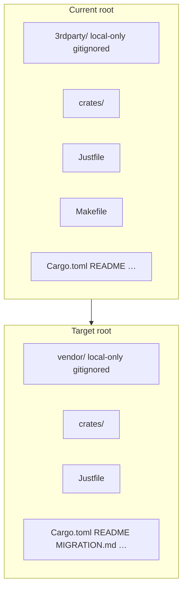
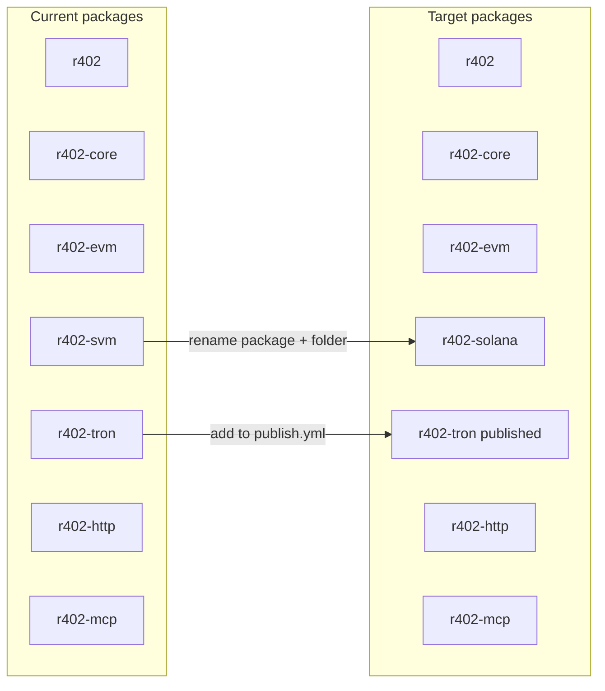
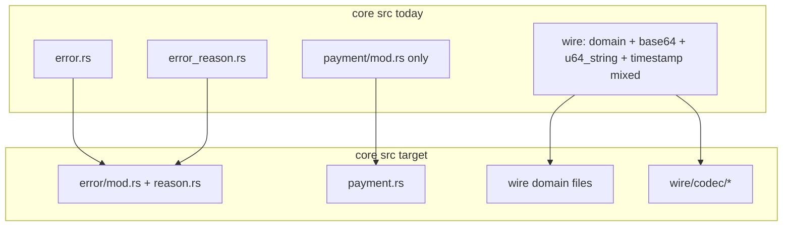
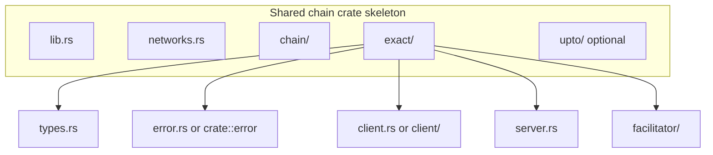
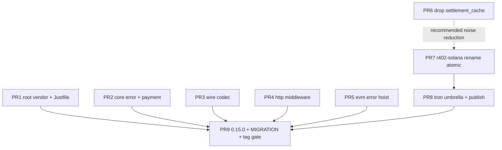

> **Obsolete.** Not the construction contract. Implement from [`docs/layout/`](layout/README.md) (384 enumerable files, HTTP shape B, three SettlementModes KEEP, upto KEEP, `r402-contract` unpublished). This file still names `r402-svm`.

# Repository Structure & Naming Aesthetics Redesign

| Field | Value |
| --- | --- |
| **Title** | Repository structure & naming aesthetics redesign for r402 |
| **Author** | TBD |
| **Date** | 2026-08-07 |
| **Status** | Draft (rev 4 — MIGRATION.md grep-gate carve-out) |
| **Scope** | First-party workspace layout, crate/package names, module trees; no protocol or logic changes |
| **Workspace** | `/Users/xu/Desktop/qntx/r402` (workspace version `0.14.0`) |

---

## Overview

The r402 workspace is a modular Rust SDK for the x402 payment protocol. First-party code under `crates/` is small (~1.1 MB source) but visually inconsistent: chain backends are named on three different taxonomies (`evm` / `svm` / `tron`); core modules mix flat files, false directories, and domain/util siblings; chain crates use asymmetric internal skeletons; the HTTP server surface mixes product terms with framework jargon; the repo root is dominated by a gitignored `3rdparty/` tree (~621 MB) and dual task-runner files with recipe-equivalent targets.

This design defines a **visual grammar** for naming and layout, a **target tree** for every first-party surface, an explicit **rename matrix** (paths, module paths, crates.io package names, publish workflow), and a **phased PR plan** so each step is independently mergeable with green CI. Behavior, wire formats, and scheme semantics are non-goals: only moves, renames, and doc/path updates required for structure.

**Breaking renames are intentional.** Per `AGENTS.md`, obsolete paths are removed rather than papered over with re-exports or compatibility layers. crates.io packages currently published under `r402-*` (notably `r402-svm`) require a deliberate publish strategy (supersession messaging, changelog, single post-series version bump). **No tag/publish until PR 9.**

---

## Background & Motivation

### Current first-party layout (verified)

```
crates/
  r402/           # umbrella re-export (core + evm + http + mcp + svm; no tron)
  r402-core/      # protocol core
  r402-evm/       # EIP-155 / EVM
  r402-svm/       # Solana (crate name = SVM; types/docs = Solana)
  r402-tron/      # Tron (workspace member; not in umbrella, README table, or publish.yml)
  r402-http/      # HTTP transport (client + server)
  r402-mcp/       # MCP transport (stub)
```

Workspace dependency keys and package names (from root `Cargo.toml` / crate manifests) use the same strings: `r402`, `r402-core`, `r402-evm`, `r402-svm`, `r402-tron`, `r402-http`, `r402-mcp`. Version: **0.14.0**.

**Publish workflow today** (`.github/workflows/publish.yml`):

```yaml
packages: "r402-core r402-evm r402-svm r402-http r402 r402-mcp"
```

Note: **`r402-tron` is not published**; **`r402-svm` is**.

Umbrella (`crates/r402/src/lib.rs`) re-exports:

| Feature | Re-export |
| --- | --- |
| (always) | `r402_core::*` |
| `evm` | `r402_evm as evm` |
| `http` | `r402_http as http` |
| `mcp` | `r402_mcp as mcp` |
| `svm` | `r402_svm as svm` |
| — | **no `tron` feature / re-export** |

### Diagnosed aesthetic problems (confirmed)

1. **Crate naming axis inconsistency**
   - `r402-evm` — tech stack / ecosystem brand
   - `r402-svm` — VM abstraction (not the product brand; CAIP namespace and types say **solana**)
   - `r402-tron` — chain brand / CAIP namespace
   Three taxonomies for “chain backend crate”.

2. **`r402-core` module surface uneven**
   - Flat: `amount.rs`, `cache.rs`, `chain.rs`, `error.rs`, `error_reason.rs`, `facilitator.rs`, `hooks.rs`, `metrics.rs`
   - Directories: `extensions/`, `payment/`, `scheme/`, `wire/`
   - `payment/` is a **false hierarchy** — only `mod.rs` (241 lines)
   - `error.rs` + `error_reason.rs` are tightly related (~317 + ~301 lines) but ungrouped
   - `wire/` mixes domain protocol types with serde helpers (`base64`, `u64_string`, `timestamp`) — already private `mod`s with type `pub use`; layout is still noisy

3. **Chain crate internal skeleton asymmetry**

   | Aspect | EVM | SVM | Tron |
   | --- | --- | --- | --- |
   | client | `exact/client/` dir | `exact/client.rs` file | `exact/client.rs` file |
   | error | `exact/facilitator/error.rs` | `exact/error.rs` | `exact/error.rs` |
   | floating root | — | `settlement_cache.rs` (pure re-export of `r402_core::cache`, including constant aliases) | — |
   | `upto` | present; `eip2612` at both `upto/eip2612.rs` and `upto/client/eip2612.rs` | absent | absent |
   | facilitator settle | `settle.rs` present | **no `settle.rs`** (settle lives inside facilitator flow) | `settle.rs` present |

   EVM’s `Eip155ExactError` is already documented as scheme-shared (exact + upto) yet lives under `exact/facilitator/`.

4. **HTTP server vocabulary mix** (`r402-http/src/server/`)
   - Product: `paygate`, `pricing`, `upto`, `facilitator`
   - Framework shape: `layer` (Tower/Axum)
   - Cross-cutting: `cors`, `hooks`, `status`
   Flat layout is fine; the weak name is `layer`.

5. **Repo root noise**
   - `3rdparty/` — numeric prefix, **gitignored and untracked** (`git ls-files` has no entries; no `.gitmodules`), ~621 MB local (x402 + x402-rs only — CONTRIBUTING invents a nonexistent `siwx` submodule)
   - `Justfile` and `Makefile` — **recipe-equivalent** (same targets and cargo invocations; not bit-identical: Make needs `.PHONY` and tab indentation, Just uses 4-space recipes)
   - First-party source is 1.1 MB; vendor bulk dominates any file-tree glance

### Public API / rename surface (facts)

- README, CHANGELOG, CONTRIBUTING heavily mention `r402-svm` and `3rdparty`
- Published crates.io names (via publish.yml): `r402`, `r402-core`, `r402-evm`, `r402-svm`, `r402-http`, `r402-mcp`; workspace also has **unpublished** `r402-tron`
- Types: `Eip155Exact`, `SolanaExact`, `TronExact` — type axis already prefers Solana over Svm; scheme `namespace()` returns `"eip155" | "solana" | "tron"`
- Reference layout under local vendor tree: `x402-rs/crates/chains/{x402-chain-eip155,x402-chain-solana,x402-chain-tron}`
- In-tree `error_reason` consumers include core (`lib.rs`, `error.rs`, `hooks.rs`, `payment/`, `wire/response.rs`) and **`r402-http`** (`server/status.rs`, rustdoc in `server/upto.rs`)

---

## Goals & Non-Goals

### Goals

1. Define a **visual grammar**: one naming axis per layer, file-vs-directory rules, domain-vs-util separation, sibling symmetry.
2. Produce a **target tree** for workspace root, crate names, `r402-core`, chain crates (isomorphic skeleton), and `r402-http`.
3. For each rename: old → new path, public module impact, crates.io impact, type-rename in/out of scope.
4. Phase work into independently mergeable PRs with green CI.
5. Explicit decisions on contentious items (svm vs solana, 3rdparty name, error grouping, wire util split, payment flatten, settlement_cache, Justfile vs Makefile, **tron publish**).
6. Document crates.io / semver implications of package renames under the “no backward compatibility” policy, including **publish.yml** and a single release version bump.

### Non-Goals

- Protocol behavior, wire JSON, scheme algorithms, or feature semantics
- Logic refactors beyond pure moves/renames needed for structure
- Type renames of `Eip155Exact` / `SolanaExact` / `TronExact` / `Eip155ExactError` / `X402LayerBuilder` / `X402Middleware` (optional follow-ups; frozen during structural PRs)
- Implementing MCP transport beyond structural placement
- Vendor content curation, submodule conversion, or shrinking reference trees
- Adding compatibility shims, `pub use` at obsolete module paths, or dual package publishes under both names
- Inventing solana `settle.rs` solely for facilitator file-list symmetry

---

## Visual Grammar (Naming Principles)

These rules are the aesthetic contract. Every structural change in this design is justified by them.

### G1 — One naming axis per directory level

Siblings must share a single taxonomy:

| Level | Axis | Examples |
| --- | --- | --- |
| Workspace crate folder / Cargo package | Product role or **ecosystem brand** for chains | `r402-core`, `r402-http`, `r402-evm`, `r402-solana`, `r402-tron` |
| Chain crate root modules | Protocol roles | `chain`, `exact`, `upto`, `networks` |
| Scheme subtree (`exact/`, `upto/`) | Role within scheme | `client`, `server`, `facilitator`, `types`, `error` |
| Core crate root | Domain concern | `wire`, `scheme`, `error`, `payment`, `facilitator` |
| `wire/` | Domain protocol types at top; codecs under `codec/` | `payment_payload`, `codec/base64` |
| HTTP `server/` | Domain role of the server component | `paygate`, `middleware`, `pricing`, … |

**Forbidden at one level:** mixing CAIP namespace + VM acronym + brand (`eip155` vs `svm` vs `tron`), or product term + framework jargon without a consistent rule.

### G2 — File vs directory

| Condition | Form |
| --- | --- |
| Single source unit, no submodules expected soon | `name.rs` |
| Two or more sibling source files for one module | `name/mod.rs` + siblings |
| Directory containing only `mod.rs` | **Illegal** — collapse to `name.rs` |

Threshold is structural, not line count. A 600-line single concern stays a file until a real sub-concern splits out (e.g. EVM `exact/client/` needs `permit2.rs` → directory is correct).

Do **not** invent empty files (e.g. solana `facilitator/settle.rs`) for cosmetic file-list parity across chains. Symmetry is the **skeleton** (roles present when needed), not identical leaf file names.

### G3 — Domain vs utility separation

Within a module family, pure serialization/encoding helpers do not sit as peers of domain types unless they *are* domain types.

- Domain (protocol nouns): `PaymentPayload`, `PaymentRequired`, …
- Codec/util: base64 bytes wrapper, stringified integers, timestamps → `wire/codec/`

### G4 — Sibling symmetry for chain crates

All chain crates expose the same **skeleton** at the first two levels:

```text
r402-{chain}/src/
  lib.rs
  networks.rs
  chain/          # chain primitives, providers, types
  exact/          # exact scheme (always present today)
  upto/           # only when the scheme is implemented (EVM today)
```

Under `exact/` (and `upto/` when present):

```text
exact/
  mod.rs
  types.rs
  error.rs        # scheme-level errors (single-scheme crates only;
                  # multi-scheme EVM uses crate-root error.rs — see D8)
  client.rs | client/   # file unless multi-file
  server.rs
  facilitator/    # directory when multi-file (always is today)
                  # leaf files vary: solana has config/memo/verify only
                  # (no settle.rs); do not invent settle.rs for symmetry
```

Chain-specific files under `chain/` (`nonce.rs`, `rpc.rs`, `contracts.rs`, …) are allowed; they do not break the skeleton.

### G5 — No floating exceptions

A file that only re-exports another crate’s type does not earn a root module slot. Import the source of truth directly or place a thin alias next to the only consumer (not at crate root).

### G6 — Repo root is first-party signal

Root entries should be: workspace manifests, first-party `crates/`, tooling config, licenses, docs. Vendor/reference material lives under one clearly named, gitignored directory. Dual build-entry files with recipe-equivalent content are not allowed.

### G7 — Public module paths follow directories

No “virtual” module trees that disagree with the filesystem. Crate root `pub use` re-exports for ergonomics are fine; they do not invent a second taxonomy. **Ergonomic re-exports must not preserve obsolete module paths** after a move (see G8 / D8).

### G8 — Breaking renames over compatibility layers

Obsolete crate names, module paths, and feature flag names are removed in the same change that introduces the new name. No dual-path period inside the tree. Downstream migration is documentation + version bump, not dual maintenance. **No `pub use` at the old module path** after a move.

---

## Key Decisions

| # | Decision | Rationale |
| --- | --- | --- |
| **D1** | Rename **`r402-svm` → `r402-solana`**. Keep **`r402-evm`** (not `r402-eip155`). Keep **`r402-tron`**. | Single axis = **ecosystem brand** for chain crates. Types, docs, and CAIP namespace already say Solana; `svm` is the outlier. `evm` is discoverable and matches how integrators speak; `eip155` is precise CAIP but worse crates.io search and would force a second published rename without aesthetic gain. `tron` already matches brand + CAIP. |
| **D2** | Umbrella feature/module: **`svm` → `solana`**; add **`tron`** feature re-export for symmetry. | Matches crate names. Tron omission is a structural hole, not a product decision to preserve. |
| **D2b** | **Publish `r402-tron` on crates.io** in the same release train as the solana rename. Add it to `publish.yml`. **Prerequisite:** create missing `crates/r402-tron/README.md` (manifest already declares `readme = "README.md"`; without the file `cargo package` fails). | Umbrella `features = ["tron"]` must resolve for crates.io consumers of `r402`. Leaving tron path-only while exposing a crates.io-facing feature is broken. Workspace-only tron is rejected once D2 lands. |
| **D3** | **`3rdparty/` → `vendor/`** (gitignore + docs; local dirs renamed out-of-band). | Short, conventional, no numeric prefix. Remains gitignored/untracked. Fix CONTRIBUTING: no git submodules; no fictional `siwx`. |
| **D4** | Merge **`error` + `error_reason` into `error/`** module: `error/mod.rs` + `error/reason.rs`. Crate-root type re-exports stay. Module path `error_reason` **deleted**. | Related concerns; removes side-by-side split. |
| **D5** | Split wire utils into **`wire/codec/`**. Domain types remain direct children of `wire/`. Submodules stay **private** (already true today). | Domain vs util (G3). Prefer `codec` over `ser`. |
| **D6** | Flatten **`payment/` → `payment.rs`**. | False hierarchy (G2). |
| **D7** | **Delete** solana root **`settlement_cache`** module entirely (types **and** constant aliases). Consumers use `r402_core::cache` names. | Floating pure re-export (G5). |
| **D8** | EVM: move shared error to **`src/error.rs`**. **Preferred public path: `r402_evm::Eip155ExactError`** (crate-root `pub use`). **Forbidden after move:** `pub use` of the type from `exact::facilitator` (old path deleted). Internal exact/upto code imports **`crate::error::Eip155ExactError` only**. Single-scheme crates keep **`exact/error.rs`**. | Multi-scheme sharing without burying under facilitator; G8 forbids dual path. |
| **D9** | Client layout: **directory only when multi-file**. Keep EVM `exact/client/`; keep solana/tron `exact/client.rs`. | G2 over false isomorphism. |
| **D10** | HTTP server: keep flat; rename **`layer` → `middleware`** (module only). **`X402LayerBuilder` / `X402Middleware` type names frozen** in that PR. | Single jargon fix; type renames are a separate optional follow-up. |
| **D11** | **Keep `Justfile`; delete `Makefile`.** | Recipe-equivalent twins; Just is used by reference `x402-rs`; one entry point. |
| **D12** | **Type renames out of scope** for this redesign. | Layout first. Optional follow-ups: `Eip155ExactError` → scheme-neutral name; `X402LayerBuilder` → middleware-aligned name. |
| **D13** | crates.io: publish **`r402-solana`** and **`r402-tron`**; stop publishing **`r402-svm`**. No dual-maintenance re-export crate. **Workspace version set to `0.15.0` in PR 9 only.** No tag/publish from intermediate main. | AGENTS.md; single release train. |
| **D14** | `upto/eip2612.rs` (wire model) vs `upto/client/eip2612.rs` (signing) **kept as two files**. | Different roles, not duplication. |
| **D15** | **`r402-solana` keywords:** `["x402", "payment", "solana", "spl-token"]` — **drop `"svm"`**. | Package name is solana; keyword axis matches brand. Searchers for “svm” still find solana ecosystem crates elsewhere. |
| **D16** | **`MIGRATION.md` is required** for this breaking series (aligns with existing CONTRIBUTING step 4). Produced in PR 9. | Process consistency. |

---

## Proposed Design

### Before / after — workspace root



**Target root (first-party visible / tracked):**

```text
r402/
  AGENTS.md
  Cargo.toml
  Cargo.lock
  CHANGELOG.md
  CONTRIBUTING.md
  MIGRATION.md             # required for 0.15 breaking renames (PR 9)
  Justfile                 # sole task runner
  LICENSE-APACHE
  LICENSE-MIT
  README.md
  clippy.toml
  deny.toml
  rust-toolchain.toml
  rustfmt.toml
  crates/
  vendor/                  # gitignored; was 3rdparty/ — not in git
    x402/
    x402-rs/
  .github/
    workflows/
      ci.yml
      publish.yml          # package list updated (see matrix)
```

| Old | New | Notes |
| --- | --- | --- |
| `3rdparty/` (local, untracked) | `vendor/` (local, untracked) | **Not a git mv.** Update `.gitignore` `3rdparty/` → `vendor/`; fix docs; operators rename local directories out-of-band |
| `Makefile` | *(deleted)* | Use `just` (recipe-equivalent targets) |
| `Justfile` | `Justfile` | Unchanged recipe set |

### Before / after — crates naming



| Old path | New path | Cargo package | Umbrella feature / `pub use … as` | Type renames |
| --- | --- | --- | --- | --- |
| `crates/r402-svm/` | `crates/r402-solana/` | `r402-svm` → **`r402-solana`** | `svm` → **`solana`**; `r402_svm as svm` → `r402_solana as solana` | Out of scope (`SolanaExact` stays) |
| `crates/r402-evm/` | unchanged | `r402-evm` | `evm` / `as evm` | Out of scope |
| `crates/r402-tron/` | unchanged | `r402-tron` (**newly published**) | **add** `tron` / `as tron` | Out of scope |
| others | unchanged | unchanged | unchanged | — |

**Internal Rust crate identifiers:** `r402_svm` → `r402_solana` (Cargo converts hyphens).

**Workspace `Cargo.toml` keys** (version numbers remain `0.14.0` on main until PR 9 sets `0.15.0`):

`[workspace.dependencies]` entries use **explicit** `version = "…"` strings matching `[workspace.package] version`. Do **not** write `version.workspace = true` inside `[workspace.dependencies]` — that inheritance form applies only to member `[package]` tables (e.g. `version.workspace = true` in `crates/*/Cargo.toml`), not to workspace.dependency path specs. Live style:

```toml
# before
r402-svm = { version = "0.14.0", path = "crates/r402-svm" }

# after folder rename (PR 7); still 0.14.0 until PR 9
r402-solana = { version = "0.14.0", path = "crates/r402-solana" }
r402-tron   = { version = "0.14.0", path = "crates/r402-tron" }

# PR 9: rewrite [workspace.package] version and every internal
# workspace.dependencies version in lockstep:
#   version = "0.14.0" → version = "0.15.0"
```

**Publish workflow (`publish.yml`) — mandatory rename-matrix row:**

| Artifact | Before | After (PR 7 + D2b) |
| --- | --- | --- |
| `.github/workflows/publish.yml` `packages:` | `"r402-core r402-evm r402-svm r402-http r402 r402-mcp"` | **`"r402-core r402-evm r402-solana r402-tron r402-http r402-mcp r402"`** |

Order in the string should match leaf-first dependency order used by the reusable workflow (core → chain leaves including solana+tron → transports → umbrella last). Implementers must keep **umbrella `r402` last**.

**crates.io impact (D13 + D2b):**

| Package | Action |
| --- | --- |
| `r402-solana` | New package; first publish at `0.15.0` release |
| `r402-tron` | **First publish** at `0.15.0` (was workspace-only). **Blocker today:** `Cargo.toml` sets `readme = "README.md"` but **`crates/r402-tron/README.md` is missing** — create it in PR 8 before adding to `publish.yml` (mirror `r402-evm` / former `r402-svm` README shape). Verify with `cargo package -p r402-tron --list` |
| `r402-svm` | Superseded by `r402-solana`; no further publishes; do **not** leave an empty stub crate in-tree |
| `r402`, `r402-core`, `r402-evm`, `r402-http`, `r402-mcp` | Bump to `0.15.0` in PR 9; update feature deps that pointed at `r402-svm` |
| Downstream `Cargo.toml` | `r402-svm` → `r402-solana`; feature `svm` → `solana`; optional `tron` |

### Target tree — `r402-core/src`

```text
r402-core/src/
  lib.rs
  amount.rs
  cache.rs                 # feature-gated
  chain.rs
  facilitator.rs
  hooks.rs
  metrics.rs               # feature-gated
  payment.rs               # was payment/mod.rs
  error/
    mod.rs                 # FacilitatorError, VerificationError, … (was error.rs)
    reason.rs              # ErrorReason, PaymentProblem, … (was error_reason.rs)
  extensions/
    mod.rs
    bazaar.rs
    payment_id.rs
  scheme/
    mod.rs
    client.rs
    server.rs
    registry.rs
    sealed.rs
  wire/
    mod.rs
    payment_payload.rs
    payment_required.rs
    payment_requirements.rs
    price_tag.rs
    request.rs
    resource_info.rs
    response.rs
    supported.rs
    extensions.rs
    version.rs
    codec/
      mod.rs               # private re-exports of leaf modules
      base64.rs
      u64_string.rs
      timestamp.rs
```



#### Rename matrix — core

| Old path | New path | Public module path impact | crates.io | Types |
| --- | --- | --- | --- | --- |
| `src/error.rs` | `src/error/mod.rs` | `r402_core::error` **unchanged** as module name | none | none |
| `src/error_reason.rs` | `src/error/reason.rs` | **`r402_core::error_reason` removed**; use crate-root re-exports or `r402_core::error::reason` | package name unchanged | type names unchanged |
| `src/payment/mod.rs` | `src/payment.rs` | `r402_core::payment` unchanged | none | none |
| `src/wire/base64.rs` | `src/wire/codec/base64.rs` | **Already private `mod`**; filesystem only; `wire::Base64Bytes` stays | none | none |
| `src/wire/u64_string.rs` | `src/wire/codec/u64_string.rs` | same (`U64String` at `wire::`) | none | none |
| `src/wire/timestamp.rs` | `src/wire/codec/timestamp.rs` | same (`UnixTimestamp` at `wire::`) | none | none |

**Policy for wire codec:** Today `wire/mod.rs` already uses **private** `mod base64` / `mod u64_string` / `mod timestamp` with `pub use` of types — so `wire::base64` was **never** a public module path. The redesign is **filesystem hygiene only**: move files under `codec/`, keep private `mod` + type `pub use` at `wire::`. No public API change for wire types.

**Policy for `error_reason`:** the **module path** `r402_core::error_reason` is **removed** (G8). Crate-root re-exports in `lib.rs` remain for `ErrorReason`, `AsPaymentProblem`, `PaymentProblem`.

**Explicitly out of scope (must remain):**

| Token | Why it stays |
| --- | --- |
| Wire struct field `error_reason` (e.g. in `wire/response.rs`) | Serde field under `rename_all = "camelCase"` → JSON **`errorReason`** (protocol wire; Non-Goals / Data Model: no change) |
| Test helpers `arb_error_reason`, `error_reason_roundtrips`, … | Local identifiers, not the deleted module path |

**Cross-crate module-path consumers (must update in PR 2, not only core):**

| Path | Usage |
| --- | --- |
| `crates/r402-core/src/lib.rs` | `pub mod error_reason` + `pub use` |
| `crates/r402-core/src/error.rs` | `use crate::error_reason::…` → `use crate::error::reason::…` (or same-module) |
| `crates/r402-core/src/hooks.rs` | `use crate::error_reason::ErrorReason` |
| `crates/r402-core/src/payment/mod.rs` | same |
| `crates/r402-core/src/wire/response.rs` | **module** import `use crate::error_reason::…` only — keep field name `error_reason` |
| `crates/r402-http/src/server/status.rs` | `use r402_core::error_reason::ErrorReason` + rustdoc links |
| `crates/r402-http/src/server/upto.rs` | rustdoc link to `r402_core::error_reason::…` |

**PR 2 / final acceptance gate (path-aware — not naive `rg error_reason`):**

Fail only on deleted **module path** usage. Suggested checks (implement with `rg` or equivalent):

```text
# MUST be zero after PR 2:
pub mod error_reason
use .*::error_reason::
r402_core::error_reason::
\berror_reason::

# ALLOWED (do not fail the gate):
#   - struct fields named error_reason (wire JSON errorReason)
#   - test fn / helper names containing error_reason
#   - CHANGELOG historical prose
```

### Target tree — chain crates (isomorphic skeleton)

```text
# r402-evm (multi-scheme)
src/
  lib.rs
  networks.rs
  error.rs                 # Eip155ExactError; crate-root pub use
  chain/
    mod.rs
    nonce.rs
    provider.rs
    types.rs
  exact/
    mod.rs
    types.rs
    client/
      mod.rs
      permit2.rs
    server.rs
    facilitator/
      mod.rs
      contract.rs
      settle.rs
      signature.rs
      verify.rs
      # error.rs REMOVED — no re-export of Eip155ExactError here
  upto/
    mod.rs
    types.rs
    eip2612.rs             # wire model for extension
    client/
      mod.rs
      eip2612.rs           # client signing helpers
      signing.rs
    server.rs
    facilitator/
      mod.rs
      contract.rs
      settle.rs
      verify.rs

# r402-solana (was r402-svm; single-scheme)
src/
  lib.rs
  networks.rs
  chain/
    mod.rs
    provider.rs
    rpc.rs
    types.rs
  exact/
    mod.rs
    types.rs
    error.rs
    client.rs
    server.rs
    facilitator/
      mod.rs
      config.rs
      memo.rs
      verify.rs
      # no settle.rs — settle is inline in facilitator flow; do not invent one
  # settlement_cache.rs REMOVED (types + SETTLEMENT_* aliases)

# r402-tron (single-scheme; same skeleton as solana)
src/
  lib.rs
  networks.rs
  chain/
    mod.rs
    contracts.rs
    provider.rs
    types.rs
  exact/
    mod.rs
    types.rs
    error.rs
    client.rs
    server.rs
    facilitator/
      mod.rs
      settle.rs
      signature.rs
      verify.rs
```



#### Rename matrix — chain

| Old | New | Module impact | crates.io | Types |
| --- | --- | --- | --- | --- |
| `crates/r402-svm/**` | `crates/r402-solana/**` | all `r402_svm::` → `r402_solana::`; umbrella `svm` → `solana` | new package | keep `SolanaExact`, etc. |
| `r402-svm/src/settlement_cache.rs` module | **deleted** | `r402_svm::settlement_cache` gone | — | see alias rows |
| `settlement_cache::SettlementCache` | `r402_core::cache::SettlementCache` | import path change | — | same type |
| `settlement_cache::Duplicate` | `r402_core::cache::Duplicate` | import path change | — | same type |
| `settlement_cache::SETTLEMENT_CAPACITY` | `r402_core::cache::DEFAULT_SETTLEMENT_CAPACITY` | **alias name removed** | — | same value |
| `settlement_cache::SETTLEMENT_TTL` | `r402_core::cache::DEFAULT_SETTLEMENT_TTL` | **alias name removed** | — | same value |
| `r402-evm/.../exact/facilitator/error.rs` | `r402-evm/src/error.rs` | **Breaking:** `r402_evm::exact::facilitator::Eip155ExactError` **deleted**. Stable path: `r402_evm::Eip155ExactError` / `r402_evm::error::Eip155ExactError`. Internal: `crate::error::Eip155ExactError` only. **No** `pub use` from `exact::facilitator` | package name same | type name out of scope |
| solana/tron `exact/error.rs` | unchanged path pattern | none | none | none |

**EVM export rules after PR 5 (normative):**

```rust
// lib.rs
pub mod error;
pub use error::Eip155ExactError; // stable short path

// exact/facilitator/mod.rs
// DELETE: pub use error::Eip155ExactError;
// DELETE: mod error; / pub mod error;
```

### Target tree — `r402-http`

```text
r402-http/src/
  lib.rs
  client/
    mod.rs
    hooks.rs
    middleware.rs          # reqwest middleware (unchanged name; already correct)
  server/
    mod.rs
    cors.rs
    facilitator.rs         # HTTP client to remote facilitator
    hooks.rs
    middleware.rs          # was layer.rs — Tower/Axum X402Middleware
    paygate.rs
    pricing.rs
    status.rs
    upto.rs
```

| Old | New | Module impact | crates.io | Types |
| --- | --- | --- | --- | --- |
| `server/layer.rs` | `server/middleware.rs` | `r402_http::server::layer` → `…::middleware` | package same | **`X402LayerBuilder`, `X402Middleware`, `SettlementMode` names frozen** (D10/D12) |

No regrouping of `paygate` / `pricing` / `status` / `upto` — they are peer domain modules (G1 satisfied once `layer` is renamed).

### Target tree — umbrella `r402`

```rust
// crates/r402/src/lib.rs (target shape)
pub use r402_core::*;

#[cfg(feature = "evm")]
pub use r402_evm as evm;

#[cfg(feature = "solana")]
pub use r402_solana as solana;

#[cfg(feature = "tron")]
pub use r402_tron as tron;

#[cfg(feature = "http")]
pub use r402_http as http;

#[cfg(feature = "mcp")]
pub use r402_mcp as mcp;
```

#### Full post-change `crates/r402/Cargo.toml` features + deps (normative)

```toml
[features]
default = ["evm", "http"]

evm = ["dep:r402-evm"]
solana = ["dep:r402-solana"]
tron = ["dep:r402-tron"]
http = ["dep:r402-http"]
mcp = ["dep:r402-mcp"]

client = [
    "r402-evm?/client",
    "r402-solana?/client",
    "r402-tron?/client",
    "r402-http?/client",
    "r402-mcp?/client",
]
server = [
    "r402-evm?/server",
    "r402-solana?/server",
    "r402-tron?/server",
    "r402-http?/server",
    "r402-mcp?/server",
]
facilitator = [
    "r402-evm?/facilitator",
    "r402-solana?/facilitator",
    "r402-tron?/facilitator",
]

telemetry = [
    "r402-core/telemetry",
    "r402-evm?/telemetry",
    "r402-solana?/telemetry",
    "r402-tron?/telemetry",
    "r402-http?/telemetry",
    "r402-mcp?/telemetry",
]

cache = ["r402-core/cache"]

ext-bazaar = ["r402-core/ext-bazaar"]
ext-payment-id = ["r402-core/ext-payment-id"]
all-extensions = ["r402-core/all-extensions"]

full = [
    "evm",
    "solana",
    "tron",
    "http",
    "mcp",
    "client",
    "server",
    "facilitator",
    "telemetry",
    "cache",
    "all-extensions",
]

[dependencies]
r402-core = { workspace = true }
r402-evm = { workspace = true, optional = true }
r402-solana = { workspace = true, optional = true }
r402-tron = { workspace = true, optional = true }
r402-http = { workspace = true, optional = true }
r402-mcp = { workspace = true, optional = true }
```

Default features remain `evm` + `http` (tron opt-in only). `full` includes **solana + tron**.

Split of work: PR 7 applies solana rename (`svm` → `solana`, deps). PR 8 adds tron feature + dep + forwarding (snippet above is the **final** target after PR 8).

### Documentation, CI, and ops checklist (complete)

Every row is required before the 0.15 release tag. Grep gates are part of PR acceptance.

| Path / artifact | Change | Bound to PR |
| --- | --- | --- |
| `.gitignore` | `3rdparty/` → `vendor/` | PR 1 |
| Local dir `3rdparty/` | Operators rename to `vendor/` out-of-band (untracked; not git mv) | PR 1 (doc note) |
| `Makefile` | Delete | PR 1 |
| `Justfile` | Keep | PR 1 |
| `CONTRIBUTING.md` | `3rdparty` → `vendor`; remove “git submodule” / `siwx` claims; commit example `fix(svm):` → `fix(solana):`; keep `MIGRATION.md` requirement | PR 1 (vendor/submodule) + PR 7 (svm→solana) + PR 9 (migration) |
| `CHANGELOG.md` | Breaking section; path prose | PR 9 (narrative); incidental path fixes earlier OK |
| Root `README.md` | Crate table: solana not svm; **add tron**; badge URLs | PR 7–9 |
| `MIGRATION.md` | **Create** (required by CONTRIBUTING for breaking API) | PR 9 |
| `.github/workflows/ci.yml` | `submodules: true` → false/remove unless real submodules added | PR 1 |
| `.github/workflows/publish.yml` | packages string → `r402-core r402-evm r402-solana r402-tron r402-http r402-mcp r402` | **PR 7** (solana) + **PR 8** (tron) — both must land before tag; PR 9 checklist gates release |
| Root `Cargo.toml` | dep keys; comment `# Solana (SVM)` → `# Solana` | PR 7 |
| Root `Cargo.lock` | automatic package path/name refresh after folder rename | PR 7 (commit lockfile) |
| `crates/r402-solana/Cargo.toml` | `name = "r402-solana"`; keywords drop `"svm"` (D15) | PR 7 |
| `crates/r402/{Cargo.toml,src/lib.rs,README.md}` | features + re-exports | PR 7–8 |
| `crates/r402-core/README.md` | sibling crate names | PR 7 |
| `crates/r402-core/src/scheme/sealed.rs` | comment `r402-svm` → `r402-solana` | PR 7 |
| `crates/r402-http/src/client/mod.rs` | rustdoc `r402-svm` → `r402-solana` | PR 7 |
| `crates/r402-svm/README.md` | moves with crate folder; retitle | PR 7 |
| `crates/r402-tron/README.md` | **Create** (missing today; required for `cargo package` / crates.io). Mirror structure of `r402-evm` or former `r402-svm` README | **PR 8** (before or with `publish.yml` tron insert) |
| Workspace-wide rg gates | See **Grep gate policy** below (path-aware; migration/history docs may name old paths) | PR 1 / PR 2 / PR 7 / final PR 9 |
| Workspace version | `0.14.0` → **`0.15.0`** in `[workspace.package]` **and** every internal `workspace.dependencies` `version = "…"` | **PR 9 only** |

#### Grep gate policy (normative)

Gates are **path- and pattern-aware**. Naive whole-repo `rg error_reason` or `rg r402-svm` is **not** the acceptance test.

**Documentation that must describe renames** (`MIGRATION.md`, CHANGELOG historical + Breaking supersession prose) is allowed to contain old package names, feature names, and vendor path strings as left-hand “before” documentation. Zero-hit scopes apply only to **live code and live product surfaces** (code, manifests, workflows, crate/feature tables that present current APIs).

| Gate | Fail on (must be zero) | Allow |
| --- | --- | --- |
| Vendor path (PR 1) | `\b3rdparty\b` in **live setup surfaces**: `.gitignore`, `CONTRIBUTING.md` (setup steps), `.github/workflows/**`, comments/tests that instruct clone/build paths | **CHANGELOG.md** historical bullets that name past `3rdparty/…` paths; **`MIGRATION.md`** if it documents the rename `3rdparty` → `vendor` |
| Error module path (PR 2) | `pub mod error_reason`; `use …::error_reason::`; `r402_core::error_reason::`; `\berror_reason::` | Wire field `error_reason` / JSON `errorReason`; test names (`arb_error_reason`, …); CHANGELOG history; **`MIGRATION.md`** before→after tables naming the old module path |
| Package rename (PR 7 + final PR 9) | `\br402-svm\b` / `\br402_svm\b` / feature `"svm"` in **live code + live product docs**: `crates/**` (except migration-only prose if any), root `README.md` **crate/feature tables** (current names only), `CONTRIBUTING.md` (commit examples / setup as current practice), `.github/workflows/**`, `Cargo.toml` / member manifests | **`MIGRATION.md`** (required to show `r402-svm` → `r402-solana`, `svm` → `solana`, etc. as before→after); **CHANGELOG.md** historical release notes; Breaking supersession sentences that name the old package once |
| Feature flag | umbrella / live README feature tables still advertising `svm` as a current feature | **`MIGRATION.md`** and CHANGELOG history documenting the old feature name |

---

## API / Interface Changes

### Integrator-facing (breaking)

```toml
# Before
r402 = { version = "0.14", features = ["svm", "client"] }
r402-svm = "0.14"

# After
r402 = { version = "0.15", features = ["solana", "client"] }
r402-solana = "0.15"
# optional
r402-tron = "0.15"
r402 = { version = "0.15", features = ["tron", "facilitator"] }
```

```rust
// Before
use r402::svm::SolanaExact;
use r402_svm::SolanaExactClient;
use r402_svm::settlement_cache::{SettlementCache, SETTLEMENT_TTL};
use r402_core::error_reason::ErrorReason;
use r402_evm::exact::facilitator::Eip155ExactError;
use r402_http::server::layer::X402Middleware; // module path

// After
use r402::solana::SolanaExact;
use r402_solana::SolanaExactClient;
use r402_core::cache::{SettlementCache, DEFAULT_SETTLEMENT_TTL};
use r402_core::ErrorReason; // or r402_core::error::reason::ErrorReason
use r402_evm::Eip155ExactError; // crate root only
use r402_http::server::middleware::X402Middleware;
// still valid: use r402_http::server::X402Middleware; // if re-exported from server
```

### Unchanged (explicitly)

- Wire JSON field names and protocol version
- Type names: `Eip155Exact`, `SolanaExact`, `TronExact`, `Paygate`, `X402Middleware`, `X402LayerBuilder`, …
- `r402_core::wire::{PaymentPayload, Base64Bytes, …}` type paths
- Scheme feature flags on chain crates (`client`, `server`, `facilitator`, `exact`, `upto`, …) except umbrella `svm` → `solana` (+ new `tron`)

### Deleted public paths (normative list)

| Deleted | Replacement |
| --- | --- |
| crate `r402-svm` / `r402_svm::*` | `r402-solana` / `r402_solana::*` |
| feature `svm` | feature `solana` |
| `r402::svm` | `r402::solana` |
| `r402_core::error_reason` | crate root or `error::reason` |
| `r402_svm::settlement_cache` (+ `SETTLEMENT_CAPACITY` / `SETTLEMENT_TTL`) | `r402_core::cache` (+ `DEFAULT_SETTLEMENT_*`) |
| `r402_evm::exact::facilitator::Eip155ExactError` | `r402_evm::Eip155ExactError` |
| `r402_http::server::layer` | `r402_http::server::middleware` |

---

## Data Model Changes

**None.** No schema, serde representation, or on-chain data changes. This redesign is filesystem and Rust module path only.

Migration strategy for *code* dependents: compile-error-driven rename. For *crates.io* dependents: `MIGRATION.md` + CHANGELOG + package supersession blurb; single `0.15.0` publish train after PR 9.

---

## Alternatives Considered

### A1 — Chain crate names = CAIP namespace (`r402-eip155`, `r402-solana`, `r402-tron`)

| Pros | Cons |
| --- | --- |
| Perfect match to `SchemeId::namespace()` | Renames **two** published packages (`r402-evm` and `r402-svm`) |
| Matches `x402-rs` folder names (`x402-chain-eip155`) | `eip155` is weak for crates.io discovery vs `evm` |
| | Type prefix `Eip155*` vs crate `eip155` is fine, but ecosystem speech is still “EVM” |

**Rejected** for `r402-evm`: cost/benefit poor. **Accepted** the solana half only (via brand axis, which coincides with CAIP for solana/tron).

### A2 — Keep `r402-svm` package name; only fix internal layout

| Pros | Cons |
| --- | --- |
| No crates.io package rename | Leaves the worst naming inconsistency in the public surface |
| | Types say Solana; docs say Solana; package says SVM — permanent aesthetic debt |

**Rejected.**

### A3 — Compatibility crate `r402-svm` that depends on `r402-solana` and re-exports

| Pros | Cons |
| --- | --- |
| Softer crates.io landing | Violates `AGENTS.md` |
| | Dual maintenance |

**Rejected.**

### A4 — `3rdparty` → `third-party` or `refs` or `external`

| Name | Pros | Cons |
| --- | --- | --- |
| `third-party` | Clear English | Long; hyphen |
| `refs` | Short | Ambiguous |
| `external` | Generic | Vague |
| **`vendor`** | Conventional; short | Slight “vendored into build” connotation; mitigated by gitignore |

**Chosen: `vendor`.**

### A5 — Group HTTP server into `server/gate/` + `server/middleware/`

**Rejected** — extra depth for eight files.

### A6 — Keep `error_reason` as top-level module

**Rejected** — diagnosed grouping problem remains.

### A7 — Flatten wire codecs into one `wire/codec.rs`

**Rejected** — three distinct types; multi-file `codec/` matches G2.

### A8 — Keep both Justfile and Makefile

| Pros | Cons |
| --- | --- |
| `make` ubiquity | Recipe-equivalent twins; root noise |

**Rejected.** Justfile only.

### A9 — Keep `r402-tron` workspace-only while adding umbrella `tron` feature

| Pros | Cons |
| --- | --- |
| Avoid first crates.io publish of tron | crates.io consumers of `r402` + `features = ["tron"]` cannot resolve path dep |
| | Contradicts D2 “structural hole” framing |

**Rejected** in favor of **D2b** (publish tron in the same release train).

---

## Security & Privacy Considerations

| Topic | Assessment |
| --- | --- |
| Threat model | Unchanged — no auth, crypto, or network behavior changes |
| Supply chain | Package rename `r402-svm` → `r402-solana` creates a **name-confusion** window; new `r402-tron` first publish is normal |
| Vendor tree | `vendor/` remains gitignored; not part of published crates |
| Secrets | None in path renames |

**Severity: Low** for security; **Medium** for supply-chain confusion if publish messaging is weak.

Mitigation: CHANGELOG + `MIGRATION.md` + crates.io description blurbs (see PR 9 publish checklist).

---

## Observability

No metrics/log field renames required. Metric names like `r402_settlement_cache_reserve_total` are product identifiers, not crate names — leave them. If any tracing spans hard-code `"r402-svm"` or feature label `"svm"` as a string, update in PR 7.

---

## Rollout Plan

1. **Design approval** (this document).
2. **Phased PRs 1–8** on main at workspace version **0.14.0** (unreleased structural breaks are OK only because **no crates.io tag** is cut mid-series).
3. **PR 9:** set workspace version to **`0.15.0`**, `MIGRATION.md`, CHANGELOG Breaking section, final grep gates, publish checklist executed.
4. **Single tag** `v0.15.0` → `publish.yml` runs with updated package list.
5. **Rollback:** git revert of rename PR(s). No runtime feature flag. Do not mid-series publish.

**Hard rules:**

- Do **not** tag or publish until PR 9 merges.
- Do **not** set workspace version to `0.15.0` before PR 9 (avoids accidental `v0.14.x` tags that contain structural breaks under the wrong semver).
- Intermediate main may be temporarily “breaking vs last crates.io 0.14.0” — that is intentional and undocumented as a release.

**Risk register**

| Risk | Severity | Mitigation |
| --- | --- | --- |
| Missed path still says `3rdparty` / live `r402-svm` / module `error_reason::` | Low | Path-aware grep gates PR 1/2/7 + final PR 9 (`MIGRATION.md` + CHANGELOG history allowed for old names; live code/docs zero-hit) |
| Publish.yml still lists `r402-svm` | **Critical** | Explicit matrix row; PR 7 required; PR 9 blocks release without verify |
| Umbrella `tron` on crates.io without published `r402-tron` | **High** | D2b; packages string includes tron before tag |
| First publish of `r402-tron` fails `cargo package` (missing README) | **High** | PR 8 creates `crates/r402-tron/README.md`; checklist runs `cargo package -p r402-tron --list` |
| Dual path for `Eip155ExactError` | Medium | D8 forbids facilitator re-export; PR 5 acceptance |
| Tagging mid-series as 0.14.x | High | Version bump only in PR 9; no publish from intermediate main |
| Naive `rg error_reason` false-fails on wire field | Medium | Path-aware gate (module path only); wire field kept |
| PR 2 misses `r402-http` imports | Medium | Named in PR 2 Affected; module-path grep gate |
| EVM error move breaks `upto` | Low | Single PR, compile-driven; no other crate imports the type |

---

## Open Questions

1. **Exact next version string beyond `0.15.0`:** design default is **`0.15.0`**. Jumping to `1.0.0` is a product call outside aesthetics; not required for this redesign.
2. **Should `tron` enter default features?** Design default: **no** — defaults stay `evm`+`http`. Opt-in via `features = ["tron"]` or `full`.
3. **Vendor acquisition long-term:** keep manual local trees vs real git submodules under `vendor/`. Aesthetics only rename the ignore path; ops may later add `.gitmodules`.
4. **Yank policy for historical `r402-svm` versions on crates.io:** maintainer legal/policy choice. Design requires stop-publishing + supersession blurb; optional yank after N days is listed in the publish checklist but not mandated.
5. **Optional type renames (follow-up series):** `Eip155ExactError` → scheme-neutral; `X402LayerBuilder` → middleware-aligned. Out of this redesign.
6. **`r402-mcp` stub:** leave as-is structurally; no rename; remains published.

---

## References

- Workspace root: `/Users/xu/Desktop/qntx/r402/Cargo.toml` (members `crates/*`, version `0.14.0`)
- Publish list: `.github/workflows/publish.yml` (`packages: "r402-core r402-evm r402-svm r402-http r402 r402-mcp"`)
- Umbrella re-exports: `crates/r402/src/lib.rs`
- Core modules: `crates/r402-core/src/lib.rs`
- Chain libs: `crates/r402-evm/src/lib.rs`, `crates/r402-svm/src/lib.rs`, `crates/r402-tron/src/lib.rs`
- SVM settlement cache re-export + aliases: `crates/r402-svm/src/settlement_cache.rs`
- EVM shared error used by upto: `crates/r402-evm/src/upto/facilitator/*.rs` imports `crate::exact::facilitator::Eip155ExactError`
- HTTP `error_reason` consumer: `crates/r402-http/src/server/status.rs`
- HTTP server surface: `crates/r402-http/src/server/mod.rs`
- Policy: `AGENTS.md`
- CONTRIBUTING submodule claims vs missing `.gitmodules` and gitignored untracked `3rdparty/`

---

## PR Plan

Each PR is independently reviewable and must leave CI green. Order is dependency-safe. **PR 7 is atomic:** folder rename, package name, workspace dep keys, umbrella feature `svm`→`solana`, `Cargo.lock`, and `publish.yml` solana token land together — do not split.

### PR 1 — Root hygiene: Justfile-only + vendor ignore rename

| Field | Content |
| --- | --- |
| **Title** | `chore: rename 3rdparty to vendor in ignore/docs; drop Makefile` |
| **Affected** | `.gitignore` (`3rdparty/` → `vendor/`); `Makefile` deleted; `Justfile` kept; `CONTRIBUTING.md` (vendor path; remove submodule/`siwx` fiction); `CHANGELOG.md` prose paths; comments/tests that mention `3rdparty/`; `.github/workflows/ci.yml` submodule flag |
| **Depends on** | — |
| **Changes** | D3, D11. **Not a git rename of 621 MB tree** — tree is untracked; operators `mv 3rdparty vendor` locally. No Rust module path changes. Recipes remain equivalent under `just`. |

### PR 2 — Core: flatten `payment` and group `error` (+ http consumers)

| Field | Content |
| --- | --- |
| **Title** | `refactor(core): payment.rs; nest error_reason under error::reason` |
| **Affected** | `crates/r402-core/src/payment/`; `error.rs` → `error/mod.rs`; `error_reason.rs` → `error/reason.rs`; `lib.rs` re-exports; **module-path** imports in **`crates/r402-http/src/server/status.rs`**, **`server/upto.rs` rustdoc**, core `hooks.rs` / `payment` / `wire/response.rs` (import lines only) |
| **Depends on** | — |
| **Changes** | D4, D6. Keep crate-root `pub use` of error types. Delete module path `error_reason`. **Do not** rename wire field `error_reason` / JSON `errorReason` or test helper names. **Grep gate:** path-aware module-path patterns only (see Grep gate policy); not naive `rg error_reason`. |

### PR 3 — Core: `wire/codec` extraction

| Field | Content |
| --- | --- |
| **Title** | `refactor(core): move wire base64/u64_string/timestamp under wire/codec` |
| **Affected** | `crates/r402-core/src/wire/{base64,u64_string,timestamp}.rs` → `wire/codec/`; `wire/mod.rs` |
| **Depends on** | — (parallel with PR 2) |
| **Changes** | D5. Modules **already private**; filesystem only; preserve type `pub use` at `wire::`. |

### PR 4 — HTTP: `server::layer` → `server::middleware`

| Field | Content |
| --- | --- |
| **Title** | `refactor(http): rename server::layer module to middleware` |
| **Affected** | `crates/r402-http/src/server/layer.rs` → `middleware.rs`; `server/mod.rs`; docs/tests using module path |
| **Depends on** | — |
| **Changes** | D10. **Acceptance:** module rename only; **`X402LayerBuilder` / `X402Middleware` / `SettlementMode` type names frozen** (D12). Server prelude re-exports continue from `middleware`. |

### PR 5 — EVM: hoist shared error to crate root (hard delete old path)

| Field | Content |
| --- | --- |
| **Title** | `refactor(evm): move Eip155ExactError to crate-level error module` |
| **Affected** | `crates/r402-evm/src/exact/facilitator/error.rs` → `src/error.rs`; remove facilitator `pub use`; update all `exact`/`upto` imports to `crate::error::Eip155ExactError`; `lib.rs` `pub use error::Eip155ExactError` |
| **Depends on** | — |
| **Changes** | D8. **No** residual `exact::facilitator::Eip155ExactError` path. No other workspace crate currently imports this type (in-crate only). |

### PR 6 — Solana crate: drop `settlement_cache` façade

| Field | Content |
| --- | --- |
| **Title** | `refactor(svm): remove settlement_cache re-export; use r402_core::cache` |
| **Affected** | `crates/r402-svm/src/settlement_cache.rs` (delete); `lib.rs`; `exact/facilitator/mod.rs` |
| **Depends on** | — |
| **Changes** | D7. Map `SettlementCache` / `Duplicate` → `r402_core::cache`; drop `SETTLEMENT_CAPACITY` / `SETTLEMENT_TTL` aliases (use `DEFAULT_SETTLEMENT_*`). Folder still named `r402-svm` until PR 7. |

### PR 7 — Package rename `r402-svm` → `r402-solana` (atomic)

| Field | Content |
| --- | --- |
| **Title** | `refactor!: rename r402-svm package and crate folder to r402-solana` |
| **Affected** | `crates/r402-svm/` → `crates/r402-solana/` (git mv); package `name`; keywords (D15 drop `svm`); root `Cargo.toml` + comment `# Solana (SVM)`; **`Cargo.lock`**; all `r402_svm` / `r402-svm` rustc paths; `crates/r402` features `svm`→`solana` + deps; **`.github/workflows/publish.yml`** replace `r402-svm` with `r402-solana`; README/crate docs; `sealed.rs`, `r402-http` client rustdoc, CONTRIBUTING commit example |
| **Depends on** | **PR 6 recommended** (noise reduction). PRs 1–5 **not required** (no shared files with the package rename). |
| **Changes** | D1, D2 (solana half). **Breaking. Atomic. No compatibility shim.** Do not land half of this PR. Tron feature may wait for PR 8. |

### PR 8 — Umbrella: `tron` feature + publish + docs matrix

| Field | Content |
| --- | --- |
| **Title** | `feat(r402): re-export and publish r402-tron; complete feature matrix` |
| **Affected** | `crates/r402/{Cargo.toml,src/lib.rs,README.md}` full features block (see normative snippet); root `README.md` crate table + badges for solana + tron; **`crates/r402-tron/README.md` (create — missing today)**; **`publish.yml`** insert `r402-tron` into packages string (final string per matrix) |
| **Depends on** | PR 7 (solana name stable) |
| **Changes** | D2 remainder + **D2b**. Create tron README (mirror `r402-evm` / former `r402-svm` structure: overview, features table, docs links, license). Final `[features]` matches normative umbrella snippet. **Pre-merge check:** `cargo package -p r402-tron --list` succeeds (readme and package metadata present). Only then leave tron in `publish.yml`. |

### PR 9 — Version 0.15.0, MIGRATION.md, publish checklist

| Field | Content |
| --- | --- |
| **Title** | `release: 0.15.0 structure redesign migration docs` |
| **Affected** | `[workspace.package] version = "0.15.0"`; every internal `workspace.dependencies` `version = "0.14.0"` → `"0.15.0"`; `CHANGELOG.md` Breaking (keep historical entries that name `r402-svm`); **`MIGRATION.md` (required)**; root README migration blurb; crate READMEs; final **path-aware** rg gates |
| **Depends on** | PRs 1–8 merged |
| **Changes** | D13 version bump timing; D16. **Only PR that changes workspace version.** After merge: run publish checklist (below), then tag `v0.15.0`. |

#### PR 9 — crates.io publish checklist (normative)

1. Confirm `publish.yml` packages string is exactly:  
   `r402-core r402-evm r402-solana r402-tron r402-http r402-mcp r402`
2. Confirm workspace version is `0.15.0` in `[workspace.package]` **and** all internal `workspace.dependencies` version strings; CHANGELOG Breaking section lists deleted paths. **Do not** rewrite historical CHANGELOG sections that correctly refer to past `r402-svm` releases.
3. Confirm `MIGRATION.md` exists and covers before→after tables for: package rename (`r402-svm` → `r402-solana`), features (`svm` → `solana`), `error_reason` **module path**, `settlement_cache` aliases, EVM error path, `server::layer`, vendor path. **Old names in `MIGRATION.md` are required documentation, not gate failures.**
4. Confirm `crates/r402-tron/README.md` exists; `cargo package -p r402-tron --list` and `cargo package -p r402-solana --list` succeed.
5. Final **path-aware** grep gates clean per Grep gate policy: zero old names in **live** code/manifests/workflows/current README feature tables; **`MIGRATION.md` and CHANGELOG history are allowed** to contain `r402-svm`, `svm`, `3rdparty`, `error_reason` module paths as rename documentation.
6. Tag `v0.15.0` → workflow publishes leaves first (order in string / reusable workflow), umbrella last.
7. On crates.io / docs.rs:
   - **`r402-solana` description blurb (template):**  
     `Solana chain support for the x402 payment protocol (formerly published as r402-svm).`
   - **`r402-svm` page (if editable notes / README of last version):**  
     `Superseded by r402-solana as of 0.15.0. Depend on r402-solana instead.`
   - **`r402-tron`:** first publish; crate README + description as Tron chain support for x402.
8. Optional: yank `r402-svm` versions after N days of quiet — **maintainer policy** (Open Question 4); not required to complete redesign.

### Suggested parallelization



- Solid arrows: required ordering for a correct release.
- Dotted `P6 → P7`: recommended only (smaller PR 7 diff).
- **No** `P2 → P7` or `P3 → P7` dependency — core refactors do not share files with the package rename.
- PRs 1–6 are pairwise independent and may land in any order.
- PR 7 is the high-conflict centerpiece and must stay atomic.
- PR 2 is the only structural PR that **must** touch a dependent crate (`r402-http`) in the same change.

---

## Summary of target first-party tree

```text
r402/
  Justfile
  MIGRATION.md
  crates/
    r402/
    r402-core/
      src/
        payment.rs
        error/{mod.rs, reason.rs}
        wire/{…domain…, codec/{base64,u64_string,timestamp}.rs}
        …
    r402-evm/
      src/{lib.rs, networks.rs, error.rs, chain/, exact/, upto/}
    r402-solana/          # was r402-svm
      src/{lib.rs, networks.rs, chain/, exact/}
    r402-tron/            # published as of 0.15
      src/{lib.rs, networks.rs, chain/, exact/}
    r402-http/
      src/{client/, server/{middleware.rs, paygate.rs, …}}
    r402-mcp/
  vendor/                 # was 3rdparty; gitignored local-only
    x402/
    x402-rs/
```

This layout is self-explanatory at each directory open, siblings share one naming axis, false directories and floating re-exports are gone, and chain crates share a readable skeleton without inventing empty modules for symmetry.
